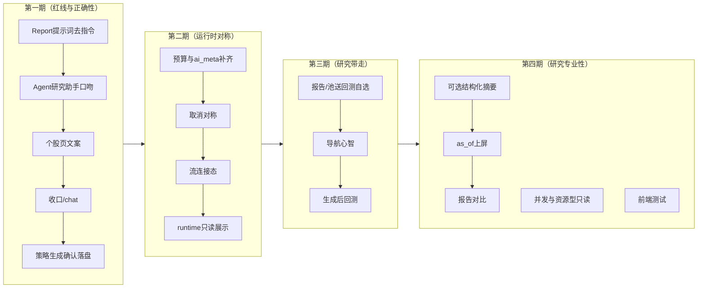

# AI 模块产品评审与路线图

> **评审日期**：2026-08-21
> **评审方式**：代码事实盘点（三类运行时全部入口、后端 API / service / 工具 allowlist、前端页面与 store，全部带文件行号证据）+ 既有计划交叉核对（`AI_RUNTIME_UNIFICATION_ASSESSMENT.md` / `PI_AGENT_PILOT_PLAN.md` / `PA_AGENT_PORTING_PLAN.md`）+ 与 2026-08-20 回测、2026-08-21 筛选评审同一套产品口径。
> **视角**：专业产品经理 + 一线使用者。
> **范围**：所有调用 LLM 的产品入口及其控制面。行业/概念/扩展分析页、研究中心定时模板、复盘红旗检测为确定性计算，只在接线处讨论。
> **明确不在范围**：把全部 AI 改成通用 Agent、用 Pi 替换 Structured Runtime、浏览器持有模型密钥、自动交易/荐股。

---

## 1. 摘要（TL;DR）

AI 层已经不是「几个页面各调一次 ChatCompletion」。底层按三类运行时分开是正确的工程决策：

| 运行时 | 入口 | 执行语义 |
|---|---|---|
| **Report** | 个股四维 / 财务 / 大盘复盘 | Markdown 流式长文 |
| **Structured** | NL 选股 / 计划检查 / 交易归因 / 策略深度体检 | `run_structured_ai` + schema + invariant + 有限重试 |
| **Agent** | `/agent` 多轮工具 | 13 个只读/研究工具，最多 5 轮，Python 默认可切 Pi sidecar |

Structured Runtime 与交易纪律（计划检查 Stage1→门禁→Stage2、归因四分类、提案人工审批）是这块模块里最像样的部分，对齐项目「AI 只做分析辅助」红线。

当前的主要矛盾不是「再接一个模型」，而是三处结构性问题：

1. **Report Runtime 在做荐股**：个股提示词要求「建议买入区间 / 止损位 / 明确操作建议」；复盘提示词要求「次日仓位区间 / 进攻防守」；财务提示词写「可直接用于投资决策」。这与 `AGENTS.md`「不内置 AI 荐股」、计划检查「不得输出订单/方向/建议价格」直接对冲。免责声明挡不住系统提示词。
2. **入口能力不对称**：取消 / attempt / 预算 / `ai_meta` / usage 快照只覆盖部分入口。个股分析后端有 `CancellationToken` 但前端从不取消；财务与复盘既无 attempt 也无预算登记；`/api/agent/chat` 仍是第二套工具循环。
3. **研究产物带不走**：分析报告不能送回测/监控/自选；Agent 选出的股票池不能在 UI 里打开；策略生成在用户点「保存」之前就已经 `strategySaveCode`。

**TOP 5 建议**（详见 §6）：① 改写三份 Report 提示词为解释非指令，并用测试锁死禁词；② 收口 `/api/agent/chat`；③ 策略生成改为确认后落盘；④ 预算与 `ai_meta` 覆盖财务/复盘/Agent/策略生成；⑤ 分析报告可带走（自选 / 回测 / 对比）。

---

## 2. 现状能力盘点（代码事实）

### 2.1 后端入口矩阵

| 入口 | 运行时 | 端点 | Prompt / 约束 | 取消 | 预算 purpose | 测试 |
|---|---|---|---|---|---|---|
| 自由 Agent | Agent | `/api/agent/sessions/*/messages` + `/stream` + `/attempts/*/cancel` | `_tools_system`：「AI 选股助手」；禁止虚构下单工具 | ✅ attempt registry | **未登记** | `tests/api/test_agent.py`、`test_agent_loop.py`、`test_agent_runtime.py` |
| 旧 Agent 循环 | Agent（重复） | `POST /api/agent/chat` | 同一套 `_tools_system`，**无 session/SSE/取消** | ❌ | 未登记 | 仍被 API 测试覆盖 |
| 个股四维 | Report | `POST /api/stock-analysis/analyze` | 「实战、可直接指导交易决策」+ 买入区间/操作建议枚举 | 后端有 token，**无取消 HTTP、前端不调** | `stock_analysis` | `test_stock_analyzer_hk.py`、`test_ai_entries_meta.py`（不伪造 usage） |
| 财务分析 | Report | `POST /api/financials/analyze` | 「可直接用于投资决策」+ 1–5 星 + 投资参考分类 | ❌ | **未登记** | 少 |
| 大盘复盘 | Report | `POST /api/market-recap/analyze` | 「可直接指导次日仓位」+ 仓位区间建议 | ❌（有 as_of 水位 409） | **未登记** | `test_market_recap_api.py` |
| NL 选股 | Structured | `POST /api/screener/nl_parse` | 只填充条件，registry 本地校验 | 走 structured retry | `nl_screener` | `test_nl_screener.py` |
| 策略代码生成 | 文本+AST | `POST /api/strategies/ai/generate`（及 step1/2 build） | 只允许 `import polars`；AST 禁 `eval/exec/open` | ❌ | **未登记** | 生成器单测有限 |
| 计划检查 | Structured | `POST /api/trading/plans/{date}/entries/{id}/check` | Stage2 禁行动字段；默认关闭 | SSE + cancel 语义 | `trading_plan_check_stage1/2` | `test_plan_check.py`、`test_trading_plan_check.py` |
| 交易归因 | Structured | `POST /api/trading/trades/{id}/autopsy` | 四分类 A/B/C/D，不可变 tradeId | 单次 | `trading_autopsy` | `test_ai_entries_meta.py` |
| 策略深度体检 | Structured | `GET /api/strategies/{id}/profile/validate?ai=true` | invariant | 单次 | `strategy_profile_deep_review` | 策略 profile 测试 |
| AI 控制面 | 非执行 | `/api/settings/ai/profiles*`、route-policy、test | fallback 默认关；单 profile 探测强制不 fallback | — | — | `test_ai_profiles.py`、`test_ai_routing.py` |

Pi sidecar（`AGENT_RUNTIME=pi`）只接 Agent Runtime、只允许 `openai_compat`、不静默回退 Python。正式发行前置（Docker Node、OS sandbox、全局并发）仍未满足，保持默认关闭是正确的。

### 2.2 Agent 工具 allowlist（13）

`agent_tools.TOOLS`（`backend/app/services/agent_tools.py:16-243`）：

`get_capabilities` / `list_strategies` / `get_kline` / `list_screener_fields` / `screen_stock_pool` / `start_pool_backtest` / `get_pool_backtest` / `get_market_overview` / `list_ext_data` / `optimize_portfolio` / `analyze_factor` / `compare_factors` / `compose_factor_score`。

全部标 `read_only: True`。`start_pool_backtest` 会创建回测任务与 artifact（Pi 试点文档 §9.5 已承认「资源型只读」未拆权）。工具不注册文件、Shell、任意网络、DuckDB 直连、交易写入——这条红线当前成立。

旧端点 `POST /api/agent/chat`（`api/agent.py:92-155`）内嵌第二套 5 轮循环，不走 `agent_runner` / bus / session 落盘。`PI_AGENT_PILOT_PLAN.md` 已写「正式切换前应删除重复入口」。

### 2.3 前端信息架构

| 入口 | 路由 | 导航域 | 用户旅程要点 |
|---|---|---|---|
| AI 助手 | `/agent` | **trading**（与交易/复盘一组） | 欢迎示例 → 多 session → SSE 工具轨迹 → 本地 `agentChatStore`；无运行时（python/pi）指示 |
| 个股分析 | `/stock-analysis` | research；导航 **Beta** | 搜标的 → 日 K+关键价位 → 流式气泡（最多 3 并发）→ 自动存历史；**无取消按钮** |
| 财务分析 | `/financials` | research | 表同步 + 个股三表 + 独立 `AiAnalysisHost` 气泡；与个股分析两套 Host/Bubble/Store |
| 复盘 | `/review` | trading；导航 **Beta** | 数据分区 + AI 报告 tab + 红旗（机械、无 LLM） |
| 条件选股 NL | `/condition-screener` | strategy | NL 只填充不执行（S1–S4 已落地） |
| 策略 AI 生成 | 策略页 `StrategyBuilderDialog` | strategy | Step1 生成后**立刻** `strategySaveCode`（`:204`），Step2 才是「确认」 |
| 交易计划检查 | `/trading` 计划台 | trading | 默认关闭文案；DecisionTrace；M25 连续性 opt-in |
| 交易归因 | `/trading` 单笔 | trading | 先读已有，404 再跑 |
| 提案/体检 | `/settings?tab=proposals` | system | 机械体检 + AI 语义审查；批准要 sampleSize≥10 |
| AI 设置 | `/settings?tab=ai` | system | 多 profile 预设、fallback 顺序、连通性探测 |

前端 AI 相关 bun 测试：**0**（`agent` / `aiProfile` / `stockAnalysis` / `planCheck` 均无 `*.test.ts`）。

### 2.4 与选股 / 回测 / 监控 / 交易的接线

| 方向 | 现状 |
|---|---|
| NL → 条件选股 | 只填条件，用户点执行；S4 已支持分组/序列 |
| Agent `screen_stock_pool` → UI | 池在服务端，聊天里只有预览；**没有「在条件页打开此池」** |
| Agent `start_pool_backtest` → 运行历史 | 返回 job_id/run_id 文本，回测页不会自动打开 |
| 个股/财务报告 → 自选/回测/监控 | **无按钮** |
| 策略 AI 生成 → 策略引擎 | 生成即写文件，选股/监控/回测立刻可见（含半成品） |
| 计划检查 → trade_events | 禁止写入（正确） |
| 归因 → 自动改策略 | 只出提案，人工批准（正确） |
| 研究中心 `/research` | 假设/证据/定时模板，**不是 LLM Agent** |
| 行业/概念/扩展分析 | 确定性聚合，**不是 LLM** |

### 2.5 既有计划结论（沿用，不重开）

- 三类运行时必须保留，不把计划检查/归因迁进通用 Agent（`AI_RUNTIME_UNIFICATION_ASSESSMENT.md` §1/§7.4）。
- Pi 只试点 `/agent`，默认 python，失败不静默回退（`PI_AGENT_PILOT_PLAN.md`）。
- PA_Agent 工程机制 P0–P5 已交付；M21 查询级复权、把个股分析做成跨日连续性 **产品门未满足**，不借本次「AI 优化」重开（`PA_AGENT_PORTING_REASSESSMENT_2026-08-09.md` §6）。

---

## 3. 使用者视角：易用性问题清单

按用户旅程。严重度：高 / 中 / 低。

### 3.1 找入口与建立心智

| # | 问题 | 严重度 | 证据 |
|---|---|---|---|
| U1 | 「AI 助手」放在交易域，个股/财务在研究域，复盘又在交易域。用户无法形成「这些都是 AI 分析」的心智 | **高** | `Layout.tsx:84,120` vs `:77,105,81` |
| U2 | 个股分析页注释与产品定位冲突：写明「AI 分析输出买卖区间 / 操作建议」 | **高** | `StockAnalysis.tsx:27-28`；prompt `stock_analyzer.py:163-218` |
| U3 | 个股分析、复盘挂 Beta，但财务分析同为 Report Runtime 不挂；用户分不清稳定边界 | 中 | `Layout.tsx:529-532` |
| U4 | Agent 自称「选股助手」，示例芯片含策略筛选/回测，但没有一句话说明「只读、不下单、不荐股」 | 中 | `agent_loop.py:41`；`Agent.tsx:27` |

### 3.2 配置与执行

| # | 问题 | 严重度 | 证据 |
|---|---|---|---|
| U5 | 个股分析后端注册了 attempt，前端 `runStream` 无 AbortController、无取消按钮；关气泡任务仍在跑 | **高** | `stock_analysis.py:170-191` vs `stockAnalysisStore.ts:191-198` |
| U6 | 财务 / 复盘流无 attempt、无取消、无 `X-AI-Attempt-ID` | **高** | `financials.py:185-192`；`market_recap.py:91-98` |
| U7 | 策略 AI：Step1 生成成功即 `strategySaveCode`，半成品策略已进引擎 | **高** | `StrategyBuilderDialog.tsx:197-204` |
| U8 | Agent 运行时（python/pi）只能改环境变量，设置页与对话页均不可见 | 中 | `PI_AGENT_PILOT_PLAN.md` §9.5；`settings/AI.tsx` 无 runtime 字段 |
| U9 | 多页面各自 `resolveEntryProfile` + `aiProfiles` query，未配置时错误文案不统一 | 中 | 评估文档 §5 第 4 条仍成立 |
| U10 | Report 流断线无连接态（回测 SSE 已有 connectionState，分析流没有） | 中 | `stockAnalysisStore.ts:239-244` 只把异常当 error |

### 3.3 读结果与带走

| # | 问题 | 严重度 | 证据 |
|---|---|---|---|
| U11 | 个股/财务/复盘报告不能加自选、不能送回测、不能对比两份报告 | **高** | 三页均无 handoff；筛选 S3 的 `screenerBacktestHandoff` 未复用 |
| U12 | Agent 工具选出的 `pool_id` 只存在模型上下文，UI 无「打开此股票池」 | **高** | `agent_tools.py:49-53`「完整列表不进模型」；`Agent.tsx` 无 pool 卡片 |
| U13 | 财务与个股两套气泡/Host/历史，用户最小化后找不到另一类任务 | 中 | `Layout.tsx:8-11` 同时挂两个 Host |
| U14 | `ai_meta`（profile/fallback/usage）个股流有、财务/复盘/Agent 覆盖不一致 | 中 | `ai_budgets.py:31-43` 无 financials/recap/agent；评估文档 §5 第 5 条 |
| U15 | 计划检查默认关闭是对的，但开启入口藏在交易计划台深处，研究用户基本找不到 | 低 | `Trading.tsx` PlanPanel |

---

## 4. 产品经理视角：缺失功能与竞品差距

### 4.1 与成熟产品对照

| 能力 | 问财/东财妙想 | TradingView AI | Bloomberg/研究终端 | ChatGPT+插件 | **本项目** |
|---|---|---|---|---|---|
| 自然语言选股 | ✅ 核心 | ◐ | — | ◐ | ✅ NL 只填充 + 强类型执行（正确） |
| 个股研究摘要 | ✅ 常带「买入/目标价」 | ◐ 解释 K 线 | ✅ 研究口径、不给订单 | ✅ 但易幻觉 | ◐ **有四维，但 prompt 在下指令** |
| 纪律/计划审查 | ❌ | ❌ | ✅ 合规研究 | ❌ | ✅ 计划检查（领先项） |
| 交易归因 | ❌ | ❌ | ◐ | ❌ | ✅ 四分类 + 提案审批（领先项） |
| 多轮工具 Agent | ◐ | ❌ | ◐ | ✅ | ✅ 13 工具 + session + 取消 |
| 分析→回测/监控闭环 | ✅ | ◐ alert | ✅ | ❌ | ❌ Report 无带走；Agent 只有文本 job_id |
| 引用与数据时点 | ◐ | ◐ | ✅ as-of | ❌ 常编造 | ◐ 个股有 K 线 frame/preflight；报告正文不强制引用 as_of |
| 费用/用量可见 | ✅ | ✅ | ✅ | ✅ | ◐ 设置页健康快照；报告页常不展示 |
| 可取消 / 可重放 | ◐ | ◐ | ✅ | ✅ | ◐ 仅 Agent 完整；Report 残缺 |

本项目不该抄问财的「AI 荐股」和东财的目标价。应该抄的是：**研究口径（解释、引用、时点）+ 纪律审查（已有）+ 把结论带走做回测**。计划检查/归因已经领先免费终端；Report 提示词把领先项抵消了。

### 4.2 缺失功能清单（按优先级）

**P0 —— 正确性 / 红线（数日级）**

| # | 功能 | 理由 | 复用基础 |
|---|---|---|---|
| F1 | **Report 提示词去指令化**：个股/财务/复盘改为结构诊断；禁止买入区间、操作建议枚举、仓位指令；关键价位只作观察锚点。测试锁死禁词 | U2；与计划检查红线对齐；免责声明不能对抗 system prompt | `stock_analyzer.py:163-224`、`financial_analyzer.py:78-116`、`market_recap.py:41-89` |
| F2 | **收口 `POST /api/agent/chat`**：410 + 中文说明改走 session 流 | 两套循环；Pi 文档已点名删除 | 筛选 F10 收口 `/screener/run` 先例 |
| F3 | **策略生成确认后落盘**：Step1 只预览，显式保存才 `strategySaveCode` | U7；半成品污染策略池/监控/回测 | `StrategyBuilderDialog.tsx:189-249` |
| F4 | Agent 系统提示改为「只读研究助手」，禁止选股/买卖建议口吻 | U4 | `agent_loop.py:40-54` |
| F5 | 个股分析页去「买卖区间/操作建议」文案；页头一句话「解释行情，不给交易指令」 | U2 | `StockAnalysis.tsx:22-28` |

**P1 —— 运行时对称 + 工作台闭环（1–2 周）**

| # | 功能 | 理由 | 复用基础 |
|---|---|---|---|
| F6 | 财务/复盘/策略生成/Agent 登记 `ai_budgets`；流式入口统一 `ai_meta`（不伪造 usage） | U14；预算表是「受控入口」的单一事实源，现在漏了半数字段 | `ai_budgets.py`、`test_ai_entries_meta.py` |
| F7 | 个股分析前端接 attempt 取消；财务/复盘补 attempt registry + 取消按钮 | U5/U6 | `ai_attempts.py`；Agent 取消路径 |
| F8 | 分析报告「加自选 / 送回测」；Agent `pool_id` 卡片可打开条件页或回测 | U11/U12 | `screenerBacktestHandoff.ts`、`useWatchlistBatchAdd` |
| F9 | Report 流连接态（生成中 / 已断开 / 已取消），对齐回测 `connectionState` | U10 | `BacktestRunStatus.tsx` 已有 interrupted/resumed |
| F10 | 设置页只读展示 `AGENT_RUNTIME`（不提供正式发行开关）；Agent 页角标 python/pi | U8 | 试点边界：默认仍 python |
| F11 | 导航：Agent 归研究域，或研究域增加「AI」分组；统一免责短句 | U1 | `Layout.tsx` NAV_DOMAIN |
| F12 | 策略生成后提供「回测此策略」；生成失败保留草稿（已有 draftStore） | 研究→生产 | 筛选 S3 `screen:` handoff |

**P2 —— 专业研究能力（需设计）**

| # | 功能 | 理由 | 主要成本 |
|---|---|---|---|
| F13 | 个股 Report 可选结构化摘要（趋势/关键价位/数据缺口）与 Markdown 并存，摘要禁止方向字段 | 长文难扫读；结构化可校验 | 复用 `run_structured_ai`，不得替代门禁 |
| F14 | 报告强制展示 `data_as_of` / canonical 水位 / 数据缺口（preflight 已有，要上屏） | 研究终端基本功 | `analysis_context.preflight_analysis` |
| F15 | 同标的两份报告 diff（日度） | 用户问「和昨天有何不同」 | M25 产品门仍未满足，先做显式对比、不做隐式续写 |
| F16 | Agent 全局并发与费用上限；`start_pool_backtest` 标成资源型只读 | Pi §9.5 / §10 | 正式发行前置，可先做软上限 |
| F17 | 前端 bun 测试：handoff、prompt 禁词不在 UI 文案、Agent 事件 reducer | 筛选批已证明前端无测会漏竞态 | `screenerBacktestHandoff.test.ts` 先例 |

### 4.3 明确不建议做

- **荐股 / 目标价 / 涨停预测 / 「明日买什么」**：项目定位红线。本次 P0 是删指令，不是把指令做漂亮。
- **把个股/财务/复盘改成 Agent**：评估文档 No-Go；Structured/Report 的程序门禁不能交给工具循环。
- **Pi 替换 provider 主链或交易纪律域**：试点范围已冻结。
- **M21 查询级复权、M25 个股跨日隐式续写**：产品门未满足。
- **第三套 Agent 循环**：`/chat` 必须删，不能再加 MCP 直连模型。
- **自动把 AI 结论写入监控规则或 trade_events**。

---

## 5. 专业性与 Bug（口径 / 正确性）

| # | 事项 | 现状 | 建议 |
|---|---|---|---|
| B1 | **Report 与 Structured 红线分裂** | 计划检查禁行动字段（`plan_check.py:79-102,536-550`）；个股/复盘 prompt 主动要买卖指令 | F1，P0 |
| B2 | **双 Agent 循环** | session 流 vs `/chat` 内嵌 5 轮（`api/agent.py:92-155`） | F2 |
| B3 | **策略生成未确认即落盘** | Dialog `:204` | F3 |
| B4 | **预算表不完整** | 仅 6 个 purpose；财务/复盘/Agent/策略生成可被调用方放大 tokens | F6 |
| B5 | **取消能力名实不符** | 个股注册 attempt 但无取消 API 暴露给该页、前端不读 `X-AI-Attempt-ID` | F7 |
| B6 | **`start_pool_backtest` 伪只读** | `read_only: True` 但创建 job | F16；P1 可先在工具描述标明「会创建回测任务」 |
| B7 | **Agent 温度/max_tokens 写死** | `agent_loop.py:129` `temperature=0.2, max_tokens=1200` 不走 `resolve_budget` | F6 |
| B8 | 个股流不伪造 usage（正确）；财务/复盘是否伪造未锁测试 | `test_ai_entries_meta.py:150-181` 只锁个股 | F6 测试扩到三入口 |
| B9 | 策略生成 AST 白名单强，但 META 提取失败仍 `valid: True` 空 meta | `ai_generator.py:75,123-135` | 生成结果无 META 应 `valid: False` 或显式警告 |
| B10 | Report 人格「15 年一线交易员」诱导指令性输出 | 三份 prompt 开篇 | 与 F1 一并改为「研究分析助手」 |

前端附带：`retryAnalysis` 不传 `profileId`（`stockAnalysisStore.ts:264-265`），重试可能换模型。

---

## 6. 建议路线图

**分期逻辑**：第一期全是「同一句话在计划检查和个股分析里意思要一样」——不修这个，后面把报告送进回测只会把荐股口径持久化。第二期把已经为 Agent/个股写过的取消、预算、usage 接到所有入口，避免第三套特例。第三期对齐筛选/回测已做的研究→生产闭环。第四期才碰结构化摘要和报告 diff，避免在 Markdown 长文上假装能做合规研究终端。

**验收口径**：每期必须有——后端禁词/410/预算测试；前端 tsc/build；浏览器一条真实路径（个股分析不再出现「操作建议:」枚举；策略生成预览不出现在 `/api/strategies` 列表，点保存后才出现；Agent 走 session 流，`/chat` 返回 410）。

---

## 7. 结论

Structured Runtime 与交易纪律是 AI 模块的资产，不要推倒。Agent 工具边界（只读、5 轮、Python 事实源）也已经像样。最高杠杆不是再接 Pi、也不是再写一套「更聪明的荐股 prompt」，而是：

1. **让「分析」在个股/复盘/财务/计划检查里指向同一条红线**（F1/F4/F5）；
2. **删掉重复循环和未确认落盘**（F2/F3）；
3. **让已经存在的取消、预算、带走能力覆盖全部入口**（F6–F8）。

Pi 试点、M21/M25、把 Report 改成 Agent，维持既有 No-Go。

## 8. 实施状态

**截至 2026-08-21（本轮）**

| 项 | 状态 | 证据 |
|---|---|---|
| F1 Report 提示词去指令 | [OK] | `stock_analyzer.py` / `financial_analyzer.py` / `market_recap.py`；`tests/services/test_ai_report_prompts.py` |
| F2 收口 `/api/agent/chat` | [OK] | `api/agent.py` 返回 410 `agent_chat_removed`；`test_chat_endpoint_gone` |
| F3 策略生成确认后落盘 | [OK] | `StrategyBuilderDialog.tsx` Step1 不再 `strategySaveCode`；预览文案标明未写入策略池 |
| F4 Agent 只读研究助手 | [OK] | `_tools_system` / `_final_system`；同禁词测试 |
| F5 个股页文案 | [OK] | `StockAnalysis.tsx` 页头「解释行情，不给交易指令」；复盘空状态改为观察清单 |
| F6 预算补齐 | [OK] | `ai_budgets.py` 增 `financials` / `market_recap` / `agent` / `strategy_generate` |
| F7 取消对称 | [OK] | 个股/财务/复盘均注册 attempt + `X-AI-Attempt-ID`；前端 AbortController fail-closed，取消不落盘 |
| F8 报告带走 | [OK] | 个股/财务完成态「加自选 / 送回测」；Agent `screen_stock_pool` 卡片打开条件选股或用预览送回测 |
| F9 流连接态 | [OK] | `aiStreamStatus.ts` connecting/open/closed；个股/财务/复盘状态条 |
| F10 runtime 只读展示 | [OK] | `GET /api/agent/runtime`；Agent 页头与设置 AI 卡只读展示 python/pi |
| F11 Agent 导航归研究域 | [OK] | `Layout.tsx` `NAV_DOMAIN['/agent'] = 'research'` |
| F12 生成后回测 | [OK] | 策略保存后「回测此策略」；空池 + 任意 strategyId handoff |
| F13 结构化摘要 | [OK] | `StockReportSummary` extra=forbid；程序组装零二次 LLM；流 `type=summary` |
| F14 as_of 上屏 | [OK] | 个股弹窗头部「数据截止 / source / adjustment」+ warnings 原文 |
| F15 报告 diff | [OK] | 同标的勾选 2 份显式两栏对比，不是续写 |
| F16 并发与资源型只读 | [OK] | `MAX_CONCURRENT_AGENT_RUNS=2` 超限立即中文 error；`resource_kind=job` |
| F17 前端 bun 测试 | [OK] | `agentEvents` / `agentPoolCard` / `aiUiCopy` / `aiStreamStatus` / handoff |

> 本报告现状陈述（§2/§3/§5）是评审当时的代码事实。实施后以本节与代码为准。竞品对照用于判断「用户会不会觉得缺一块或越界」，不作为抄功能清单。

## 9. 2026-08-26 增补：AI 短线池

### 9.1 产品取舍

- [TradingView AI Screener](https://www.tradingview.com/support/solutions/43000785770-how-to-use-the-ai-screener/) 的可取点是「自然语言映射到既有过滤器、列和排序，并解释映射结果」，而不是让模型直接生成标的；
- [TrendSpider Market Scanner](https://help.trendspider.com/kb/scanner/market-scanner) 与 [Smart Watchlists](https://help.trendspider.com/kb/scanner/using-smart-watchlists) 证明了「固定条件扫描器 → 可重复运行观察池」的产品形态；
- [同花顺问财服务协议](https://eq.10jqka.com.cn/activepage/wencaiAgreement.html) 明示生成式 AI 可能产生幻觉且不构成投资建议，因此本项目不复制不透明的 AI 荐股口径。

据此采用「**确定性筛选产候选，结构化结果卡展示证据**」：模型不参与候选生成，Agent 最终自然语言使用服务端确定性摘要且不枚举候选；短线池不是新的推荐引擎，也不自动创建交易计划、监控规则或回测任务。

### 9.2 已实现契约

| 层 | 实现 | 红线 |
|---|---|---|
| Agent 工具 | 扩展既有 `screen_stock_pool`，增加 `preset_id=short_momentum_quality_v1` 的 `oneOf` 分支；只允许 `limit=5..12`，实际可返回 `0..limit` 只 | 工具总数仍为 13；不得传 `conditions/as_of/order_by`，不得新增第 14 个工具 |
| 确定性服务 | `services/short_pool.py` 通过 `ScreenerQueryRequest` / `QueryService` 查询最新可信 canonical 日线；固定 12 条流动性、上市天数、趋势位置、动量、波动和涨停风险条件，按 `momentum_20d desc` 排序 | 不直连 DuckDB/HTTP，不使用外部 fallback；模型不得生成、删除或重排候选 |
| 证据与确认 | 每只候选返回 12 条 `{field,actual,op,target}` 证据；pool_id 为内容寻址哈希，request-local 不写 user_data artifact；确认时服务端重算 pool 内容，同 pool_id 的重复确认幂等返回同一记录 | 空池是成功结果（返回 0 只）；不宣称持久化 artifact 或文件级 checksum 校验 |
| Agent 边界 | `_tools_system` 锁定固定 preset 与非荐股措辞；成功命中短线池后，最终自然语言改由服务端生成不枚举候选的确定性摘要 | 该 `pool_id` 与旧 `start_pool_backtest` 不兼容，禁止模型传入；候选名称、代码与顺序只经结构化 `tool_result` / 前端卡片表达；回测仅由前端显式交接候选 |
| 前端 | Agent 欢迎示例 + 常显结果卡；展示 preset/version/as_of/命中数、逐股条件证据，并复用个股详情、批量自选与策略回测 handoff | 前端重验固定 schema、日期、代码、排名、条件和 actual；展示值由已验证 actual 重算，不信任自由文本 |

### 9.3 已知边界

- 该 preset 只查询最新可信交易日，不允许模型指定历史 `as_of`；历史研究必须进入正式回测；
- `short_pool` 是 request-local 研究观察结果，不写 user_data artifact，不向模型开放自动回测；
- 固定条件是可审计的首个版本，不宣称预测次日收益；是否有效必须以带成本、严格样本外的回测结果为准；

