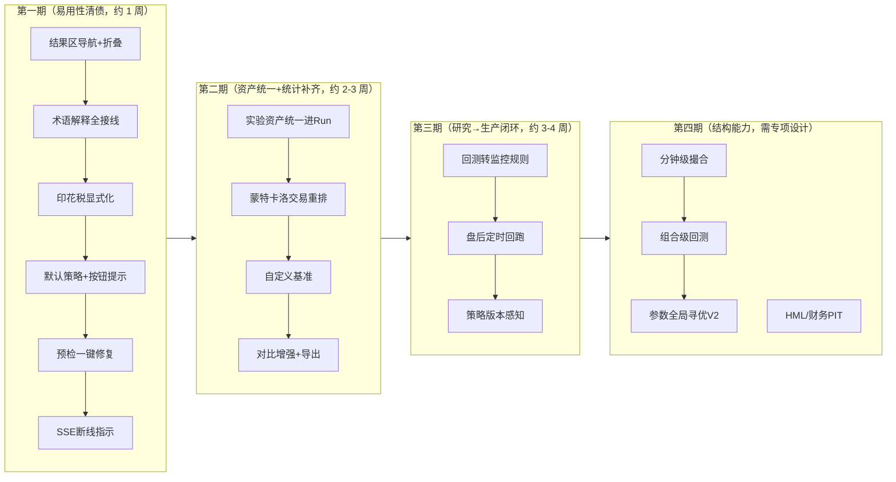

# 回测模块产品评审与路线图

> **评审日期**：2026-08-20
> **评审方式**：代码事实盘点（后端 24+9 端点 / 前端 6 tab 全组件遍历，全部带文件行号证据）+ 竞品对标（2026-08-19 调研结论：QuantConnect / vectorbt / TradingView / Portfolio Visualizer / 聚宽 / 米筐）+ 真实数据端到端验证。
> **视角**：专业产品经理 + 一线使用者。
> **范围**：`/backtest` 页全部六个 tab（因子回测/策略回测/组合策略/参数网格/策略寻优/运行历史）及其后端链路。监控中心、选股、交易纪律域不在本次范围。

---

## 1. 摘要（TL;DR）

回测模块经过 V1 口径修复 → V2 实验闭环 → V3 专业报告 → V4 可信度增强四轮迭代，**统计严谨性与可信度披露已处于免费/本地产品的上游水平**：严格 IS/OOS Walk-Forward、DSR/PBO 过拟合诊断、PSR、量能参与率容量、上市天数门控、行业/风格/状态三维归因、成本敏感性、成交可达性抽查、不可变 Run 持久化——这套组合在 QuantConnect 免费层、聚宽社区版都不完整具备。

当前的主要矛盾已经从"缺专业功能"转向三处：

1. **易用性欠债**：结果区 10+ 区块单列堆叠无导航、术语解释只接线 1/3、无默认策略导致首次运行静默失败、费用口径需要用户心算合并印花税。
2. **实验资产管理断层**：运行历史（Run）与寻优/参数网格实验是两套体系，后者不能收藏/对比/导出，资产无法统一管理。
3. **结构性能力缺口**：无组合级（资金分配）回测、无蒙特卡洛交易重排、基准仅 4 个固定指数、分钟级撮合有数据未接通。

**TOP 5 建议**（详见 §6）：① 结果区锚点导航+区块折叠；② MetricExplainer 全量接线（纯接线，词条已存在）；③ 印花税显式化+费用文案澄清；④ 网格/寻优实验资产统一进 Run 体系；⑤ 蒙特卡洛交易顺序重排。

---

## 2. 现状能力盘点（代码事实）

### 2.1 后端能力矩阵

| 层 | 现状 | 证据 |
|---|---|---|
| 端点面 | 主路由 24 个（含策略/因子 2 个 SSE 流）+ 寻优 5 个 + 参数网格 4 个；legacy 为 `POST /run`（vectorbt，固定告警）与 `/optimize`（组合权重） | `backend/app/api/backtest.py`、`backtest_optimizer.py`、`backtest_parameter_grid.py` |
| stats 键面 | position 模式约 45+ 顶层键（基础绩效 / cost_breakdown / 16 项高级风险 / execution / capacity / listing_age_gate / psr / 相对指标）；full 模式为候选执行口径，年化/Sharpe 恒 None（刻意） | `strategy.py` run() 组装段 |
| 撮合 | 日 K；建仓/清仓各自可选 close_t/open_t+1；T+1；一字涨跌停拒单；100 股整手；双边佣金+双边滑点；量能参与率上限+容量诊断；六种仓位法（等权/评分/等波动/风险平价/均值方差/最大分散） | `engine.py` MatcherConfig |
| 撮合不支持 | 盘中触发、做空、部分成交、盘口冲击模型、**独立印花税字段**（需并入 fees_pct） | `engine.py:673-674, 1869-1875` |
| 策略面 | 18 个内置 + custom/AI/composite 目录接入 + csg_ 自定义信号（字段×运算符白名单编译为 Polars）+ ephemeral 临时组合 | `strategy/engine.py`、`strategy/builtin/` |
| 诊断面 | robustness（分段/Bootstrap/置换/严格 WF/参数扰动/trade_equity_band）、parameter_grid（Pareto 分层）、Brinson-Fachler 行业归因、regime 四桶、成本敏感性、SMB/UMD/LMV 风格归因、fill_reachability、上市门控、寻优 DSR/PBO——11 项全部落地 | `app/backtest/` 各模块 |
| Run 契约 | 单 JSON/schema v1/不可变事实/仅 favorite·label 可 PATCH/20MiB 上限/旧 run_card 只读迁移/比较含 config·trade diff | `run_store.py` |
| 显式缺口 | mode=full 对 robustness 等三端点 422；fama_french 恒 unavailable；无 HML；全市场 186 天服务端内存 guard；门控/量能约束为 fail-open 降级（带计数告警） | `api/backtest.py`、`§12 边界清单` |

### 2.2 前端信息架构

- **6 tab**：因子回测 / 策略回测 / 组合策略 / 参数网格 / 策略寻优 / 运行历史（`pages/Backtest.tsx:17`）。grid/search 切走保持挂载，其余条件卸载。
- **策略回测**：左 18rem 配置面板（专业模式全字段：策略/区间/基准/双口径/资金与约束 8 项/撮合 5 项）+ 高级设置抽屉 8 tab；简单模式隐藏 11 项（`StrategyBacktest.tsx` 各处 `!simpleMode &&`）。
- **结果区**：错误条 → 运行状态 → 方法论警告 → 统计卡 9 项 → 成交约束摘要 → 净值曲线 → 专业诊断 → 可信度诊断 → 行业归因 → 稳健性/状态/成本/风格四个按钮触发面板 → 收益分布 → 三 tab 交易明细（`StrategyBacktest.tsx:1797-2414`）。
- **实验资产**：Run 支持搜索/收藏/标签/2-4 对比/导出 JSON·CSV·HTML/复跑/删除（`RunHistoryPanel.tsx`）；寻优与网格实验仅有 id 恢复+轮询，无收藏/标签/导出/跨实验对比。
- **状态持久化**：`storage.ts` 注册 7 个回测键 + 2 个 SSE 重连裸键 + 条件选股 sessionStorage 交接。

---

## 3. 使用者视角：易用性问题清单

按用户旅程排列，每条标注严重度（高/中/低）与代码证据。

### 3.1 上手与配置

| # | 问题 | 严重度 | 证据 |
|---|---|---|---|
| U1 | **首次进入无默认选中策略，"运行回测"按钮 disabled 且无任何原因提示**。实测：新会话点击运行按钮完全无响应、无 toast、无校验文案，用户只能自己发现要先点策略 chip | **高** | `StrategyBacktest.tsx:713`（初始 null）、`:1635`（disabled）、浏览器实测复现 |
| U2 | 表单校验错误为 11px 红字且**输入变化即消失**，用户可能根本没看到 | 中 | `StrategyBacktest.tsx:1035-1037, 1728` |
| U3 | 费用输入"佣金(万分之)"实际是**双边佣金+印花税合并口径**，文案未说明；A 股卖出印花税 0.05% 需用户自行心算并入 | 中 | `engine.py:673-674` 无双边分离字段 |
| U4 | 预检发现问题后**无一键修复动作**（如"样本过短"不能一键把区间拉长到建议值） | 低 | `runPreflight.ts` 只输出文案 |

### 3.2 运行过程

| # | 问题 | 严重度 | 证据 |
|---|---|---|---|
| U5 | SSE 断线时**无 UI 指示**：依赖 EventSource 自动重连，进度状态条不变，用户无法区分"还在算"和"断了" | 中 | `backtestTask.ts:94-109` |
| U6 | 全市场 >186 天被服务端 guard 拒绝（内存），但前端只在报错后才知道；预检不覆盖该项 | 中 | `api/backtest.py` guard 段 |

### 3.3 结果解读

| # | 问题 | 严重度 | 证据 |
|---|---|---|---|
| U7 | **结果区单列堆叠 10+ 区块，无锚点导航/折叠**：看交易明细需滚过统计卡/曲线/专业诊断/可信度/行业归因/四个诊断面板/分布图 | **高** | `StrategyBacktest.tsx:1721, 2010-2150` |
| U8 | **MetricExplainer 22 词条只接线 8 个**（仅 ProfessionalDiagnostics 一处挂载）；omega/信息比率/跟踪误差/年化波动**字典有词条未接线**；主统计卡 9 项仅夏普有解释；PSR/容量/DSR/PBO/MAE/MFE 无 ? 气泡 | **高** | `MetricExplainer.tsx:23-171`、`ProfessionalDiagnostics.tsx:380` |
| U9 | 四个诊断面板（稳健性/状态/成本/风格）+成交可达性全部手动按钮触发、入口分散在结果区中下部，新用户不知道存在 | 中 | `StrategyRobustnessPanel.tsx`、`RegimeBreakdownPanel.tsx:17` 等 |
| U10 | mode 切换（仓位模拟/全量模拟）放在结果区顶部而非配置区，概念上属于"怎么跑"却出现在"跑完之后" | 低 | `StrategyBacktest.tsx:1779-1784` |

### 3.4 沉淀与迭代

| # | 问题 | 严重度 | 证据 |
|---|---|---|---|
| U11 | **运行历史与寻优/网格实验是两套资产体系**：寻优场景必须先"固化为 Run"才能对比/收藏/导出；网格场景只能"回填"，连固化入口都没有 | **高** | `StrategySearchPanel.tsx:201-228`、`ParameterGridPanel.tsx`（无固化） |
| U12 | Run 对比上限 4 个，无对比报告导出（对比视图纯页面内） | 中 | `RunHistoryPanel.tsx:42, 1153-1157` |
| U13 | 寻优/网格实验之间无法互相对比（如"8 年窗 vs 5 年窗两次寻优"） | 中 | 两 panel 各自独立轮询，无统一实验列表 |

---

## 4. 产品经理视角：缺失功能

### 4.1 与成熟产品的差距对照

| 能力 | QuantConnect | 聚宽/米筐 | TradingView | Portfolio Visualizer | **本项目现状** |
|---|---|---|---|---|---|
| 分钟/盘中撮合 | ✅ | ✅ | ✅(bar replay) | — | ❌（有 minutes/trans 数据未接通撮合） |
| 组合级回测（多策略资金分配） | ✅ | ✅ | — | ✅（核心） | ❌（"组合策略"是信号合并，非资金分配） |
| 参数全局寻优 | ✅（云并行） | ✅ | — | — | ◐（局部网格≤36 + 寻优 V1 不搜参数） |
| 蒙特卡洛分析 | ✅ | ◐ | — | ✅ | ❌（有交易 bootstrap 带，非顺序重排 MC） |
| 自定义基准 | ✅ | ✅ | ✅ | ✅ | ❌（固定 4 指数） |
| 定时/盘后自动回测 | ✅ | ✅ | — | — | ❌（盘后管道有 scheduler，回测未接入） |
| 回测→实盘/监控闭环 | ✅(live) | ✅(模拟交易) | ✅(告警) | — | ◐（监控中心独立存在，回测无"转为监控"出口） |
| 严格 WF/DSR/PBO/PSR/容量 | ◐（部分付费） | ❌ | ❌ | ❌ | ✅ **（本项目领先项）** |
| 报告导出分享 | ✅ | ✅ | ✅ | ✅ | ✅（自包含 HTML；无精简分享卡） |
| 策略版本管理 | ✅ | ✅ | ✅ | — | ❌（Run 存 config 快照，但策略定义变更无追踪） |

### 4.2 缺失功能清单（按优先级）

**P0 —— 高价值低成本（1-3 天级）**

| # | 功能 | 理由 | 复用基础 |
|---|---|---|---|
| F1 | 结果区锚点导航 + 区块折叠记忆 | U7；改动纯前端，结果区组件已模块化 | `StrategyBacktest.tsx` 组件链 + storage.ts |
| F2 | MetricExplainer 全量接线（主统计卡、可信度面板、寻优 DSR/PBO、16 项高级指标补 8 个未接线词条） | U8；词条已存在，纯接线 | `MetricExplainer.tsx` 字典 |
| F3 | 印花税显式化：`stamp_tax_pct` 卖出单边字段（默认 0.05%）+ 费用文案说明；或至少文案澄清合并口径 | U3；A 股用户常识预期成本拆分；cost_breakdown 已有commission/slippage 分列，加第三项是顺直扩展 | `engine.py:1869-1875` cost_breakdown |
| F4 | 无策略选中时运行按钮 tooltip/旁注"请先选择策略"；或默认选中上次策略 | U1 | `storage.ts` 已有 `strategy-backtest-last` |
| F5 | 预检项一键修复（样本过短→拉长区间；未设成本→填入默认佣金印花税） | U4；预检已产出结构化 findings | `runPreflight.ts` |
| F6 | SSE 断线指示（连接状态点 + "已断开，重连中…"） | U5 | `backtestTask.ts` 已有 error/重连钩子 |

**P1 —— 高价值中成本（1-2 周级）**

| # | 功能 | 理由 | 复用基础 |
|---|---|---|---|
| F7 | **实验资产统一**：网格场景支持"固化为 Run"（对齐寻优）；寻优/网格实验以只读摘要行进运行历史列表（带类型徽标，可一键固化） | U11/U13；Run 契约已有 run_type 维度（策略/因子/组合），实验固化为 Run 路径已通 | `run_store.py`、`StrategySearchPanel.tsx:201-228` 先例 |
| F8 | **蒙特卡洛交易顺序重排**：N 次随机重排交易序列 → 最大回撤/终值分布、回撤超阈概率、破产概率 | 统计严谨性最后一块拼图；trade_equity_band 已证明交易级重采样管线可行，MC 是同一数据的另一种重排 | `robustness.py:trade_bootstrap_equity_band` |
| F9 | **自定义基准**：任意指数/个股/已存 Run 净值作为基准 | 相对指标管线（alpha/beta/IR/超额）已通用，只差基准源解析 | `metrics.py:relative_performance_metrics`、strategy.py benchmark 段 |
| F10 | **回测→监控联动**：回测结果页"将此策略转为监控规则"（触发器/风控参数映射到监控中心规则） | 打通研究→生产闭环，监控中心已有规则引擎与持久化 | `app/monitor/`（既有）、策略风控字段同名 |
| F11 | **定时回测**：收藏策略盘后自动重跑（最近 3 个月滚动窗），结果进运行历史并可在策略失效时提醒 | 盘后管道已有 APScheduler；trading 域已有 review_job 定时先例 | `services/` 调度基础设施 |
| F12 | Run 对比上限提升（4→8）+ 对比视图导出 HTML | U12；对比矩阵/曲线/diff 已完整 | `RunHistoryPanel.tsx:1128-1203`、`backtestReport.ts` |
| F13 | **策略版本感知**：Run 记录策略定义 hash；打开历史 Run 时若策略当前定义已变更，提示 diff | Run 已存完整 config 快照；策略目录文件可 hash | `run_store.py` config 快照、`strategy/engine.py` 目录加载 |

**P2 —— 中长期（需设计评审）**

| # | 功能 | 理由 | 主要成本 |
|---|---|---|---|
| F14 | **分钟级撮合**（可选精度档位：日 K / 分钟） | 数据面已有 minutes catalog 路由；是盘中触发、冲击模型、fill-reachability 从"诊断"升级为"能力"的前提 | 撮合引擎重写 + 内存/耗时治理；需保留日 K 档为默认 |
| F15 | **组合级回测**：多策略/多股票池按资金权重合并为单一账户净值（区别现有"组合策略"的信号合并） | 对标 Portfolio Visualizer 核心场景；回答"我同时跑这几个策略整体怎样" | 账户层资金分配器 + 跨策略事件合并 |
| F16 | 策略参数全局寻优（寻优 V2）：在寻优笛卡尔轴上增加参数维（受 DSR 预算约束） | 现有寻优明确不搜参数、网格只搜局部；需防过拟合预算联动 | `optimizer.py` 扩展 + §12 边界同步改写 |
| F17 | ~~HML 价值因子~~ **已论证暂缓（2026-08-20）** | 实测 `financial_report_balance_sheet`：`notice_date` 0/25945 覆盖（全 NULL，无法 PIT）且数据仅 2025-03 起 1 年；不满足接入前置 | 前置：上游财务归档留存 notice_date 且回溯 ≥3 年；届时重启 |
| F18 | 精简分享卡：一张图（净值曲线+5 个关键指标+方法论警告）便于粘贴分享 | HTML 报告已自包含；分享卡是传播场景 | 前端 canvas/svg 导出 |

### 4.3 明确不建议做

- **荐股/信号推送/涨停预测**：项目定位红线（AGENTS.md §1），回测输出维持"历史研究"定位。
- **盘中实时撮合宣称**：分钟撮合（F14）落地前，诊断≠能力；fill-reachability 文案已正确约束，不得在营销口径上越界。
- **全局最优宣称**：寻优/网格的任何扩展（F16）必须维持"受限候选空间+DSR/PBO 诊断"口径。
- **第三套引擎**：vectorbt legacy 与 Polars 主引擎并存已是历史包袱（`services/backtest.py` 未装 extras 503），任何新能力进主引擎，不再分叉。
- **做空/融资融券**：A 股个股融券可行性差、数据面无利率与券源，做了是玩具口径，不如不做。

---

## 5. 专业性待提高点（统计与口径）

| # | 事项 | 现状 | 建议 |
|---|---|---|---|
| Q1 | 成本模型粒度 | 固定 bps 双边滑点 + 合并佣金；无印花税分列；滑点不随参与率/波动率变化 | F3 先拆印花税；冲击成本建模等 F14 分钟撮合后才有意义，此前不伪造 |
| Q2 | 186 天全市场 guard | 服务端拒绝，无分块/流式方案 | 短期：前端预检提示+建议缩池/缩窗；长期：面板分块流式（工程量大，P2 外） |
| Q3 | mode=full 双轨 | 候选执行口径刻意禁年化/Sharpe/稳健性（422） | 维持现状；UI 已隐藏不适用面板，口径正确，不再投入 |
| Q4 | 归因时点性 | 行业映射非 point-in-time（已声明）；风格因子三分位每日重构（正确） | 待行业分类历史数据；当前声明口径已诚实，不升级宣称 |
| Q5 | 统计检验完备性 | PSR/DSR/PBO/Bootstrap/置换/MC 置换检验已有；缺交易顺序 MC（F8）与多重持仓相关性检验 | F8 补齐后，统计披露面达到本文档对标产品中的最高档 |
| Q6 | regime 阈值前视 | 全样本中位数（事后口径，已声明"仅分组解释"） | 可选滚动窗阈值版本作为第二口径并列展示；当前声明已充分，低优先 |

---

## 6. 建议路线图

**分期逻辑**：第一期全部是纯前端/小改动，直接消除 U1-U8 六个高/中严重度易用性问题；第二期把"实验资产"这一产品主线补齐并收齐统计披露；第三期打通已有但孤立的监控中心与调度设施，形成研究→生产闭环；第四期均为结构性工程，各自需要独立设计评审，不与前三期耦合。

**验收口径**：每期交付必须附带——后端 pytest 用例、前端 bun 断言、tsc/build 绿、浏览器端到端至少一条真实数据路径；文档（本文件 §4.2 表格 + `BACKTEST_MATURITY_IMPROVEMENT_PLAN.md` §11/§12）同步更新。

---

## 7. 结论

回测模块的可信度骨架（口径统一、不可变 Run、fail-closed 诊断、过拟合披露）已经搭好且经过真实数据验证——这是最难补的部分，已经完成。当前最高杠杆的投入方向不是再叠加统计方法，而是：

1. **把已有的专业能力"送到用户手边"**（U7/U8/U9：导航、术语、入口分散）——这些功能已经写了代码，却因为交互层欠债而没被消费；
2. **统一实验资产**（U11/F7）——Run 契约是整个模块最成功的设计，应把寻优/网格实验纳入同一资产体系，而不是让它们成为孤岛；
3. **打通研究→生产闭环**（F10/F11）——监控中心、盘后调度都已存在，回测作为上游出口尚未接线，这是产品形态上从"工具"升级为"工作台"的关键一步。

> 本报告全部现状陈述均有代码行号证据（§2/§3 表格）；对标结论引用 2026-08-19 竞品调研；优先级与工作量为评审判断，实施前以各功能独立设计为准。
