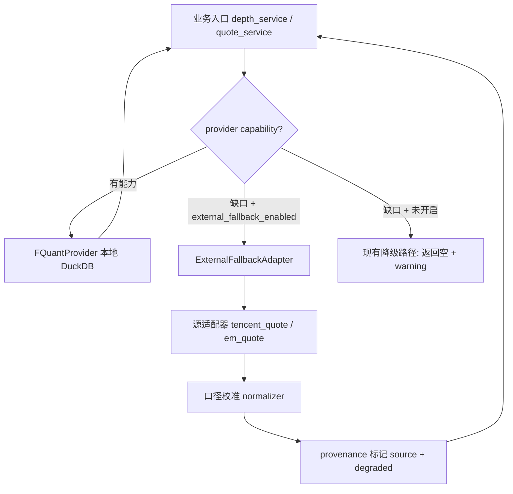

# 受控外部 Fallback 适配层设计

> 日期：2026-08-05  
> 状态：设计稿（未实现）  
> 政策来源：AGENTS.md 第 4 节「受控外部 fallback 契约」（红线 2 于 2026-08-05 修订）  
> 触发背景：`backend/docs/DAILY_STOCK_ANALYSIS_PORTING_ASSESSMENT.md` 与 `VIBE_TRADING_PORTING_ASSESSMENT.md` 审计中发现多个候选能力依赖外部公共免费行情，原"一刀切禁止"红线将其整体排除；经决策者拍板改为受控放开。

## 1. 目标与非目标

**目标**：本地 DuckDB/FQuant 主链路不变的前提下，允许用公共免费行情源补齐本地源**确实不存在**的能力，且全程可识别、可关闭、不污染任何持久化主链路数据。

**非目标**：

- 不建立多源 fallback 链（不做 daily_stock_analysis 式的 DataFetcherManager 优先级路由）；
- 不用外部源提升已有本地数据的"新鲜度"——本地有数据的路径一律不走外部；
- 不接入付费/需密钥源（TickFlow SaaS、Tushare Pro）与券商 SDK（Futu/Longbridge）；
- 不让 fallback 数据进入回测、选股、监控评估的任何输入。

## 2. 缺口清单（fallback 唯一合法服务范围）

| 缺口 | 现状 | fallback 范围 | 首批 |
|---|---|---|---|
| depth 五档盘口 | provider 不暴露 depth capability，`depth_service` 门控降级返回空 | 公共免费源五档快照（腾讯 qt.gtimg 等） | ✅ P1 |
| realtime 快照过期/缺失 | `fstore-markets.duckdb.daily_markets` generation 快照过期时返回空 + warning | 快照级实时报价（仅当本地快照日期 < 当前交易日） | ✅ P1 |
| 港股资金流/换手/开高低收 | `daily_markets` 港股行这些列全 NULL（已实测，见 `fquant_provider.py` 注释） | 免费源港股资金流覆盖差、口径杂 | ❌ 暂不纳入 |
| A 股 minutes/trans | catalog 路由 fail-closed | **永久豁免，绝不 fallback** | — |

新增缺口必须先在本文档登记，才允许写适配器。

## 3. 架构：适配层位置与调用序

**FQuantProvider 保持只读本地 DuckDB，一个字节的外部 HTTP 都不进 provider。** fallback 是 service 侧的一层独立适配：

- 新模块：`backend/app/services/external_fallback/`
  - `adapter.py` — 能力门控、源选择、熔断、缓存；
  - `sources/tencent_quote.py` / `sources/em_quote.py` — 每源一个文件，只负责 HTTP + 原始解析；
  - `calibration.py` — 单位/复权/时区/符号映射校准（每源一组 pinning 常量）；
  - `circuit.py` — 连续失败熔断（默认 5 次失败 → 冷却 10 分钟，自动降级回"返回空 + warning"，系统通知一次）。
- HTTP 一律复用 `eastmoney_client` 模式：Host 白名单、最小请求间隔、`trust_env=False`、超时 ≤5s。
- 全市场快照必须防重复拉取（daily_stock_analysis `20c399e7` 的教训）：单飞 + 短 TTL 缓存，禁止 N 个并发请求各自全量拉一次。

## 4. 六条契约的实现要点

### 4.1 默认关闭

- `preferences.external_fallback_enabled`（默认 `false`）+ `external_fallback_scopes`（`["depth", "realtime"]` 子集，默认空）；
- settings API 暴露开关；关闭时适配层短路，行为与今天完全一致（零回归面）。

### 4.2 仅补真缺口

- depth：仅当 `not provider.capabilities.depth`；
- realtime：仅当本地快照日期 < 当前交易日（以 `cn_today()` 判定）或快照缺失；本地快照新鲜时绝不触发；
- 每次触发记结构化日志（scope、原因、源、行数）。

### 4.3 provenance 全程标记

- 行级：返回 DataFrame/记录带 `source` 列（`fquant_local` / `tencent_quote` / `em_quote`）；
- 响应级：API/SSE 载荷带 `degraded: true` + `sources: {scope: source_name}`；
- UI：使用 fallback 数据的页面区块显示"外部源·降级数据"角标（对照 daily_stock_analysis `b36c7214` 的上下文透明化契约）。

### 4.4 绝不污染主链路（写禁令清单）

fallback 数据**禁止写入**：`kline_daily`、`kline_daily_enriched`、`kline_hk_*`、minute/trans 分区、`data/pools/`、回测输入、选股快照、监控评估上下文。  
允许的去处只有一个：进程内缓存 + 可选的独立 ext_data 时序表（`ext_data/external_fallback/`，带 `source` 列），且该表默认不被任何策略引用。  
保障方式：适配层返回类型与 repository 写入路径物理隔离（适配层拿不到 repo 写句柄），并为"sealed 分区写入方不接受带 `source` 列且 source≠fquant_local 的帧"加防御性断言 + 回归测试。

### 4.5 口径校准 pinning 测试

每源一组测试锁死（照 `fquant/mapping.py` 港股成交量 ×1/×100 校准先例）：

| 校准项 | 内容 |
|---|---|
| 符号映射 | `600000.SH` ↔ `sh600000`；港股 4-5 位补零 ↔ `hk00700`；北交所 `8xxxxx.BJ` |
| 单位 | volume 股/手、amount 元/万元、五档量单位 |
| 比例口径 | `change_pct`/`turnover_rate` 内部小数（÷100），展示边界才 ×100——与现有 `_ratio_from_points` 契约一致 |
| 时区/时间 | 报价时间按 Asia/Shanghai 解析；非交易时段快照标 `stale_session: true` |
| 复权 | fallback 报价一律视为不复权现价，禁止与复权序列拼接 |

### 4.6 限速 + 熔断 + 缓存

- 每 Host 最小间隔 ≥0.35s（与 `eastmoney_client._MIN_INTERVAL` 一致）；
- 单标的查询合并为批量快照请求；
- 熔断：连续 5 次失败或连续 3 次口径校验失败 → 冷却 10 分钟 + 系统通知，冷却期走原降级路径。

## 5. 候选源评估（首批）

| 源 | 端点 | 覆盖 | 需 key | 风险 |
|---|---|---|---|---|
| 腾讯行情 | `qt.gtimg.cn/q=sh600000` | 实时快照 + 五档 + A/港 | 否 | 字段位置契约（`|` 分隔定长序），需 pinning 测试锁死字段序号；GBK 编码 |
| 东财 push2 | `push2.eastmoney.com/api/qt/...` | 实时快照 + 五档 + A/港 | 否 | JSON 字段名变更历史存在；走 Host 白名单 |

首批只接入这两类只读公开端点。任何新源按第 2 节缺口登记 + 本表评估后再加。

## 6. 实施批次

1. **P1 骨架 + realtime**：`external_fallback/` 模块、preferences 开关、realtime 过期兜底、provenance 贯穿 quote_service → SSE → 前端角标；校准 + 熔断测试。
2. **P2 depth**：腾讯五档接入 `depth_service` 缺口路径；连板梯队页角标。
3. **P3 视需求**：港股增强字段（先证明免费源口径可靠，否则维持 NULL 诚实降级）。

每批验收：开关关闭时全量回归零差异；开启后 `degraded` 标记可观测；sealed 分区写禁令断言生效；`scripts/test_fquant_provider.py` 不引入对新源的网络依赖（fallback 测试全部 mock）。

## 7. 与移植评估文档的关系

- `DAILY_STOCK_ANALYSIS_PORTING_ASSESSMENT.md`：原"明确排除"的外部 fetcher 中，纯模式类（兜底排序 `90f62349`、全市场快照缓存 `20c399e7`）按本设计重分类为"受控 fallback 候选"；其 fetcher 代码仍排除（与 SQLAlchemy/DataFetcherManager 耦合，按本设计新写更干净）。
- `VIBE_TRADING_PORTING_ASSESSMENT.md`：其 loader 链维持排除（pandas loader 架构 + 外部源定位与本设计不符），仅本文档的六条契约取代其 fallback 思路。
