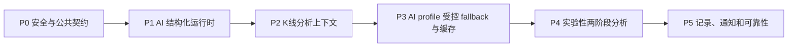
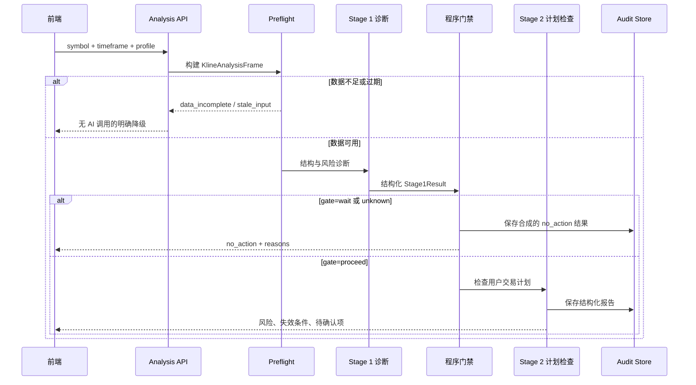
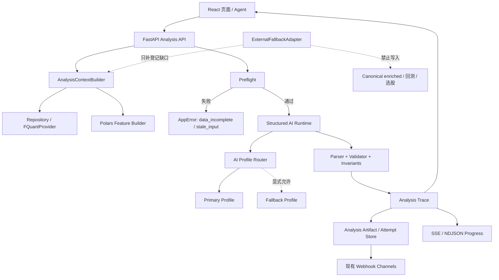
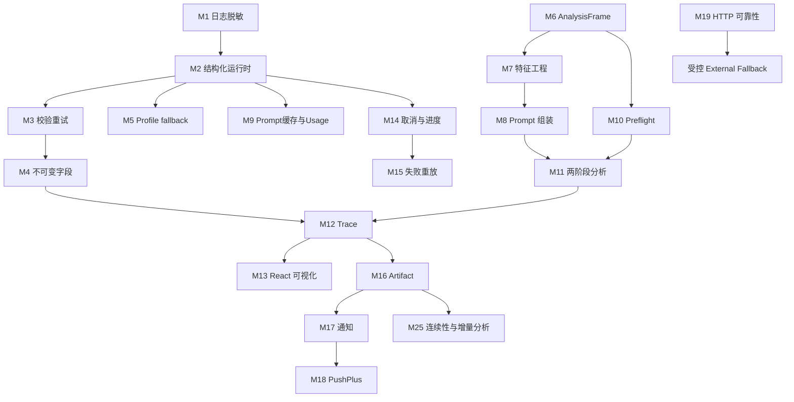

# PA_Agent 可移植能力方案

> 日期：2026-08-07  
> 状态：约定范围已完成；P0-P4 与 P5 M15-M19 已交付，M20/M22 明确排除，M21/M25 经复评暂缓，M23/M24 由既有能力覆盖  
> 源项目：`../PA_Agent`  
> 目标项目：`tickflow-stock-panel`  
> 目标读者：tickflow 后端、前端、数据与 AI 功能维护者  
> 关联约束：[`CONTROLLED_EXTERNAL_FALLBACK_DESIGN.md`](./CONTROLLED_EXTERNAL_FALLBACK_DESIGN.md)、[`YMOS_PORTING_PLAN.md`](./YMOS_PORTING_PLAN.md)、[`FQUANT_INTEGRATION_PROGRESS.md`](./FQUANT_INTEGRATION_PROGRESS.md)
> 路径约定：除 Markdown 链接外，本文代码路径均以 `tickflow-stock-panel` 仓库根目录为基准。  

## 1. 结论摘要

PA_Agent 不应作为一个子系统整体搬入 tickflow。两者产品形态和数据主链路不同：

- PA_Agent 是 PyQt6 桌面应用，核心是多公网行情适配器、秒级刷新、K 线特征组装、两阶段 LLM 决策与结构化记录。
- tickflow 是 React + FastAPI Web 工作台，核心是本地 DuckDB、Polars 批量指标、选股、回测、监控、交易复盘与 YMOS 纪律闭环。
- tickflow 明确不做自动荐股、涨停预测或自动下单，因此不能把 PA_Agent 的交易判断当作执行信号直接接入。

本方案建议迁移的是 PA_Agent 中可复用的**工程机制**，而不是原样复制其 GUI、数据源和交易结论。推荐范围共分四类：

1. **优先迁移**：AI 结构化输出运行时、校验与修复、日志脱敏、单飞/退避/瞬态错误分类、K 线分析上下文、Prompt 特征工程、失败记录与重放。
2. **重构后迁移**：Provider fallback、两阶段分析、决策节点、决策流可视化、复权模式、分析记录模型、通知格式化。
3. **条件式迁移**：PushPlus、MT5/TradingView 等外部适配器、多市场支持、LLM reasoning 缓存。
4. **明确不迁移**：PyQt6 主窗口、Qt 线程体系、PA_Agent 的全量数据源管理器、原始二元决策文本、自动交易/荐股语义、WorkBuddy/Cursor/QClaw 专用连接器。

推荐实施顺序：



优先级上，P0-P2 可独立提升 tickflow 现有 AI 分析质量，不改变产品定位；P3 的 profile fallback 默认关闭；P4 的两阶段分析必须经过产品决策后才允许启用。

### 1.1 实施账本

| 阶段 | 状态 | 已交付范围 | 主要落点 |
|---|---|---|---|
| P0 安全与公共契约 | ✅ 已完成 | 日志密钥脱敏；`AIUsage`/统一错误/attempt/request/cancellation；artifact/trace v1；敏感字段只留摘要与 hash | `backend/app/log_redaction.py`、`backend/app/errors.py`、`backend/app/services/ai_structured/` |
| P1 结构化 AI 运行时 | ✅ 已完成 | JSON fence/语法/schema/不变量校验；分类限次重试；attempt audit/usage；迁移自然语言选股、策略体检与交易归因 | `backend/app/services/ai_structured/`、`nl_screener.py`、`api/strategy_profile.py`、`services/trading/autopsy.py` |
| P2 K 线分析上下文 | ✅ 已完成 | `KlineAnalysisFrame`、Polars 特征、形成中 K 线排除、preflight、Prompt 分层预算；接入个股分析并保持 Markdown/SSE 展示 | `backend/app/services/analysis_context.py`、`stock_analyzer.py`、`api/stock_analysis.py` |
| P3 profile fallback 与缓存 | ✅ 已完成 | 显式 allowlist fallback（默认关闭）、内存健康态、provider 原生 usage/cache 聚合、四入口预算上限、设置页备用顺序与实际 profile/usage 展示 | `ai_provider.py`、`ai_routing.py`、`ai_budgets.py`、`ai_usage_snapshot.py`、`frontend/src/components/AiExecutionMetaBadge.tsx` |
| P4 两阶段分析 | ✅ 已完成（Gate C 条件全部落实） | Stage1 诊断 → 程序门禁 → Stage2 计划审查；仅检查已保存计划，门禁只可保持或降级；默认关闭；SSE 进度/取消、append-only artifact、JSON/Markdown 导出、列表式 trace UI | `services/trading/plan_check.py`、`api/trading_plans.py`、`frontend/src/components/analysis/DecisionTrace.tsx`、`frontend/src/pages/Trading.tsx` |
| P5 记录、通知和可靠性 | ✅ 已完成约定范围 | M15/M16 append-only artifact、失败队列和纯重放计划；M17 飞书报告卡片；M18 PushPlus 可选复盘通道；M19 受控 HTTP 可靠性。M21/M25 经复评暂缓，不为追求完整移植扩张主链路 | `analysis_artifacts.py`、`webhook_adapter.py`、`preferences.py`、`sina_tencent_client.py` |

2026-08-06 验证基线：终审修复后后端全量回归 `1075 passed`；前端 `npm run build` 通过；后端 `import app.main` 通过；真实开发服务 `/health` 返回 `status=ok`；浏览器验证计划台默认关闭文案与 PushPlus Token 配置入口，页面无 console/error/network 诊断。P3 fallback、P4 计划检查均默认关闭；M19 只强化既有受控适配器，不增加数据源，不写 canonical/enriched 数据。

## 2. 调研基线

### 2.1 PA_Agent 已有能力

PA_Agent 当前主要能力包括：

- 数据源：MT5、TradingView、EastMoney、EastMoneyFutures、AkShare、YFinance、Tushare。
- 实时刷新：1 秒 RefreshLoop、`_in_flight` 防重入、指数退避、状态广播与 zombie worker 回收。
- 数据模型：`KlineBar`、`IndicatorBundle`、`KlineFrame`，区分形成中 K 线和已收盘 K 线。
- 指标：EMA20、ATR14，全量和增量两种计算路径。
- AI：Stage1 市场诊断、Stage2 交易决策、门禁结果、结构化 Prompt、JSON 校验和修复。
- 决策节点：程序预填、锁定节点、可覆盖节点、决策 trace 归一化。
- LLM：流式 reasoning/content、usage 统计、多个外部 provider 的降级尝试。
- 记录：AnalysisRecord JSON、JSONL 追加记录、失败待处理记录、交易 CSV 和图表截图。
- 通知：飞书与 PushPlus。
- 安全：日志中的 API key 脱敏；配置文件本身仍需改进，不能照搬其明文密钥存储。

关键源文件：

- `../PA_Agent/pa_agent/orchestrator/two_stage.py`
- `../PA_Agent/pa_agent/ai/prompt_assembler.py`
- `../PA_Agent/pa_agent/ai/json_validator.py`
- `../PA_Agent/pa_agent/ai/decision_nodes.py`
- `../PA_Agent/pa_agent/ai/decision_tree.py`
- `../PA_Agent/pa_agent/ai/trace_normalize.py`
- `../PA_Agent/pa_agent/data/base.py`
- `../PA_Agent/pa_agent/data/refresh_loop.py`
- `../PA_Agent/pa_agent/util/logging.py`
- `../PA_Agent/pa_agent/records/`

### 2.2 tickflow 已有对应能力

tickflow 已有：

- 本地数据源：`FQuantProvider`、fstore/tdx DuckDB、generation snapshot、catalog 路由和 lease 引用计数。
- 指标：Polars 向量化 MA/EMA/MACD/BOLL/KDJ/ATR/RSI、41 列 engine compatibility 指标、关键价位和日内增量递推。
- AI：多 profile、OpenAI-compatible/Codex/ACP 类型、个股分析、财务分析、市场复盘、自然语言选股、策略生成和自由 Agent。
- 交易治理：动作门禁、append-only 决策审计、机械红旗、AI 归因、策略 profile 和变更提案。
- 实时机制：QuoteService 后台轮询、SSE 推送和监控规则。
- 记录：agent session、alerts、trade events、decision audit、trade journal。
- 通知：飞书、钉钉、企微、MeoW webhook。

关键目标文件：

- `backend/app/services/ai_provider.py`
- `backend/app/services/ai_profiles.py`
- `backend/app/services/stock_analyzer.py`
- `backend/app/services/financial_analyzer.py`
- `backend/app/services/market_recap.py`
- `backend/app/services/nl_screener.py`
- `backend/app/services/agent_loop.py`
- `backend/app/services/agent_runner.py`
- `backend/app/services/agent_bus.py`
- `backend/app/services/agent_sessions.py`
- `backend/app/api/agent.py`
- `backend/app/services/trading/`
- `backend/app/data_providers/`
- `backend/app/indicators/pipeline.py`
- `backend/app/services/quote_service.py`
- `backend/app/api/intraday.py`

## 3. 迁移原则

### 3.1 保持本地数据主链路

`FQuantProvider` 必须继续只读本地 DuckDB。PA_Agent 的公网行情适配器不得直接注册为 tickflow provider，不得进入选股、回测、监控或 enriched 持久化主链路。

外部行情能力只能遵守 `CONTROLLED_EXTERNAL_FALLBACK_DESIGN.md`：

- 默认关闭；
- 只补已登记的真实能力缺口；
- 必须带 provenance 和 degraded 标记；
- 只能进进程缓存或隔离的 ext_data；
- 禁止污染 sealed 分区；
- 必须有限速、缓存、熔断和口径 pinning 测试。

### 3.2 AI 只做分析辅助

迁移后的 AI 能力：

- 可以解释数据、生成研究结论、校验交易计划和形成结构化报告；
- 不得直接生成下单请求；
- 不得绕过 `trading/gates.py`；
- 不得把 LLM 输出作为选股、回测或监控引擎的隐式输入；
- 所有交易相关输出必须标记为辅助分析，最终动作由用户明确确认。

### 3.3 复用 tickflow 的领域模型

不得复制 PA_Agent 的 `Settings`、`EventBus`、Qt Signal、`KlineBar`、`AnalysisRecord` 类到 tickflow。迁移时应映射到：

- Pydantic v2 API schema；
- Polars DataFrame；
- FastAPI service；
- SSE/NDJSON；
- tickflow 现有 JSON/JSONL repository；
- `AppError` 标准错误码；
- `ai_profiles` 和 `secrets.json`。

### 3.4 先提炼契约，再迁移算法

PA_Agent 的核心模块复杂度很高，尤其是 `PromptAssembler`、`JsonValidator`、`TwoStageOrchestrator` 和 `decision_nodes.py`。禁止直接复制整个文件。每个候选应先形成小接口和独立测试，再按 tickflow 需要重写。

## 4. 候选总表

| ID | 候选能力 | 价值 | 成本 | 风险 | 建议 |
|---|---|---:|---:|---:|---|
| M1 | 日志密钥脱敏 | 高 | 低 | 低 | 优先迁移 |
| M2 | AI 结构化输出统一运行时 | 高 | 中 | 中 | 优先迁移 |
| M3 | JSON 错误分类、修复与重试 | 高 | 中 | 中 | 优先迁移 |
| M4 | 不可变字段与防篡改校验 | 高 | 低中 | 中 | 优先迁移 |
| M5 | AI profile 健康状态与受控 fallback | 高 | 中 | 中 | 重构后迁移 |
| M6 | K 线分析上下文模型 | 高 | 中 | 低 | 优先迁移 |
| M7 | K 线形态特征工程 | 高 | 中 | 低中 | 优先迁移 |
| M8 | Prompt 分层组装与 token 预算 | 高 | 中 | 中 | 优先迁移 |
| M9 | Prompt/前缀缓存与 usage 统计 | 中 | 中 | 中 | 条件式迁移 |
| M10 | 数据不足 preflight 与无调用降级 | 高 | 低中 | 低 | 优先迁移 |
| M11 | 两阶段结构化分析 | 中高 | 高 | 高 | 实验性迁移 |
| M12 | 决策节点与 trace 归一化 | 中高 | 高 | 中高 | 重构后迁移 |
| M13 | 决策流可视化 | 中 | 中 | 低 | M12 后迁移 |
| M14 | AI 取消、超时、进度与 worker 监管 | 高 | 中 | 中 | 优先迁移 |
| M15 | 失败分析待处理队列与重放 | 高 | 中 | 低中 | 优先迁移 |
| M16 | 分析记录 envelope 与 sidecar | 高 | 中 | 低 | 重构后迁移 |
| M17 | 飞书通知格式增强 | 中 | 低 | 低 | 选择性迁移 |
| M18 | PushPlus 通道 | 低中 | 低 | 低中 | 条件式迁移 |
| M19 | 外部 HTTP 单飞、退避和瞬态错误分类 | 高 | 中 | 中 | 受控迁移 |
| M20 | 外部源多 Host/TLS 指纹轮换 | 低中 | 中 | 高 | 默认不迁移 |
| M21 | 查询级 qfq/hfq/none | 中 | 中高 | 高 | 条件式迁移 |
| M22 | 多市场/多行情适配器 | 低中 | 高 | 高 | 不纳入当前主线 |
| M23 | EMA20/ATR14 增量算法 | 低 | 低 | 低 | 无需迁移，已有覆盖 |
| M24 | 自由追问会话 | 低 | 低 | 低 | 无需迁移，tickflow 已更完整 |
| M25 | 跨轮连续性与增量分析 | 中高 | 中高 | 中高 | M16 后条件式迁移 |

### 4.1 最终处置账本

> “暂缓/排除/已有覆盖”是多 Agent 评估后的明确产品决策，不属于未完成实现；若需求或上游契约变化，必须重新通过对应决策门。

| ID | 最终处置 | 当前证据 |
|---|---|---|
| M1 | ✅ 已交付 | `app/log_redaction.py` |
| M2 | ✅ 已交付 | `services/ai_structured/runtime.py` |
| M3 | ✅ 已交付 | `services/ai_structured/parser.py`、`retry.py` |
| M4 | ✅ 已交付 | `services/ai_structured/immutable.py` |
| M5 | ✅ 已交付，默认关闭 | `services/ai_routing.py`、AI 设置页 |
| M6 | ✅ 已交付 | `services/analysis_context.py` |
| M7 | ✅ 已交付 | `services/analysis_context.py` 的 Polars 特征行 |
| M8 | ✅ 已交付 | `assemble_prompt()`、`ai_budgets.py` |
| M9 | ✅ 已交付 | provider 原生 usage/cache 聚合、`ai_usage_snapshot.py` |
| M10 | ✅ 已交付 | `preflight_analysis()` |
| M11 | ✅ 已交付，默认关闭 | `services/trading/plan_check.py` 两阶段计划检查 |
| M12 | ✅ 已交付 | `AnalysisTraceNode`、trace DAG 校验 |
| M13 | ✅ 已交付 | `frontend/src/components/analysis/DecisionTrace.tsx` |
| M14 | ✅ 已交付 | cancellation token、attempt registry、进度/timeout/watchdog |
| M15 | ✅ 已交付 | `analysis_artifacts.py` 失败队列与纯重放计划 |
| M16 | ✅ 已交付 | append-only analysis artifact/sidecar |
| M17 | ✅ 已交付 | 飞书报告白名单卡片 |
| M18 | ✅ 已交付，可选 | PushPlus 固定 host 适配、secrets-only Token、设置与复盘 UI |
| M19 | ✅ 已交付 | 受控 HTTP single-flight/cache/retry/backoff/circuit breaker |
| M20 | ❌ 明确不迁移 | 多 Host/TLS 指纹轮换不符合服务条款与项目安全边界 |
| M21 | ⏸ 经复评暂缓 | canonical enriched 口径已稳定，暂无查询级复权的明确场景 |
| M22 | ❌ 明确不迁移 | 不引入 PA_Agent 多公网行情适配器，继续遵守本地 provider 主链路 |
| M23 | ♻️ 既有能力覆盖 | 指标流水线已有 EMA/ATR 批量计算，无需复制增量算法 |
| M24 | ♻️ 既有能力覆盖 | tickflow Agent/分析会话能力已更完整 |
| M25 | ⏸ 经复评暂缓 | 跨日论点追踪与失效/重放语义未形成产品契约 |

## 5. M1：日志密钥脱敏

### 5.1 迁移内容

PA_Agent 的 `MaskingFormatter` 与 `mask_secret()` 可提炼为 tickflow 的通用日志过滤器：

- 掩码 AI profile API key；
- 掩码 webhook token；
- 掩码 Authorization/Bearer header；
- 掩码 URL query 中的 token/key；
- 掩码异常对象和第三方 SDK error message 中回显的密钥片段。

### 5.2 目标设计

新增：

- `backend/app/log_redaction.py`：纯函数和 logging Filter；
- `redact_secret(value, keep_prefix=3, keep_suffix=2)`；
- `redact_mapping(payload, sensitive_keys)`；
- `SecretRedactionFilter.filter(record)`。

集成位置：

- `backend/app/main.py` 日志初始化；
- `backend/app/services/ai_provider.py`；
- webhook 发送模块；
- external fallback HTTP 日志。

### 5.3 验收

- 完整密钥、Bearer token 和 webhook token 不出现在日志；
- 普通股票代码、URL host 和 request id 不被误脱敏；
- Filter 处理 dict、list、exception args 和字符串；
- 不修改 `secrets.json` 的现有存储契约。

## 6. M2-M4：AI 结构化输出运行时

### 6.1 问题

tickflow 当前 AI 入口各自处理文本：

- `nl_screener.py` 有一套 JSON 解码和一次重试；
- `trading/autopsy.py` 使用文本行解析；
- `backend/app/api/strategy_profile.py` 定义 AI 深度体检格式；`backend/app/services/strategy_profile.py` 只负责 profile 读写与结构校验；
- 个股、财务和复盘主要返回 Markdown 文本。

这些实现难以统一错误分类、重试、token 统计、取消和审计。

### 6.2 目标接口

建议新增 `backend/app/services/ai_structured/`：

```text
ai_structured/
├── models.py       # 请求、结果、错误与 usage schema
├── runtime.py      # 调用、解析、校验、重试编排
├── parser.py       # fence 清洗、JSON 抽取、有限修复
├── validator.py    # Pydantic/业务不变量
├── retry.py        # 重试分类与 corrective prompt
├── immutable.py    # 不可变字段、防篡改检查
└── audit.py        # attempt 记录、usage、耗时和失败原因
```

公共接口：

```python
async def run_structured_ai(
    *,
    profile_id: str | None,
    messages: list[dict[str, str]],
    output_model: type[BaseModel],
    invariants: tuple[Invariant, ...] = (),
    immutable_context: dict[str, object] | None = None,
    retry_policy: RetryPolicy = DEFAULT_RETRY_POLICY,
    cancel_token: CancellationToken | None = None,
    purpose: str,
) -> StructuredAIResult:
    ...
```

结果 envelope：

```json
{
  "status": "ok",
  "data": {},
  "raw_text": "...",
  "attempts": 1,
  "usage": {
    "prompt_tokens": 0,
    "cached_prompt_tokens": 0,
    "completion_tokens": 0,
    "total_tokens": 0
  },
  "provider": "openai_compat",
  "profile_id": "...",
  "model": "...",
  "request_id": "...",
  "elapsed_ms": 0,
  "warnings": []
}
```

### 6.3 错误分类

借鉴 PA_Agent 的内部分类，但不要混淆“输入数据不足”和“模型输出无效”。内部保留细分类；重试耗尽后使用 AI 专用错误码，不复用当前表示“账户/策略等上游未就绪”的 `blocked_by_dependency`：

| 类别 | 含义 | 是否重试 | 对外表达 |
|---|---|---:|---|
| `syntax` | JSON fence、截断、尾逗号或括号错误 | 可有限修复，失败后重试 | `ai_output_invalid`，detail 保留 `syntax` |
| `missing` | 模型输出缺少必填字段 | corrective prompt 后重试 | `ai_output_invalid`，detail 保留 `missing` |
| `invalid` | 类型、枚举、范围或业务不变量失败 | corrective prompt 后重试 | `ai_output_invalid`，detail 保留 `invalid` |
| `plaintext` | 期望 JSON 却返回自然语言 | 重试 | `ai_output_invalid`，detail 保留 `plaintext` |
| `quota` | 额度、预算、限流 | 不做内容重试 | `ai_provider_error`，detail 保留 `quota` |
| `cancelled` | 用户取消或任务取消 | 不重试 | attempt 状态 `cancelled`，不伪装成错误或 `no_change` |
| `provider` | 网络、鉴权、模型不存在或 provider 不可用 | 按路由策略换 profile/降级 | `ai_provider_error`，detail 保留具体原因 |

P0 实施时必须在 `backend/app/errors.py` 注册 `ai_output_invalid`、`ai_provider_error`，并同步 README 与 YMOS 的统一失败语义清单。输入 K 线不足、数据过期等 preflight 问题仍分别使用 `data_incomplete`、`stale_input`；它们不属于模型输出校验错误。

默认策略建议：

- 格式错误最多重试 2 次；
- 语义不变量错误最多重试 1 次；
- quota/auth/cancel 不做同 profile 重试；
- JSON 修复只处理明确、可证明安全的语法缺陷，不猜字段值；
- 保留原始输出和每次校验问题，不把失败伪装成成功。

### 6.4 防篡改与不可变字段

借鉴 `detect_cheat`，但适配场景：

- 股票代码、市场、数据截止时间、数据来源、交易 ID、策略 profile ID 由程序注入并锁定；
- LLM 不得修改真实成交、持仓、红旗、门禁结果和财务原始数据；
- 只允许 LLM 填写解释、归因、风险提示和建议动作；
- 发现不可变字段漂移时，不应自动覆盖程序事实，应标记 `immutable_violation` 并拒绝本次输出。

首批接入入口：

1. `nl_screener`；
2. `strategy_profile` AI 体检；
3. `trading/autopsy`；
4. 后续结构化个股分析。

## 7. M5：AI profile 健康状态与受控 fallback

### 7.1 不直接复制 PA_Agent fallback 链

PA_Agent 的 WorkBuddy→Cursor→QClaw 顺序绑定特定桌面环境，不适合 tickflow。tickflow 应基于现有具名 AI profile 做通用路由。

### 7.2 目标行为

建议新增 `ai_route_policy`：

- 默认仍使用用户在当前入口明确选中的 profile；
- 仅当用户开启 `allow_profile_fallback` 时，才允许使用备用 profile；
- fallback 列表按 profile ID 配置，不按 provider kind 硬编码；
- auth 失败、quota、模型不存在、网络超时分别记录原因；
- 不允许静默切换到数据政策不同的远端模型；
- 切换后响应必须带 `fallback_used=true`、原 profile 和实际 profile；
- token budget 必须跨 fallback attempt 累计。

### 7.3 健康状态

每个 profile 维护内存态：

- 连续失败次数；
- 最近成功时间；
- 最近错误分类；
- cooldown 截止时间；
- latency EWMA；
- quota/auth 故障状态。

不得把 API key 写入健康状态或日志。

### 7.4 验收

- fallback 默认关闭；
- 显式选择 profile 且关闭 fallback 时，失败不换模型；
- 开启后只按 allowlist 切换；
- 每个 attempt 可审计；
- 取消不会触发备用 profile；
- quota 失败不会在同一 profile 无限重试。

## 8. M6-M10：K 线分析上下文与 Prompt 工程

### 8.1 KlineAnalysisFrame

PA_Agent 的 `KlineFrame` 不直接复制。建议定义只用于 AI 分析的 Pydantic envelope：

```python
class KlineAnalysisFrame(BaseModel):
    symbol: str
    market: str
    timeframe: str
    data_as_of: datetime
    source: str
    degraded: bool = False
    adjustment: Literal["qfq", "hfq", "none"]
    bars: list[KlineAnalysisBar]
    indicators: dict[str, list[float | None]]
    features: list[KlineFeatureRow]
    warmup_bars: int
    warnings: list[str]
```

构建器目标路径：

- `backend/app/services/analysis_context.py`；
- 数据只从 repository/provider 公开接口读取；
- 不直接 ATTACH 新 DuckDB；
- 默认排除形成中 K 线；
- 明确 `data_as_of`、source、adjustment 和 freshness warning；
- 少于规定收盘 K 线时 preflight 失败，不调用 AI。

### 8.2 Preflight

建议首批规则：

- 日 K 少于 60 根：拒绝技术结构分析；
- ATR/EMA 等所需 warmup 不足：标记 `data_incomplete`；
- 数据截止日期过旧：返回 `stale_input`；
- source 为 external fallback：不得进入交易计划建议，只能用于展示型解释；
- 港股未复权或字段缺失：在结果中强制 warning；
- symbol/market/timeframe 不一致：拒绝分析。

### 8.3 特征工程

可迁移 PA_Agent 的 K 线形态特征概念，但应在 Polars 中重写：

- bar type：阳线、阴线、十字、趋势棒；
- body/range 比例；
- 上下影线比例；
- 收盘在整根 K 线中的位置；
- Range/ATR；
- EMA20 位置和斜率；
- 相邻重叠率；
- inside/outside bar；
- ii/iii、ioi 等组合形态；
- 成交量相对均值；
- 与关键价位的距离。

这些特征应作为独立纯函数：

- 输入：tickflow 规范 Polars frame；
- 输出：附加列，不修改 canonical enriched 分区；
- 只在请求内存或隔离 cache 使用；
- 用固定 fixture 对拍边界情况；
- 不把自然语言标签写入策略或回测主表。

### 8.4 Prompt 分层

建议 Prompt 分为：

1. 稳定 system contract；
2. 场景方法论；
3. 结构化市场事实；
4. K 线/指标/形态特征；
5. 用户问题；
6. 输出 schema 和不变量；
7. corrective prompt，仅用于重试。

Prompt assembler 不得依赖 GUI 文本，也不得读取任意本地文件。方法论文档按明确 allowlist 加载。

### 8.5 Token 预算

- K 线采用列式紧凑表或 JSON rows，避免同时重复发送原始列和等价文字；
- 大量指标按场景选择，不默认注入全部 60+ 指标；
- 记录 prompt section token 估算；
- 达到 budget 时优先裁剪新闻、重复解释和旧 K 线，不裁剪 schema、不变量和数据来源；
- 为每个入口设置独立的最大 context 和 completion 预算。

### 8.6 场景知识路由与历史经验

可借鉴 PA_Agent 的 strategy file routing、pattern brief 和 ExperienceReader 思路，但应使用 tickflow 的 allowlist：

- 按 `purpose`、分析阶段和 strategy profile 选择方法论文档，不让模型自行读取任意文件；
- Stage1 只加载诊断方法和数据字典，Stage2 只加载计划检查、风险和门禁说明；
- 历史 artifact 检索必须同 symbol/market/timeframe/schema，并默认只取结构化摘要；
- 过期、失败、被用户标记错误或违反 immutable 约束的 artifact 不进入上下文；
- 个人交易经验、账户和流水相关内容默认不检索，只有用户显式 opt-in 后才能使用脱敏聚合；
- 记录实际加载的知识版本、artifact ID 和裁剪原因，保证结果可追踪。

该机制归入 M8 Prompt 组装，不单独引入知识库框架或向量数据库。

## 9. M9：Prompt 缓存与 usage 统计

### 9.1 可迁移部分

- 稳定 system prompt 缓存；
- 方法论文档内容缓存；
- token usage、cached prompt token 和 cache hit rate 记录；
- reasoning/content 分通道时分别记录；
- session 和日级预算累积。
- profile 可声明 `thinking`、`reasoning_effort` 等推理控制，但只有 provider capability 明确支持时才下发；
- unsupported 参数不得静默伪装为已生效，应在结果 warning 中标记；
- reasoning 与 final content 双通道是可选能力，不要求所有 provider 伪造 reasoning；

### 9.2 限制

- 只有 provider 明确支持 prefix/prompt cache 时启用；
- 不伪造 cached token；
- 不缓存含 API key、个人交易流水或未脱敏账户信息的完整 prompt；
- cache key 必须包含模型、system prompt hash、方法论版本和 output schema 版本；
- profile 切换不得复用不兼容 cache。

## 10. M11：可选两阶段结构化分析

### 10.1 迁移定位

不得命名为“AI 荐股”或“自动交易决策”。推荐名称：

- “结构化个股分析”；或
- “交易计划辅助检查”。

该能力只产生报告和风险提示，不产生订单。

### 10.2 流程



### 10.3 与 PA_Agent 的关键差异

Stage2 不让模型自由生成“买入/卖出点”，而是检查用户已有计划：

- 是否给出失效条件；
- 止损是否存在且距离合理；
- 期限是否与 strategy profile 一致；
- 仓位是否超过规则；
- 证据是否互相冲突；
- 当前数据是否足以做判断；
- 是否触发现有 `trading/gates.py` 红线。

### 10.4 GateResult

建议输出：

```python
class AnalysisGateResult(BaseModel):
    status: Literal["proceed", "wait", "unknown"]
    reasons: list[str]
    missing_inputs: list[str]
    data_as_of: datetime
    source: str
    program_rules_version: str
```

`wait`/`unknown` 结果由程序合成，不调用 Stage2。合成 artifact 约定 `result.status="no_action"`，同时保留 `gate.status="wait"|"unknown"`；`no_action` 不是 GateResult 枚举值，也不是错误码。这样既复用 PA_Agent 的降本思路，也保持 tickflow 的 fail-closed 纪律。

### 10.5 功能开关

- 默认关闭；
- 只在个股详情和 Trading 计划页展示；
- 不进入 Screener、Monitor 或 Backtest；
- 不自动写交易事件；
- 不自动绕过门禁；
- 输出必须附带模型、profile、数据截止时间、程序规则版本和免责声明。

## 11. M12：决策节点与 trace 归一化

### 11.1 不复制原始二元决策树

PA_Agent 的“二元决策.txt”和节点编号与其 Prompt、策略文本紧耦合。直接复制会引入不可维护的第二套交易领域语言。

### 11.2 推荐模型

使用 tickflow 已有领域对象生成 trace：

- 数据充足性节点；
- 趋势/波动/流动性事实节点；
- strategy profile 失效条件节点；
- `trading/gates.py` 门禁节点；
- 机械红旗节点；
- 用户确认节点；
- 最终报告状态节点。

节点结构：

```python
class AnalysisTraceNode(BaseModel):
    id: str
    kind: Literal["fact", "program_rule", "model_assessment", "user_input"]
    label: str
    status: Literal["pass", "fail", "unknown", "skipped"]
    source_refs: list[str]
    reason: str | None = None
    locked: bool = False
```

程序事实和门禁节点 `locked=true`，LLM 只能解释，不能改状态。

### 11.3 归一化

- symbol、date、price、ratio 和 bar range 使用统一 formatter；
- source refs 指向结构化字段，而不是仅保存自然语言；
- trace 必须是 DAG；
- 每个最终状态都能回溯到至少一个程序事实；
- 不允许同一 locked 节点在重试前后改变状态。

## 12. M13：决策流可视化

PA_Agent 的 PyQt6 `DecisionFlowViz` 不迁移代码，只迁移交互概念。

React 版本建议：

- 节点按 program/model/user 三类配色；
- 明确锁定节点；
- 展开节点显示来源字段和数据截止时间；
- `wait/unknown` 显示缺失输入；
- 重试时保留 attempt 切换；
- 禁止用动画掩盖仍在运行或失败状态；
- 结果可导出 Markdown/JSON。

目标路径可为：

- `frontend/src/components/analysis/DecisionTrace.tsx`；
- 接入现有 `frontend/src/pages/StockAnalysis.tsx` 或 `frontend/src/pages/Trading.tsx`，不新增第二套页面目录约定。

只有 M11/M12 的结构化契约稳定后才实施前端。

## 13. M14：取消、超时、进度与 worker 监管

### 13.1 迁移内容

PA_Agent 的 `CancelToken`、worker 超时和 zombie 回收思想应扩展 tickflow **已有**的 Agent attempt runtime，而不是另造一套。现有 `agent_runner.py`、`agent_bus.py`、`agent_sessions.py` 和 `api/agent.py` 已提供 attempt ID、取消端点、状态持久化和基础事件；M14 的增量范围是：

- 把现有 attempt/取消契约推广到 `nl_screener`、`stock_analyzer` 等非 Agent AI 入口；
- 所有 stage 和 retry 边界检查既有 cancellation event；
- HTTP stream 断开后按入口策略取消或转后台；
- provider 调用设置连接、读取和总超时；
- 超时后不进入下一个 stage；
- stuck attempt 由 watchdog 标记失败，并保留最后心跳与阶段；
- 新事件继续复用现有 agent bus/session store，避免双 runtime。

### 13.2 事件

SSE/NDJSON 统一事件：

- `attempt_started`；
- `preflight_completed`；
- `stage_started`；
- `token_usage_updated`；
- `validation_failed`；
- `retry_started`；
- `stage_completed`；
- `attempt_cancelled`；
- `attempt_failed`；
- `attempt_completed`。

事件不包含 API key、完整私密 prompt 或原始交易流水。

## 14. M25：跨轮连续性与增量分析

PA_Agent 的 `decision_continuity.py`、失效检查、翻转冷却和增量 Stage1 更新有迁移价值，但必须等 M16 analysis artifact 稳定后再做：

- 新分析可以引用上一份同 symbol/timeframe/schema 的 artifact；
- 程序先比较数据截止时间、策略 profile、失效条件和 locked facts，再决定是否允许 continuity；
- 前结论只作为“历史模型判断”，不得升级为程序事实；
- 方向或状态翻转必须输出触发证据和冷却原因；
- 失效条件命中、profile/schema 变化或数据跨度过大时强制全量分析；
- 增量分析生成新 artifact，通过 `parent_attempt_id` 串联，禁止覆盖旧结论；
- 不直接复用包含敏感交易信息的完整旧 prompt。

该能力主要服务用户重复查看同一标的时的变化解释和成本控制，不用于自动持仓决策。

## 15. M15-M16：失败队列与分析记录

### 15.1 失败待处理队列

建议引入隔离的 AI dead-letter/retry store：

```text
data/user_data/ai_attempts/
├── attempts/{attempt_id}.json
├── failed/{attempt_id}.json
└── index.jsonl
```

记录：

- purpose、profile/model；
- 输入引用和 hash，不默认复制完整敏感输入；
- output schema version；
- 原始输出，可按入口决定是否保存；
- 错误分类和校验问题；
- retry 次数；
- usage 和耗时；
- cancellation 状态。

### 15.2 重放规则

- 只允许用户或管理员显式重放；
- 重放使用当前 profile 前提示是否模型已变化；
- 必须重新读取数据并更新 `data_as_of`；
- 旧结果不可覆盖，生成新 attempt 并通过 parent_attempt_id 关联；
- quota/auth/cancelled 默认不自动重放；
- 交易相关 attempt 不得因后台重放写入交易事件。

### 15.3 分析记录 envelope

不复制 PA_Agent 的 `AnalysisRecord`，而是定义 tickflow 版：

```python
class AnalysisArtifact(BaseModel):
    id: str
    attempt_id: str
    request_id: str
    purpose: str
    status: Literal["ok", "failed", "cancelled"]
    schema_version: str
    prompt_version: str
    program_rules_version: str | None
    created_at: datetime
    data_as_of: datetime
    symbol: str | None
    market: str | None
    adjustment: Literal["qfq", "hfq", "none"] | None
    source_refs: list[str]
    provider: str
    profile_id: str
    model: str
    result: dict[str, object] | None = None
    error: AIErrorDetails | None = None
    trace: list[AnalysisTraceNode] = Field(default_factory=list)
    warnings: list[str] = Field(default_factory=list)
    usage: AIUsage
    parent_attempt_id: str | None = None
```

它是研究/审计 artifact，不是订单或策略事实源。

## 16. M17-M18：通知能力

### 16.1 飞书格式增强

可借鉴 PA_Agent 对分析报告的消息格式化：

- 标题、symbol、数据截止时间；
- 风险等级和 gate 状态；
- 关键证据；
- 失效条件；
- warning；
- panel 内详情链接；
- attempt/request id。

推送仍复用 tickflow 现有 webhook adapter，不复制 PA_Agent notifier 单例。

### 16.2 PushPlus

PushPlus 可作为可选 webhook channel，优先级低于现有飞书/钉钉/企微/MeoW。只有明确用户需求时实现：

- token 进入 secrets store；
- 只接受显式启用；
- 失败不阻断主业务；
- 遵守日志脱敏；
- 不把完整交易流水或账户信息发送到第三方。

## 17. M19-M20：外部 HTTP 可靠性模式

### 17.1 可迁移模式

PA_Agent 公网数据适配器中可复用的工程模式：

- single-flight，防止并发重复全量拉取；
- 每 Host 最小间隔；
- 短 TTL 缓存；
- 连接/读取/总超时；
- 瞬态错误分类；
- 带 jitter 的指数退避；
- 连续失败熔断；
- 状态变化通知；
- worker/watchdog 超时检测；
- 请求结果 provenance。

这些模式应并入 `CONTROLLED_EXTERNAL_FALLBACK_DESIGN.md` 规划中的 `external_fallback/`，而不是另建第二套网络层。

### 17.2 瞬态错误分类

建议只按类型和 HTTP status 判定，字符串关键字作为兜底：

- connect reset/closed；
- timeout；
- TLS EOF；
- 429；
- 502/503/504；
- broken pipe；
- source-specific temporary unavailable。

400/401/403/404、schema drift 和口径校验失败不能当普通瞬态错误无限重试。

### 17.3 不默认迁移的模式

TLS fingerprint 轮换和多个 CDN host 轮换只适用于源明确需要且法律/使用条款允许的情况。默认不实施：

- 不以规避服务端限制为目的；
- 不伪造大量客户端身份；
- 不在未登记源上自动换 host；
- 不突破 `CONTROLLED_EXTERNAL_FALLBACK_DESIGN.md` 的 host allowlist。

## 18. M21：查询级复权模式

### 18.1 现状

tickflow canonical enriched 数据使用前复权。PA_Agent 支持 qfq/hfq/none。

### 18.2 推荐边界

不改变 canonical enriched 主表。若确有需求，只在个股展示和 AI 分析查询层增加：

- `adjustment=qfq`：默认；
- `adjustment=none`：展示真实历史价格；
- `adjustment=hfq`：仅在因子和数据覆盖验证后开放。

禁止不同复权序列拼接，回测仍使用当前统一口径。

### 18.3 验收

- 除权日前后固定 fixture 对拍；
- qfq canonical 结果不变；
- API/SSE/分析 artifact 明确标记 adjustment；
- external fallback 现价只能视为 none，不能拼入 qfq/hfq 历史序列；
- 监控与策略不因 UI 查询参数改变口径。

## 19. M22：多市场与多适配器

### 19.1 当前不纳入主线

不建议把 MT5、TradingView、AkShare、Tushare、YFinance 和 EastMoney K 线适配器注册到 tickflow provider：

- 破坏本地数据优先；
- 形成多套口径；
- 增加网络、限流和 schema drift 风险；
- 把选股/回测的一致性问题重新引入；
- 与 `CONTROLLED_EXTERNAL_FALLBACK_DESIGN.md` 的非目标冲突。

### 19.2 未来条件

只有出现以下明确产品需求时单独立项：

- 外汇/期货研究；
- 美股或港股批量研究；
- 用户自有 MT5 账户的只读行情；
- TradingView 符号或图表联动。

即使立项，也应作为隔离的数据域和 capability，不并入 A 股 canonical 表。

## 20. 无需迁移的能力

### 20.1 指标

tickflow 已覆盖并超过 PA_Agent：

- EMA20；
- ATR14；
- 全量和增量计算；
- 更完整的 MA/MACD/BOLL/KDJ/RSI/量价/关键价位体系。

只需在分析上下文中选择所需指标，无需复制 `pa_agent/indicators/`。

### 20.2 自由会话

tickflow 已有：

- 服务端 session；
- 多轮消息；
- NDJSON/SSE 流式；
- 工具循环；
- 取消、导出和附件上下文。

PA_Agent 的 `FreeChatSession` 不应迁移。

### 20.3 事件总线和 GUI 线程

Qt EventBus、QThread worker、pyqtgraph、主窗口和决策流 widget 不适用于 React/FastAPI。只迁移取消、进度和可视化的语义，不迁移实现。

PA_Agent 的交易 CSV 配图和图表截图不迁移。Web 端继续直接渲染现有图表；如需导出，使用前端已有页面状态生成图片或报告，不能把桌面截图流程搬入后端。

## 21. 明确禁止迁移

| 能力 | 不迁移理由 |
|---|---|
| PA_Agent PyQt6 GUI 和 QThread 体系 | 技术栈不匹配，tickflow 已有 Web/SSE 架构 |
| 原始 `settings.json` 密钥存储 | PA_Agent 当前 API key 可明文保存，不符合 tickflow secrets 边界 |
| WorkBuddy/Cursor/QClaw 专用连接器 | 环境强绑定，tickflow 应使用具名 profile 和通用协议 |
| 原始“二元决策.txt”及节点编号 | 与 PA_Agent Prompt/术语强耦合，会形成第二套领域语言 |
| 自动荐股、自动下单或绕过门禁 | 与产品定位及 YMOS 纪律约束冲突 |
| 7 源自动行情 fallback 链 | 与本地 provider 及受控 external fallback 契约冲突 |
| 公网源数据写 canonical enriched | 破坏数据来源、一致性和回测可审计性 |
| LLM 修改程序事实 | 交易、持仓、红旗和门禁结果必须由程序锁定 |
| 静默切换 AI profile | 违反用户选择与成本/隐私透明性 |
| 未经确认发送敏感交易信息到通知渠道 | 隐私和外部披露风险 |

## 22. 目标架构



## 23. 实施阶段

### P0：安全和公共契约

目标：为后续迁移建立统一边界，不改变 AI 产品行为。

任务：

1. M1 日志脱敏；
2. 定义 `AIUsage`、`AIErrorCategory`、`StructuredAIResult`；
3. 统一 attempt/request ID；
4. 明确 cancellation event；
5. 定义 analysis artifact 和 trace schema v1；
6. 确认敏感字段和保留策略。
7. 在 `backend/app/errors.py` 注册 AI 专用错误码，并同步 README 与 YMOS 的统一失败语义清单。

验收：

- 现有 AI 入口行为不变；
- 日志无密钥；
- schema 可独立序列化；
- 取消、错误和 usage 有统一表达；
- 新功能全部默认关闭。

### P1：结构化 AI 运行时

目标：先替换重复、脆弱的解析逻辑。

任务：

1. 实现 M2-M4；
2. 首先迁移 `nl_screener`；
3. 再迁移 strategy profile AI 体检；
4. 再迁移 trading autopsy；
5. 显式实施 M14：复用现有 Agent attempt runtime，向非 Agent AI 入口扩展取消、进度、provider 超时和 watchdog；
6. 接入 attempt audit 和 usage。

验收：

- 旧输入输出契约保持兼容；
- 格式/字段/不变量错误可区分；
- retry 次数有上限；
- 原始输出与校验问题可追踪；
- 不可变字段修改会失败；
- provider quota/auth 不发生错误重试风暴。

### P2：K 线分析上下文

目标：提升现有个股 AI 分析的事实密度和可审计性。

任务：

1. M6 `KlineAnalysisFrame`；
2. M7 Polars 特征工程；
3. M8 Prompt assembler 和 token budget；
4. M10 preflight；
5. 接入现有 `stock_analyzer`，保持当前 Markdown 展示兼容。

验收：

- 形成中 K 线不进入默认分析；
- data_as_of/source/adjustment 可见；
- 数据不足时零 AI 调用；
- Prompt 不重复注入等价数据；
- 特征 fixture 可对拍；
- 现有个股分析页面无功能回退。

### P3：AI profile 受控 fallback 与缓存

目标：提高 AI 可用性和成本可观测性。

任务：

1. M5 profile 健康状态和显式 fallback；
2. M9 prompt cache/usage；
3. 每入口预算；
4. 设置页展示 fallback 开关和备用顺序；
5. 响应展示实际使用 profile。

验收：

- 默认关闭；
- 用户未允许时绝不换 profile；
- 切换透明可见；
- token 跨 attempt 累计；
- cooldown 和取消行为正确；
- 不缓存敏感完整 prompt。

P3 完成记录（2026-08-06）：

- 非流式入口（自然语言选股、策略体检、交易归因）返回 additive `ai_meta`；实际 profile、fallback 及 provider 原生 usage 可见，旧业务字段保留。
- fallback 仅在用户开启 allowlist 后，对 provider/quota/auth/timeout 等可判定故障按顺序尝试；取消和输出校验错误不触发切换。
- 缓存仅保留方法论文档的安全内容与 provider 返回的 `cached_prompt_tokens` 计数；不缓存完整 prompt、凭据或账户/交易数据。
- 四入口 completion/context 预算由 `ai_budgets.py` 集中限制，调用方只能向下收缩。

### P4：实验性两阶段分析

前置：P0-P3 稳定，且产品明确接受“结构化个股分析/计划检查”入口。

Gate C 已于 2026-08-06 通过多 Agent 条件式决策：架构与安全评估判定现有 P0-P3 基座足以隔离实现；产品仲裁判定真实存在“计划写入后、执行前”的质量检查空档；可测试性与 UX 的 defer 意见均源于语义误读风险，而非技术缺口。实施必须吸收其约束：`proceed` 只表示输入与前置条件充分，UI 使用中性文案，不呈现为买入/执行信号；程序门禁只能保持或降级，模型不能升级；空计划或关键输入缺失 fail-closed；M13 使用列表式 trace，不复制 PA_Agent 的交易终态图或动画。

任务：

1. M11 Stage1 + program gate + Stage2；
2. M12 trace；
3. 对接现有 trading gates 和 strategy profile；
4. M13 React 决策流；
5. artifact 导出。

验收：

- 功能默认关闭；
- `wait/unknown` 时不调用 Stage2；
- Stage2 只检查用户计划，不生成订单；
- locked 节点不可被模型修改；
- 不进入 screener/backtest/monitor；
- 不写 trade event；
- 全链路可取消、可审计；失败重放在 P5 的 M15 交付后再作为增强验收。

P4 当前交付（2026-08-06）：

- 新增 `services/trading/plan_check.py`：Stage1 只诊断 canonical 日 K 事实，程序门禁复用 `trading/gates.py` 与 strategy profile；只有门禁为 `proceed` 才运行 Stage2，且 Stage2 schema 不含订单、方向、建议价格或执行动作。
- 计划条目以 additive 字段补齐策略、计划价、止损、退出规则、期限和失效条件；旧计划仍可读取。检查入口只接受已持久化的 `date + entry_id`，不读取前端临时文本。
- 新增默认关闭的 `structured_plan_check_enabled` 开关、独立 AI profile 选择、SSE 进度与取消、attempt/result/export API。取消、失败和成功均使用统一 artifact；trace DAG 与 locked 节点由程序生成和校验。
- 前端计划台使用中性文案显示数据充分性、诊断、审查项和可审计决策链；`proceed` 不直接展示为交易建议。JSON/Markdown 导出只读取结构化白名单字段并固定附带免责声明。

### P5：记录、通知和可靠性

任务：

1. M15 失败队列与重放；
2. M16 analysis artifact；
3. M17 飞书模板；
4. 按需求决定 M18 PushPlus；
5. 将 M19 工程模式合并进受控 external fallback 实施；
6. 评估 M21 查询级复权。
7. M16 稳定后，按实际需求实施 M25 跨轮连续性与增量分析。

P5 当前交付（2026-08-06）：

- M15/M16：`analysis_artifacts.py` 将结构化结果安全投影为 append-only artifact；失败副本独立、索引只追加、重放计划只生成新 attempt/parent 关联并强制刷新 `data_as_of`，不执行 AI 或写交易事件。
- M17：`build_analysis_card_payload()` 只读取报告白名单字段；账户、持仓与完整流水一律忽略，不阻断既有 webhook。
- M18：复评结论为“值得作为严格可选的低风险通知通道”。PushPlus 用于用户已配置渠道的监控告警，并可在复盘页单独勾选接收已生成报告；固定 `https://www.pushplus.plus/send`、`trust_env=False`、5 秒超时、失败静默降级。Token 只存 `secrets.json`（0600），API/UI 只返回掩码；不接收自定义 URL，不进入分析、交易或行情输入链路。
- M19：既有 Sina/Tencent 适配器增加 host allowlist、`trust_env=False`、限流、短 TTL cache、single-flight、有界重试/退避与熔断。它不启用外部 fallback，真正接线仍须遵守受控 fallback 契约。
- M21（查询级复权）暂缓：当前 canonical enriched 复权口径稳定，新增查询级 `hfq/qfq` 会扩大缓存键、跨市场口径和回测一致性验证面，但没有已确认的用户场景。
- M25（跨轮连续性/增量分析）暂缓：当前产品没有“同一论点跨日追踪”的明确入口；在 parent chain、失效策略与 stale replay 的用户语义确定前，不引入隐式上下文或 token 成本。

验收：

- 失败不会丢失或伪装成功；
- 重放不覆盖旧结果；
- 通知不泄露敏感信息；
- external fallback 不污染 canonical 数据；
- 关闭所有开关时行为与迁移前一致。
- 若未来重新开启 M25，必须生成新 artifact、保留 parent chain，并在连续性失效时强制回到全量分析；当前不启用。

## 24. 测试与验证策略

### 24.1 单元测试

必须覆盖：

- JSON fence、尾逗号、截断、plaintext；
- 必填字段和枚举错误；
- immutable violation；
- retry 上限；
- quota/auth/cancel 不重试；
- token 累计；
- feature builder 边界 K 线；
- warmup 和 forming bar 排除；
- source/adjustment/freshness；
- trace DAG、locked 节点；
- 日志脱敏；
- fallback profile allowlist；
- external fallback single-flight/熔断/缓存；
- qfq/hfq/none fixture（若实施 M21）。

### 24.2 Golden tests

为结构化分析固定：

- K 线输入 fixture；
- 程序特征输出；
- preflight 结果；
- GateResult；
- trace 节点和来源；
- schema version。

Golden test 不应断言 LLM 自然语言逐字相同，只断言程序事实、结构、不变量和状态转换。

### 24.3 集成验证

- mock OpenAI-compatible provider，覆盖 stream、tool、quota、timeout、malformed JSON；
- API 断开与取消；
- SSE 事件顺序；
- attempt store 和重放；
- 通知失败不阻断 artifact；
- profile fallback 可见；
- 关闭功能开关时旧路径零差异。

### 24.4 实际 smoke test

每批必须运行真实入口：

- P1：自然语言选股和 strategy profile AI 体检；
- P2：个股分析页面，分别测试正常、历史不足、数据过期；
- P3：主 profile 故障后显式 fallback；
- P4：proceed/wait/unknown 三条流程；
- P5：失败重放和飞书测试消息。

## 25. 可观测性

新增指标建议：

- `ai_attempt_total{purpose,status,provider}`；
- `ai_retry_total{reason}`；
- `ai_validation_failure_total{category}`；
- `ai_fallback_total{from_profile,to_profile,reason}`；
- `ai_tokens_total{purpose,profile,kind}`；
- `ai_latency_ms{purpose,stage}`；
- `ai_cancel_total{purpose}`；
- `analysis_preflight_reject_total{reason}`；
- `analysis_gate_total{status}`；
- `external_fallback_total{scope,source,result}`。

日志字段：request_id、attempt_id、purpose、profile_id、model、stage、error_category、elapsed_ms；不记录密钥和默认不记录完整 prompt。

## 26. 安全与隐私

- API key 和 webhook token 只进入 secrets store 和运行时内存；
- 日志、trace、artifact 必须脱敏；
- 用户交易流水默认不进入外部 LLM；
- 如将聚合交易指标用于 AI，必须显式 opt-in；
- 外部 fallback 数据必须展示来源；
- AI profile fallback 需要用户开启；
- 结构化输出不能覆盖程序事实；
- 通知默认不发送账户、持仓数量、完整交易流水；
- artifact 应支持保留周期和用户删除；
- 重放前显示实际 profile、模型和预计成本；
- 不执行 PA_Agent Prompt 或第三方响应中携带的工具指令。

## 27. 发布与回滚

### 27.1 功能开关

建议：

- `ai_structured_runtime_enabled`；
- `ai_profile_fallback_enabled`；
- `ai_kline_features_enabled`；
- `structured_stock_analysis_enabled`；
- `analysis_artifact_store_enabled`；
- `external_fallback_enabled`（沿用既有设计）；
- `analysis_adjustment_modes_enabled`。

### 27.2 发布策略

- 每个入口单独灰度；
- 新旧解析器可短期 shadow compare，但只返回旧结果；
- shadow 比较只记录结构差异，不重复触发通知或交易副作用；
- 观察 validation failure、latency、token 和 fallback 指标；
- 稳定后删除旧路径，不长期保留双实现。

### 27.3 回滚

- 关闭入口开关即恢复旧路径；
- schema 采用版本化并保持旧 artifact 可读；
- 新 store 与交易事实 store 物理隔离；
- external fallback 关闭后回到当前“返回空 + warning”；
- 复权查询开关关闭后只允许 canonical qfq；
- rollback 不删除历史 artifact，只停止新写入。

## 28. 主要风险与缓解

| 风险 | 影响 | 缓解 |
|---|---|---|
| 两阶段分析被理解为荐股 | 偏离产品定位、合规风险 | 改为计划检查；默认关闭；不产生订单；显式免责声明 |
| 第二套领域模型 | 维护成本和语义冲突 | 映射现有 strategy profile/gates/AppError，不复制 PA 类 |
| LLM 输出被当程序事实 | 审计污染 | immutable 字段和 locked trace 节点 |
| Prompt 膨胀 | 成本和延迟失控 | 分层组装、场景指标选择、预算和 usage |
| 自动 fallback 泄露或增费 | 隐私/成本不可控 | 默认关闭、profile allowlist、透明显示、跨 attempt 预算 |
| 外部数据污染 | 回测/选股不可复现 | 遵守受控 fallback，物理隔离与 provenance |
| JSON 修复掩盖语义错误 | 错误结果被接受 | 只修语法，不猜值；业务不变量独立校验 |
| 失败队列保存敏感内容 | 隐私风险 | 输入引用/hash 优先，入口级保存策略和保留期限 |
| qfq/hfq/none 混用 | 指标和价格失真 | canonical qfq 不变，查询级隔离，明确 adjustment |
| Prompt/规则版本漂移 | 结果不可复现 | schema/prompt/program_rules 版本进入 artifact |

## 29. 依赖关系



## 30. 推荐首批范围

若只允许一个开发分支，建议首批只做以下五项：

1. M1 日志密钥脱敏；
2. M2-M4 结构化 AI 运行时，先迁移 `nl_screener`；
3. M6/M10 K 线 AnalysisFrame + preflight；
4. M7/M8 特征工程 + Prompt 分层，接入现有个股分析；
5. M14 attempt 取消、进度和 usage。

首批明确不做：

- 两阶段交易计划检查；
- profile 自动 fallback；
- 外部行情源；
- PushPlus；
- hfq；
- 决策流 UI。

这样可以先验证 PA_Agent 工程能力是否真正改善 tickflow 的 AI 输出稳定性、成本和可审计性，而不改变产品定位和数据主链路。

## 31. 实施决策门

在进入下一阶段前必须回答：

### Gate A：P1 → P2

- 结构化运行时是否降低解析失败率？
- 重试是否显著增加 token 成本？
- 取消和 timeout 是否可靠？
- 日志是否完成脱敏？

### Gate B：P2 → P3

- 特征工程是否提高个股分析可读性和事实一致性？
- Prompt token 是否在预算内？
- data_as_of/source/adjustment 是否全链可见？

### Gate C：P3 → P4

- 用户是否明确需要结构化计划检查？
- 产品是否接受 `proceed/wait/unknown` 语义？
- 交易门禁、策略 profile 和分析 trace 是否能用一套领域词汇？
- 是否确认该功能不进入自动选股/监控/下单？

2026-08-06 决策记录：5 个独立评估切片（架构、产品风险、安全、UX、可测试性）加 1 次产品仲裁完成。架构、安全与产品评估支持条件式 GO；UX/可测试性建议 defer 的核心理由均为本 Gate 尚未给出可执行语义。产品仲裁接受用户授权的多 Agent 决策方式并解除 Gate C，统一边界如下：

1. `proceed/wait/unknown` 只作为机器门禁状态；UI 分别表述为“信息充分，已生成检查 / 暂缓检查 / 信息不足”，不使用交易方向或执行措辞；
2. Stage2 只检查用户已保存的计划，不包含订单、方向、建议价格或执行动作字段；
3. 程序门禁拥有最终权威，只能保持或把结果降级为 `wait/unknown`，模型不能把程序结果升级；
4. 功能默认关闭、每次由用户显式触发；不写 trade event，不进入 screener/backtest/monitor；
5. M13 采用可访问的列表式 trace，程序事实节点锁定；导出物保留数据截止时间、规则版本、实际 profile 与免责声明。

任何 Gate 不通过，停在当前阶段，不为追求“完整移植”继续扩大范围。

## 32. 源码证据索引

### PA_Agent

- 数据模型：`../PA_Agent/pa_agent/data/base.py`
- 刷新与容错：`../PA_Agent/pa_agent/data/refresh_loop.py`
- EastMoney 客户端：`../PA_Agent/pa_agent/data/eastmoney_client.py`
- Prompt：`../PA_Agent/pa_agent/ai/prompt_assembler.py`
- JSON 校验：`../PA_Agent/pa_agent/ai/json_validator.py`
- 重试与不可变字段：`../PA_Agent/pa_agent/ai/retry_policy.py`
- 一致性校验：`../PA_Agent/pa_agent/ai/coherence_checks.py`
- 决策节点：`../PA_Agent/pa_agent/ai/decision_nodes.py`
- 决策树：`../PA_Agent/pa_agent/ai/decision_tree.py`
- trace：`../PA_Agent/pa_agent/ai/trace_normalize.py`
- 跨轮连续性：`../PA_Agent/pa_agent/ai/decision_continuity.py`
- 两阶段编排：`../PA_Agent/pa_agent/orchestrator/two_stage.py`
- LLM client：`../PA_Agent/pa_agent/ai/deepseek_client.py`
- 记录：`../PA_Agent/pa_agent/records/`
- 日志 formatter：`../PA_Agent/pa_agent/util/logging.py`
- 密钥掩码：`../PA_Agent/pa_agent/util/mask_secret.py`
- 通知：`../PA_Agent/pa_agent/notify/`

### tickflow

- AI provider：`backend/app/services/ai_provider.py`
- AI profiles：`backend/app/services/ai_profiles.py`
- 自然语言选股：`backend/app/services/nl_screener.py`
- 个股分析：`backend/app/services/stock_analyzer.py`
- Agent loop：`backend/app/services/agent_loop.py`
- Agent attempt 执行：`backend/app/services/agent_runner.py`
- Agent 事件总线：`backend/app/services/agent_bus.py`
- Agent session 持久化：`backend/app/services/agent_sessions.py`
- Agent API：`backend/app/api/agent.py`
- 交易门禁：`backend/app/services/trading/gates.py`
- AI 归因：`backend/app/services/trading/autopsy.py`
- 机械红旗：`backend/app/services/trading/red_flags.py`
- 策略 profile AI 体检：`backend/app/api/strategy_profile.py`
- 策略 profile 存储与结构校验：`backend/app/services/strategy_profile.py`
- 数据 provider：`backend/app/data_providers/`
- 指标：`backend/app/indicators/pipeline.py`
- QuoteService：`backend/app/services/quote_service.py`
- SSE：`backend/app/api/intraday.py`
- 受控外部 fallback：`backend/docs/CONTROLLED_EXTERNAL_FALLBACK_DESIGN.md`
- YMOS：`backend/docs/YMOS_PORTING_PLAN.md`
- 结构化计划检查：`backend/app/services/trading/plan_check.py`
- 计划检查 API：`backend/app/api/trading_plans.py`
- 决策链 UI：`frontend/src/components/analysis/DecisionTrace.tsx`
- PushPlus 安全适配：`backend/app/services/webhook_adapter.py`

## 33. 最终建议

PA_Agent 对 tickflow 最有价值的不是它的桌面端、七个数据源或交易判断文本，而是以下五个可独立复用的工程思想：

1. 让 AI 输出成为可校验、可重试、可审计的结构化契约；
2. 在调用 AI 前先由程序做数据充足性和门禁判断；
3. 把程序事实锁定，禁止模型在重试时篡改；
4. 用紧凑 K 线特征和分层 Prompt 控制 token 与事实密度；
5. 对外部依赖实施单飞、退避、熔断、取消和失败重放。

P0-P4 与 P5 的 M15-M19 已按上述边界交付。后续不再以“完整移植”为目标：M21 查询级复权与 M25 连续性分析保持暂缓，只有出现明确用户场景、口径契约和可验证收益时才重新过决策门；PA_Agent 的桌面 GUI、多公网数据源、自动交易/荐股语义与专用连接器继续明确排除。
