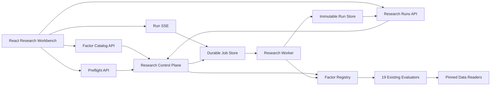

# Research Workbench V2 设计

## 1. 文档状态

- 状态：Implemented（2026-08-31）
- 目标读者：tickflow-stock-panel 前端、后端和研究模块维护者
- 范围：将 `docs/TODO.md` 中已有代码实现的 19 项研究能力接入统一前端工作台
- 非目标：改变任何因子算法、研究裁决、数据口径或交易生命周期

本文保留实施前基线与最终架构，便于追溯迁移决策：

- **实施前基线**：第 2–4 节记录重构启动时可核对的仓库事实。
- **已实现**：第 5–16 节所定义的统一目录、控制面、Durable Run、Workbench 与治理闭环已落地。

## 2. 背景与问题

### 2.1 当前后端能力

`backend/app/api/research.py` 已为 `docs/TODO.md` 中 19 项研究能力提供 HTTP 入口，因子实现分布在 `backend/app/services/`。其中 11 项另有全市场 adapter，注册于 `backend/app/services/full_market_research.py`，由 `backend/scripts/run_full_market_research.py` 离线运行。

当前 19 项研究能力为：

1. N 字金凤凰
2. 15 分钟方向 + 5 分钟确认
3. 弱转强
4. 量价序列突破
5. MACD 多阶段
6. 单阳不破
7. 左一 K 线防守位
8. 日线开盘价锚定
9. 坚定持有四形态
10. 独孤趋势
11. MERA 路由
12. 大涨前四特征
13. S1-S10 盘中逃命信号
14. N 字回调深度分档
15. 五类负面清单
16. 十字星形态
17. 筹码峰五条判读
18. 周线拉旗杆
19. 四大逃生窗口

`docs/TODO.md` 当前记录 3 项 `[x]`、16 项 `[~]`。`[x]` 表示研究工作已经收口，不表示因子被接受或晋级；当前 3 项 `[x]` 的研究结论均为 `rejected`。现有研究能力没有自动进入默认策略、短线池、Agent 候选或交易执行。

### 2.2 当前前端能力

当前前端侧边栏在 `frontend/src/components/Layout.tsx` 注册“研究中心”，路由位于 `frontend/src/router.tsx`，页面为 `frontend/src/pages/Research.tsx`。

该页面包含五个 Tab：

- 研究假设
- 定时研究
- 市场数据
- 分析计算
- 做T适用性

其中“市场数据”读取 `/api/market-data/*`，其余研究功能主要读取 hypotheses、schedules、单标的分析和做T适用性接口。当前 `frontend/src` 没有调用 `/api/research/factors/*`，19 项因子均没有页面入口。

当前 `/signal-scorecard`、`/cross-section` 和 `/backtest` 的因子回测属于独立接口链路，不是上述 19 项研究因子的前端入口。

### 2.3 核心问题

直接为 19 个接口分别增加表单和结果页面会产生以下问题：

- 前端需要理解 19 套不同请求和响应。
- 数据可用、研究裁决、工程状态和晋级状态会被混为一个状态。
- 全市场计算被误放进同步 HTTP 请求会阻塞 FastAPI。
- 事件明细和曲线可能形成过大响应。
- provenance 被隐藏在原始 JSON，而不是成为研究结果的一部分。
- 现有 `Research.tsx` 和 `frontend/src/lib/api.ts` 会继续增长为浅层巨型模块。

## 3. 目标与非目标

### 3.1 目标

1. 19 项研究能力全部出现在统一因子目录。
2. 19 项全部能从前端创建研究运行。
3. 11 个现有 full-market adapter 可通过 Durable Job 页面化运行。
4. 每次运行都有不可变请求、结果、数据谱系和裁决。
5. 数据不可用必须显示具体原因，不能以空数组代替。
6. 前端不重算研究指标、风险指标或 verdict。
7. 运行结果可关联研究假设和证据。
8. 所有研究运行使用统一 catalog、preflight、run 和 artifact 契约。
9. 完成迁移后删除旧的因子专用 HTTP 入口和旧研究单页，不保留双轨调用。

### 3.2 非目标

- 不改变 19 个 evaluator 的算法。
- 不改变 pinned generation、PIT、OOS、执行时点、成本和 baseline 口径。
- 不给研究结果增加交易动作、订单或仓位语义。
- 不自动晋级因子。
- 不在前端连接 DuckDB、Parquet 或 snapshot 路径。
- 不把普通回测引擎并入 Research Workbench。

## 4. 关键架构决策

### ADR-1：以统一 Factor Registry 取代 19 套 HTTP 编排

**决定**：新增 Research Control Plane，使用一个 Factor Registry 同时服务目录、参数 schema、preflight、interactive run、full-market run 和结果 normalization。

**理由**：调用方只学习一套接口；因子差异集中在 adapter 内；HTTP 和 CLI 不再维护两套注册表。

**拒绝方案**：前端直接调用现有 19 个 route。该方案使前端成为因子差异的编排者，模块没有深度。

### ADR-2：所有运行均为 Durable Run

**决定**：单标的、批量和全市场研究都先创建 Run，再由 worker 执行。

**理由**：统一运行历史、取消、重试、重启恢复和证据链；避免“快速运行不留记录、全市场运行另走 CLI”的双轨模型。

**代价**：快速单标的研究也会多一次 job 创建和查询，但本地工作台可接受该开销。

### ADR-3：研究不可用是领域结果，不是系统错误

**决定**：缺 PIT、样本不足、coverage 不足等结果落盘为 `completed + unavailable`。只有程序、存储或 worker 失败才是 `failed`。

### ADR-4：full-market 使用独立受控进程

**决定**：full-market 不在 FastAPI 请求线程运行。worker 保留现有单实例锁、线程限制、RSS 上限、nice、generation pin 和 cohort hash。

### ADR-5：Run 事实不可变

**决定**：请求、结果、provenance 和 artifact 不可修改；仅 `favorite` 和 `label` 可 PATCH。重跑创建新 Run，并以 `source_run_id` 关联旧 Run。

### ADR-6：前端只实现五种结果 profile

**决定**：19 项原始结果由后端 normalizer 收敛到五种 profile：

- `arm_comparison`
- `event_signal`
- `shape_distribution`
- `retrieval`
- `calendar_effect`

前端不为每个因子创建专用结果协议。

## 5. 目标架构



### 5.1 后端模块

拟议新增：

```text
backend/app/research/
├── contracts.py
├── catalog.py
├── preflight.py
├── runner.py
├── job_store.py
├── run_store.py
├── worker.py
└── normalizers/
    ├── arm_comparison.py
    ├── event_signal.py
    ├── shape_distribution.py
    ├── retrieval.py
    └── calendar_effect.py
```

现有 `backend/app/services/` 中的因子 evaluator 和 data reader 保持算法职责，不下沉 HTTP、持久化或页面字段。

### 5.2 FactorDefinition interface

```python
class FactorDefinition(Protocol):
    id: str
    title: str
    category: FactorCategory
    description: str
    engineering_status: EngineeringStatus
    supported_scopes: tuple[RunScope, ...]
    result_profile: ResultProfile
    request_model: type[BaseModel]
    data_requirements: tuple[DataRequirement, ...]

    def preflight(
        self,
        context: ResearchContext,
        scope: RunScope,
        parameters: BaseModel,
    ) -> PreflightResult: ...

    def execute(
        self,
        context: ResearchContext,
        scope: RunScope,
        parameters: BaseModel,
        progress: ProgressReporter,
        cancel: CancellationToken,
    ) -> RawFactorResult: ...

    def normalize(
        self,
        raw: RawFactorResult,
    ) -> NormalizedResearchResult: ...
```

Registry 必须一次性注册 19 个公开 factor ID。现有 11 个 full-market adapter 合并为对应 FactorDefinition 的可选 full-market executor，不再保留独立公共注册表。内部 adapter 名可与公开 ID 不同，但不能作为第二套用户接口暴露。

`engineering_status` 只映射工程进度：

- TODO `[x]` → `completed`
- TODO `[~]` → `partial`
- 未来尚无实现的条目 → `planned`，但不进入当前 19 项目录

它不映射 `accepted/rejected`，也不映射 promotion。

统一 Run 信封只固定 `factor_id`、`scope` 和 `parameters`。`scope` 拥有 symbol/full-market 选择；`parameters` 严格由各因子的 Pydantic request model 定义，不强迫所有因子共享 `start/end/oos_start/cost_bps`：

- `weak-to-strong` 使用 `signal_date`、可选 `oos_start` 和 `cost_bps`，symbol scope 上限为 100。
- `macd-arms` 使用 `start/end/oos_start`；五个 arms 与 20 bps 往返成本是冻结常量，不暴露可调周期或成本。
- 其余因子由各自 request model 和 adapter 明确 scope 字段到现有 evaluator 请求的映射。

### 5.3 Factor ID 与 profile

|Factor ID|结果 profile|支持范围|
|---|---|---|
|`n-shape`|`event_signal`|symbols|
|`mtf-direction`|`event_signal`|symbols|
|`weak-to-strong`|`event_signal`|symbols|
|`volume-breakout`|`arm_comparison`|symbols|
|`macd-arms`|`arm_comparison`|symbols/full_market|
|`single-yang-no-break`|`arm_comparison`|symbols/full_market|
|`zuoyi-defense`|`arm_comparison`|symbols|
|`daily-open-anchor`|`arm_comparison`|symbols|
|`hold-firm`|`arm_comparison`|symbols/full_market|
|`dugu-trend`|`arm_comparison`|symbols/full_market|
|`mera`|`retrieval`|symbols/full_market|
|`pre-surge`|`arm_comparison`|symbols/full_market|
|`escape-risk`|`event_signal`|symbols/full_market|
|`n-depth`|`arm_comparison`|symbols/full_market|
|`negative-exclusion`|`arm_comparison`|symbols/full_market|
|`doji-patterns`|`event_signal`|symbols/full_market|
|`chip-peak-patterns`|`shape_distribution`|symbols|
|`weekly-flagpole`|`arm_comparison`|symbols/full_market|
|`escape-windows`|`calendar_effect`|symbols|

`negative-exclusion` 保持一个公开 ID。当前 symbol scope 可执行 V2/V4/V5；V1/V3 仅作为 capability unavailable 展示，不能进入 `enabled_classes`。full-market scope 内部映射现有 `negative-v5` adapter，并强制只运行 V5。目录必须逐 scope 披露该差异，不能把 V5 能力标成 V1-V5 全量能力。
## 6. API 契约

所有新接口继续使用 `/api/research` 前缀。该应用当前为内部同仓前后端，设计不新增 URL 版本号；完成全部调用方、脚本和测试迁移后直接删除旧因子专用 route。

### 6.1 因子目录

#### `GET /api/research/factors`

返回有界因子目录。支持过滤：

- `category`
- `engineering_status`
- `data_status`
- `verdict`
- `scope`
- `query`

响应：

```json
{
  "items": [
    {
      "id": "escape-risk",
      "title": "S1-S10 盘中逃命信号",
      "category": "intraday",
      "description": "卖出侧事件因子与配对基线研究",
      "engineering_status": "partial",
      "latest_data_status": "ready",
      "latest_verdict": "unavailable",
      "promotion_status": "not_promoted",
      "supported_scopes": ["symbols", "full_market"],
      "result_profile": "event_signal",
      "data_requirements": ["canonical", "markets", "minutes", "trans", "index_daily"],
      "todo_status": "in_progress",
      "docs": ["docs/TODO.md", "docs/ISSUE-48/verification.md"]
    }
  ]
}
```

#### `GET /api/research/factors/{factor_id}`

在目录字段之外返回：

- parameter schema
- UI 分组提示
- Arms
- strongest baseline
- acceptance gates
- provenance requirements
- known gaps
- latest runs

参数 schema 来自每个 FactorDefinition 的 Pydantic `model_json_schema()`；scope 中的 symbols/full-market 由 Control Plane 统一处理，其余字段保留因子原始语义。前端只支持 `symbol_list`、`date`、`number`、`integer`、`boolean`、`enum` 和 `multi_enum` 七种控件，必须包含 `signal_date` 等因子特有字段。服务端不能指定任意 React component。

### 6.2 Preflight

#### `POST /api/research/preflights`

请求：

```json
{
  "factor_id": "escape-risk",
  "scope": {
    "type": "symbols",
    "symbols": ["600519.SH"]
  },
  "parameters": {
    "start": "2025-07-01",
    "end": "2025-08-29",
    "oos_start": "2025-08-01",
    "cost_bps": 10
  }
}
```

成功响应：

```json
{
  "ready": true,
  "factor_id": "escape-risk",
  "normalized_request": {},
  "sources": [
    {
      "kind": "canonical",
      "status": "ready",
      "generation": "20260831T111526",
      "manifest_sha256": "..."
    },
    {
      "kind": "markets",
      "status": "ready",
      "generation": "20260831T111526",
      "available_from": "2022-03-04",
      "available_to": "2026-08-31"
    }
  ],
  "cohort": {
    "requested_symbols": 1,
    "eligible_symbols": 1,
    "censored_symbols": 0
  },
  "warnings": [],
  "blocking_reasons": [],
  "resource_estimate": {
    "class": "interactive",
    "full_market_supported": true
  }
}
```

正常的数据不可用仍返回 HTTP 200 和 `ready=false`：

```json
{
  "ready": false,
  "blocking_reasons": [
    {
      "code": "pit_eligible_universe_unavailable",
      "message": "请求区间缺少可证明的 PIT eligible universe",
      "source": "universe_scd"
    }
  ]
}
```

前端预检用于交互反馈，但不是授权令牌。`POST /runs` 必须在创建任务前使用同一 FactorDefinition 再执行一次 preflight，并原子冻结 request、generation、manifest 和 cohort。若复核后仍为 `ready=false`，返回 `409 preflight_blocked` 且不创建 Run；任务执行过程中才暴露的数据删失则落盘为 `completed + unavailable`。

### 6.3 创建运行

#### `POST /api/research/runs`

请求：

```json
{
  "factor_id": "macd-arms",
  "scope": {"type": "full_market"},
  "parameters": {
    "start": "2023-01-01",
    "end": "2026-08-28",
    "oos_start": "2025-07-01"
  },
  "source_run_id": null
}
```

`macd-arms` 的默认 `(12,26,9)`、候选 `(10,20,7)`、五个 arms 和 20 bps 往返成本来自现有冻结 evaluator；统一 API 不新增这些旋钮。现有 `POST /factors/macd-stages/evaluate` 同时返回 legacy stage 与 arms，registry 的 `macd-arms` 只映射 `evaluate_macd_arms`。

返回 HTTP 202：

```json
{
  "run_id": "rr-01J9A8Y3K7D5",
  "job_status": "pending",
  "factor_id": "macd-arms",
  "scope": {"type": "full_market"},
  "created_at": "2026-09-01T09:30:00Z",
  "links": {
    "self": "/api/research/runs/rr-01J9A8Y3K7D5",
    "stream": "/api/research/runs/rr-01J9A8Y3K7D5/stream",
    "events": "/api/research/runs/rr-01J9A8Y3K7D5/events"
  }
}
```

### 6.4 Run 查询

#### `GET /api/research/runs`

使用 cursor pagination；支持 `factor_id`、`job_status`、`verdict`、`scope.type`、时间和 favorite 过滤。默认 `limit=50`。

#### `GET /api/research/runs/{run_id}`

返回请求、摘要、arms、horizons、risk、provenance、warnings、unavailable reasons 和 artifact 可用性，但不内嵌全部事件。

#### `PATCH /api/research/runs/{run_id}`

仅允许修改：

```json
{
  "label": "MACD 2025 OOS",
  "favorite": true
}
```

### 6.5 事件和曲线

#### `GET /api/research/runs/{run_id}/events`

支持 cursor pagination，单页最多 200 行；支持 symbol、arm、qualified、reachable、censor code 和日期过滤。

#### `GET /api/research/runs/{run_id}/series`

支持选择 equity、baseline、increment、drawdown；服务端下采样到 `max_points<=2000`。

### 6.6 SSE

#### `GET /api/research/runs/{run_id}/stream`

事件类型：

- `snapshot`
- `progress`
- `warning`
- `interrupted`
- `completed`
- `failed`
- `cancelled`
- `heartbeat`

客户端使用 `Last-Event-ID` 重连。每个 `snapshot` 都携带规范化 `job_status`；服务重启后的连接必须收到 `interrupted` 或带该状态的 snapshot，UI 随即停止“运行中”动画并提供“基于此 Run 重跑”。

### 6.7 取消和重跑

#### `POST /api/research/runs/{run_id}/cancellation`

取消状态立即落盘。研究 evaluator 没有 checkpoint，进程重启后的 `running` 任务标记为 `interrupted`，不宣称断点续跑。

重跑通过再次 `POST /api/research/runs` 并设置 `source_run_id`，生成新的不可变 Run。

Control Plane 对外只有一个 `run_id`，它同时标识 durable job 和最终 Run aggregate；不公开第二个 job_id。内部 job 文件与 artifact 目录使用相同 run_id，避免客户端维护 ID 映射。

## 7. 状态模型

四套状态必须独立：

### JobStatus

```text
pending | running | interrupted | completed | failed | cancelled
```

### ResearchVerdict

```text
accepted | rejected | unavailable | inconclusive
```

### DataStatus

```text
ready | partial | missing | stale | censored
```

### PromotionStatus

```text
not_promoted | candidate | promoted
```

例如：

```json
{
  "job_status": "completed",
  "data_status": "ready",
  "verdict": "rejected",
  "promotion_status": "not_promoted"
}
```

该状态表示系统和数据正常，研究结论为拒绝，不是运行失败。

## 8. 持久化设计

拟议路径：

```text
data/research/factor_jobs/{run_id}.json

data/research/factor_runs/{run_id}/
├── summary.json
├── events.parquet
├── series.parquet
├── raw-result.json
└── manifest.json
```

约束：

- 对外只有 run_id；job 记录与 Run artifact 使用同一严格白名单 ID，禁止路径穿越。
- Run 目录先写 staging，再原子 rename 发布。
- `summary.json` 最大 20 MiB。
- 大规模事件和曲线存 Parquet，由 API 分页或下采样读取。
- Web 请求不接受输出路径。
- manifest 记录文件 hash、bytes 和 rows。
- 只有 label/favorite 可变。

## 9. Worker 设计

### 9.1 Interactive worker

用于 1 至 200 个 symbol 的有界研究，最大并发 2。所有任务仍创建 Durable Run。

### 9.2 Full-market worker

full-market 使用独立进程。Web API 只传白名单 run_id：

```text
python -m app.research.worker --run-id <validated-run-id>
```

worker 从受控 job store 读取请求，不接受 shell 字符串或任意文件路径。它保留现有 runner 的：

- 单实例文件锁
- 线程数上限
- 默认 8 GiB RSS hard limit
- `nice(10)`
- generation/manifest 校验
- cohort hash
- 原子 artifact 写出

## 10. 前端信息架构

### 10.1 路由

```text
/research
├── /overview
├── /factors
├── /factors/:factorId
├── /runs
├── /runs/:runId
├── /evidence
├── /data
├── /automation
└── /analytics
    ├── /symbol
    ├── /signals
    └── /cross-section
```

现有功能迁移：

|当前功能|目标入口|
|---|---|
|研究假设|`/research/evidence`|
|定时研究|`/research/automation`|
|市场数据|`/research/data`|
|分析计算|`/research/analytics/symbol`，继续使用独立只读 `GET /api/research/analysis/symbol/{symbol}`|
|做T适用性|`/research/overview` 的市场状态与研究门禁|
|信号记分卡|`/research/analytics/signals`|
|横截面分析|`/research/analytics/cross-section`|

单标的分析是独立的风险/绩效/ADF/GARCH 统计工具，不伪装成某个 factor run，也不进入统一 Factor Registry。`/backtest` 保持策略/因子回测职责，只与研究 Run 双向链接。

### 10.2 前端模块

拟议结构：

```text
frontend/src/features/research/
├── api/
│   ├── transport.ts
│   ├── catalog.ts
│   ├── preflight.ts
│   ├── runs.ts
│   └── evidence.ts
├── model/
│   ├── factor.ts
│   ├── preflight.ts
│   ├── run.ts
│   ├── result.ts
│   └── provenance.ts
├── routes/
│   ├── ResearchLayout.tsx
│   ├── ResearchOverview.tsx
│   ├── FactorCatalogPage.tsx
│   ├── FactorWorkbenchPage.tsx
│   ├── RunCenterPage.tsx
│   ├── RunDetailPage.tsx
│   ├── EvidencePage.tsx
│   ├── DataLineagePage.tsx
│   └── AutomationPage.tsx
├── components/
│   ├── FactorCatalogTable.tsx
│   ├── FactorHeader.tsx
│   ├── ParameterForm.tsx
│   ├── ScopeEditor.tsx
│   ├── PreflightInspector.tsx
│   ├── RunProgress.tsx
│   ├── VerdictSummary.tsx
│   ├── ArmTable.tsx
│   ├── HorizonMatrix.tsx
│   ├── RiskCharts.tsx
│   ├── EventTable.tsx
│   └── ProvenanceInspector.tsx
└── queryKeys.ts
```

完成迁移后删除 `frontend/src/pages/Research.tsx`。`frontend/src/lib/api.ts` 只保留共享 transport，research 类型和方法全部迁入 domain module。

## 11. 页面规格

### 11.1 Research Overview

```text
┌──────────────────────────────────────────────────────────┐
│ 研究工作台                  Generation / 数据日期 / 队列 │
├─────────────┬─────────────┬─────────────┬───────────────┤
│ 因子 19     │ 可运行      │ 未完成 16   │ Promoted 0    │
├────────────────────────────────┬─────────────────────────┤
│ 因子状态矩阵                   │ 当前数据健康            │
├────────────────────────────────┼─────────────────────────┤
│ 最近运行                       │ 队列与资源              │
├────────────────────────────────┼─────────────────────────┤
│ 待处理 unavailable             │ 最近证据与假设          │
└────────────────────────────────┴─────────────────────────┘
```

Overview 同时展示工程、数据、裁决和晋级状态，不把 `[x]` 显示为 accepted。

### 11.2 Factor Catalog

使用语义化高密度 table，而不是 19 张卡片：

```text
因子               工程   数据   裁决          Scope       最近运行
MACD 多阶段         部分   可用   unavailable   S/B/FM      08-31
左一防守位          完成   可用   rejected      S/B         08-29
弱转强              部分   缺失   unavailable   S           08-29
```

支持搜索、分类、状态、verdict、scope 和 full-market 过滤。

### 11.3 Factor Workbench

桌面三栏：

```text
┌──────────────┬──────────────────────────┬───────────────────┐
│ 因子定义     │ 参数与结果               │ Preflight/谱系     │
│ Arms         │ Scope                    │ canonical         │
│ Baselines    │ Symbols                  │ markets           │
│ Gates        │ Start/End/OOS            │ minutes/trans     │
│ 缺口         │ Cost/Factor Params       │ presence/index    │
│ 历史运行     │ Run                      │ blockers/hash     │
└──────────────┴──────────────────────────┴───────────────────┘
```

移动端改为“定义 → 参数 → 预检 → 运行 → 结果”的顺序流，不保留三栏。

任何参数改变后旧 preflight 立即失效，Run 按钮重新禁用。

### 11.4 Run Center

列：

- Run ID
- Factor
- Scope
- Window
- Status
- Verdict
- Samples
- Baseline
- Created
- Duration
- Favorite

支持打开、取消、基于旧 Run 重跑、关联假设、收藏和标签。不提供“应用到策略”。

### 11.5 Run Detail

固定六个 Tab：

1. 摘要
2. Arms 与基线
3. Horizon
4. 风险与净值
5. 事件
6. 数据谱系

前端只展示后端指标，不重算收益、风险、baseline、bootstrap 或 verdict。

## 12. 前端状态与视觉规则

### 12.1 状态管理

- TanStack Query 管理 catalog、preflight、runs、events 和 series。
- 页面局部配置使用 `useReducer`。
- 参数修改递增 preflight revision，旧响应不得再启用 Run。
- SSE 连续进度不写入全局 React state。
- 不新增 Zustand。

### 12.2 视觉

- 深色高密度研究工作台。
- 冷蓝/青色表示交互。
- 绿色、红色和黄色只表示研究或风险语义。
- 数值、symbol、generation、hash 使用 mono + tabular numerals。
- 正文不低于 14px，主要数据不低于 12px。
- 长列表使用 table、section 和 split pane，减少无意义卡片。
- 动效只用于状态变化、面板切换和运行反馈。
- 保留现有 React、Tailwind、TanStack Query、ECharts、Framer Motion 和 Lucide，不引入第二套组件系统。

## 13. 错误语义

### 13.1 HTTP 错误

|状态码|含义|
|---:|---|
|400|请求语义错误|
|404|factor/run 不存在|
|409|当前状态不允许操作|
|422|Pydantic 字段校验失败|
|429|full-market 队列已满|
|500|内部程序错误|
|503|基础设施无法启动 job|

统一错误结构：

```json
{
  "error": {
    "code": "full_market_queue_busy",
    "message": "当前已有一个全市场研究任务运行",
    "retryable": true,
    "field": null,
    "details": {}
  }
}
```

### 13.2 领域 unavailable

样本不足、PIT 缺失或 coverage 不足返回正常 Run：

```json
{
  "status": "completed",
  "verdict": "unavailable",
  "unavailable_reasons": [
    {
      "code": "insufficient_oos_samples",
      "observed": 5,
      "required": 30
    }
  ]
}
```

## 14. 迁移方案

### Wave 1：Control Plane

交付：

- contracts
- 19 项 Factor Registry
- factor catalog/detail
- preflight
- registry contract tests

验收：

- 19 个唯一交互式 factor ID。
- 所有 ID 都能生成 request schema。
- 所有数据依赖显式列出。
- 11 个 full-market executor 映射到对应 factor。
- 不改变现有 evaluator 结果。

### Wave 2：Durable Run

交付：

- job store
- run store
- interactive worker
- runs API
- SSE
- cancellation/recovery

先用三种代表性 profile 验证接口：

- `macd-arms`
- `escape-risk`
- `chip-peak-patterns`

这是接口验证顺序，不缩减最终 19 项范围。

### Wave 3：Frontend Shell

交付：

- ResearchLayout
- Overview
- Factor Catalog
- 导航重构
- research domain client

验收：

- 19/19 因子可见。
- 四套状态不混淆。
- loading、empty、error 和 unavailable 独立呈现。
- 375、768、1440 像素宽度无横向溢出。

### Wave 4：Workbench 与 Results

交付：

- 参数表单
- preflight inspector
- 五种 result renderer
- 事件分页
- 曲线下采样
- provenance inspector
- 19 项 interactive run 全部接线

### Wave 5：Full-market

交付：

- 独立 worker
- 单实例队列
- 11 个现有 full-market executor 页面化
- 资源状态展示
- immutable artifact

### Wave 6：治理闭环与 clean cutover

交付：

- Run 关联 Hypothesis/Evidence。
- Automation 新增 `factor_run` schedule kind，冻结 factor ID、scope 和 parameters。
- 保留现有 `market_recap_daily`、`watchlist_recap_daily`、`strategy_pool_weekly` 三种 recap template；它们继续生成并关联现有 run-card。
- 保留 `/api/research/run-cards/{run_id}` 与前端 RunCardInline，作为 recap/历史 evidence artifact；factor Run 不冒充旧 run-card。
- 单标的分析迁到 `/research/analytics/symbol`，保留独立 `GET /api/research/analysis/symbol/{symbol}`。
- Signal Scorecard/Cross Section 并入 Research 导航并迁移全部内部链接。
- `backend/scripts/run_full_market_research.py` 改为调用统一 registry，继续作为运维 CLI；删除 `full_market_research.ADAPTERS` 公共注册表。
- 迁移并删除全部旧因子 POST route，包括 `/api/research/escape-windows/evaluate`。
- 迁移并删除约十条旧 factor capability GET；能力统一由 factor detail/preflight 返回。
- 更新现有 API 测试、脚本、文档和所有调用方。
- 删除旧 `Research.tsx` 和旧前端 research client。
- 更新 TODO、功能指引和架构文档。

## 15. 风险与控制

|风险|控制|
|---|---|
|19 种响应导致前端分支爆炸|五种 result profile normalizer|
|动态表单演变为低代码平台|只支持七种字段控件|
|full-market 阻塞 FastAPI|独立受控进程|
|结果体过大|summary JSON + Parquet + 分页/下采样|
|accepted arm 被误显示为 promoted|四套独立状态|
|旧 preflight 被新参数误用|preflight revision 失效|
|系统失败与研究 unavailable 混淆|HTTP error 与领域 verdict 分离|
|任意路径或命令注入|API 只接受 registry ID 和白名单 run_id|
|旧接口长期共存|同一迁移分支内完成 clean cutover|
|前端重算指标产生口径漂移|所有指标和 verdict 以后端为准|

## 16. 最终完成定义

只有满足以下条件，本重构才算完成：

1. 19 个 TODO 因子全部出现在 Factor Catalog。
2. 19 个全部可从 Workbench 创建 interactive Run。
3. 11 个现有 full-market executor 可通过 Durable Job 运行。
4. 每次 Run 都能查看 generation、manifest、cohort 和数据可用性。
5. 每个 unavailable 都能解释具体原因。
6. 所有结果都能关联研究假设和证据。
7. 前端不重算研究指标。
8. 不存在 19 套手写客户端协议。
9. 不存在旧研究单页、旧因子专用 POST/GET capability route 或独立公共 full-market adapter 注册表。
10. 没有任何研究结果自动进入策略池、Agent 候选或交易执行。

## 17. 实施起点（历史）

第一轮开发应同时完成 Wave 1 与 Wave 2：先建立统一 Factor Registry、Preflight 和 Durable Run，再用 MACD、escape-risk、chip-peak 三类差异最大的结果验证接口深度。接口成立后再开始页面重构，避免先完成一套无法承载全部 19 种结果的静态 UI。

## 18. 实施与验收结果

2026-08-31 已完成 clean cutover：

- 单一 Factor Registry 注册 19 个公开 ID；每项均有严格 Pydantic 参数模型、数据依赖与 interactive executor；
- 11 项 full-market 映射统一从 FactorDefinition 解析，经独立进程、单实例锁、线程上限、8 GiB RSS hard limit 与退出 watcher 执行；
- `POST /api/research/preflights`、Durable Run、SSE、取消/重启恢复、不可变 summary/manifest/Parquet artifact 已统一；
- Hypothesis/Evidence、`factor_run` 定时任务、三类 recap 与旧 Run Card 各守边界，研究结果不会自动进入策略池、Agent 或交易；
- 旧因子专用 evaluate/capability route、旧研究单页与旧前端 research client 已删除，信号记分卡和横截面以重定向并入工作台；
- 后端研究相关回归套件 618 项通过；新增模块 Ruff `F/E/I` 检查通过；前端 `tsc -b && vite build` 通过；
- 实际浏览器验证目录、因子表单、运行中心、证据、数据谱系、自动化、分析页、旧路由重定向及 HTTP 错误态；1440、768、375 三个视口均无页面级横向溢出。

以上只证明工作台工程闭环，不改变 `docs/TODO.md` 中任何因子研究裁决或晋级状态。
