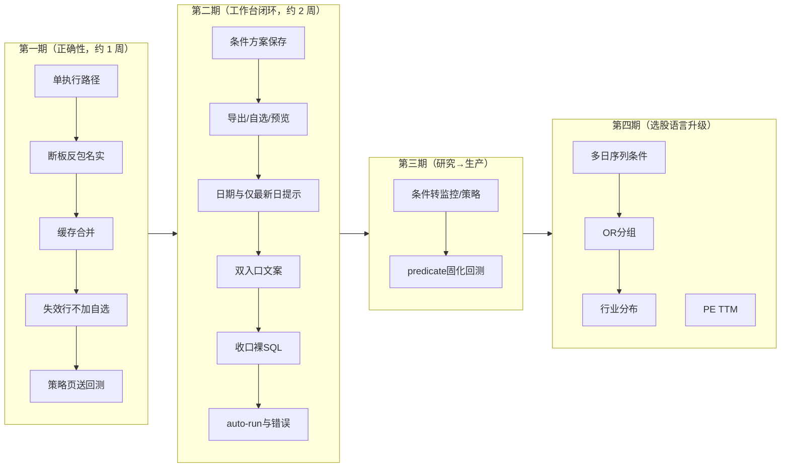

# 股票筛选模块产品评审与路线图

> **评审日期**：2026-08-20
> **评审方式**：代码事实盘点（后端 11 端点 / 两页前端全组件遍历，全部带文件行号证据）+ 竞品对标（Finviz / TradingView Screener / 同花顺问财 / 东方财富条件选股 / 通达信公式选股）+ 与当日回测模块评审同一套产品口径。
> **视角**：专业产品经理 + 一线使用者。
> **范围**：`/screener`（导航「策略」）与 `/condition-screener`（「条件选股」）及其后端链路。监控中心、回测、连板梯队页只在接线处讨论。

---

## 1. 摘要（TL;DR）

筛选模块其实已经不是「12 张策略卡片」。条件选股走 **registry 白名单 + Polars 字面谓词**（`POST /api/screener/query`），字段覆盖行情 / 市值 / 技术 / 涨停 / 基本面 / 龙虎榜 / 筹码 / 资金流 / 融资融券；策略选股走 **盘后缓存秒加载 + 监控实时叠加 + 失效行 + 一键监控**。条件页到回测的 handoff 已经打通。这套骨架在本地免费产品里是扎实的。

当前的主要矛盾不是「再加 20 个字段」，而是三处结构性问题：

1. **两套选股宇宙**：同一 `trend_breakout` 等 12 个 id，选股页跑 `PRESET_STRATEGIES`（无默认 basic_filter、无 limit），监控/回测跑 `strategy/builtin/*.py`（有价格/市值/ST/次新门控 + 加权评分 + limit 100）。用户以为「选股命中 = 回测/监控同一批票」，事实不是。
2. **两页能力不对称**：条件页能查财务/龙虎榜/筹码却不能加自选、不能保存方案、刷新即丢；策略页能监控/自选/列配置却不能把命中结果送回测。
3. **名称与过滤撒谎**：「断板反包」文案是「连板≥2 后断板 1–2 天再反包」，过滤实际是「当日涨停 + 量比≥1.5 + 涨幅>3%」。选股、监控、回测三处同一套错。

**TOP 5 建议**（详见 §6）：① 12 个内置策略只留 engine 文件一条执行路径；② 修正「断板反包」过滤或改名；③ 条件方案可保存/复用，并补导出+加自选；④ 策略页结果「送回测」；⑤ 关掉或收口 `/api/screener/run` 裸 SQL。

---

## 2. 现状能力盘点（代码事实）

### 2.1 后端能力矩阵

| 层 | 现状 | 证据 |
|---|---|---|
| 端点面 | 11 个：`/fields` `/query` `/nl_parse` `/nl_presets` `/strategies` `/run` `/run_preset` `/cached` `/market-snapshot` `/run_all` `/limit-ladder` | `backend/app/api/screener.py` |
| 条件选股 | registry 60+ 字段、条件 1–20 条、limit 1–500、AND only；编译为 Polars，**不拼 SQL**；非法语义 400，缺数据 503 fail-closed | `screener_query.py:58-64, 871-1003` |
| 策略选股 | 12 个 `PRESET_STRATEGIES` + 自定义/AI 文件策略；`run_all` 写盘后缓存；`/cached` 叠加监控内存结果；canonical 水位守卫丢弃超前缓存 | `screener.py:124-269`、`api/screener.py:314-378, 416-523` |
| 财务 | `notice_date ≤ as_of` 点时序；EPS 年化 = 累计 EPS / 季度 × 4（**不是 TTM**）；PE/PB 标近似 | `screener_financials.py:75-126` |
| 仅最新日 | 市值、AH/沪深股通/上市天数：历史 `as_of` 直接 503 | `screener_query.py:220-224, 886-888` |
| 声明不可用 | `northbound_net_inflow`、`realtime_concept`；deprecated：`pb` / `main_fund_flow` / `ttm` / `main_net_flow` | `screener_query.py:214-219` |
| 已知债 | `POST /run` 把客户端 SQL WHERE / ORDER BY 直接拼进 DuckDB（条件页**刻意不走**这条） | `screener.py:417-424`；设计稿 `docs/superpowers/specs/2026-07-16-condition-screener-page-design.md:29-33` |
| 测试 | `/query` 全链路 38 + 财务 8 + history_cache 11 + API 层若干；**无** `/run` 注入面、`run_preset` 逻辑、PRESET↔builtin 对拍、`write_cache` 子集覆盖 | `backend/tests/services/test_screener_*.py`、`tests/api/test_screener_api.py` |

### 2.2 前端信息架构

- **双入口**（`Layout.tsx:73-74`）：「策略」=`/screener`，「条件选股」=`/condition-screener`，同属 strategy 组，导航无一句话区分。
- **策略选股**（`Screener.tsx` 848 行）：策略池卡片（命中/失效/监控开关）→ 结果表（55 内置列、日 K 蜡烛、批量加自选、本地 FilterPanel）→ 设置/创建/策略池弹窗。缓存优先，`screener_auto_run` 默认开。
- **条件选股**（`ConditionScreener.tsx` 501 行）：NL 只填充不执行 → gostock 5 个常用条件 → 高级筛选 / 逐条添加（AND，≤20）→ 纯文本结果表 → **策略回测 / 因子回测** handoff。
- **持久化不对称**：策略页有策略池/列配置/卡片尺寸/蜡烛开关；条件页 conditions/asOf/limit **刷新即丢**。
- **前端测试**：screener 相关 **0** 个 bun 文件（`applyFilter`、handoff normalize、条件校验均无单测）。

### 2.3 与回测 / 监控的接线

| 方向 | 现状 |
|---|---|
| 条件结果 → 回测 | sessionStorage 一次性 handoff：`symbols≤500` + `asOf` 作回测起点；**不带 strategy_id**，到了回测页仍要手选策略 |
| 策略结果 → 回测 | **无按钮** |
| 策略 → 监控 | 卡片 RadioTower 一键建/删 `type=strategy` 规则 |
| 条件 → 监控 | **无** |
| 条件 → 自选 | **无**（策略页有单只 toggle + 批量） |
| 回测 / 监控执行的策略 | `StrategyEngine` 读 `strategy/builtin/*.py`，**不是**选股页的 `PRESET_STRATEGIES` |

---

## 3. 使用者视角：易用性问题清单

按用户旅程排列。严重度：高 / 中 / 低。

### 3.1 找入口与建立心智

| # | 问题 | 严重度 | 证据 |
|---|---|---|---|
| U1 | 导航「策略」≠ 页标题「策略选股」，与「条件选股」相邻，**没有一句话说明**「卡片策略 vs 自己拼条件」 | **高** | `Layout.tsx:73-74` |
| U2 | 条件页默认零条件，无「用一个示例跑一遍」；gostock 预设要先点再执行 | 中 | `ConditionScreener.tsx:63, 163-171` |
| U3 | 运算符裸英文（`between` / `in`）；涨跌幅「0.05=5%」只在部分行提示 | 中 | `ConditionValueEditor.tsx`、`ConditionBuilder.tsx:124` |

### 3.2 配置与执行

| # | 问题 | 严重度 | 证据 |
|---|---|---|---|
| U4 | 条件 / 日期 / 条数一改，**结果立刻清空**（含只改 limit） | 中 | `ConditionScreener.tsx:97-99` |
| U5 | NL 有任何 `unrecognized` 就禁止执行，必须逐条点 X，无「忽略未识别并跑已识别」 | 中 | `ConditionScreener.tsx:107` |
| U6 | 条件页日期是原生 `input type=date`，无 enriched min/max，可选周末/未来，只能靠 503 | 中 | `ConditionScreener.tsx:351` vs 策略页 `DatePicker` `:533-541` |
| U7 | 历史 `as_of` + 上市天数/AH/市值 → 503，前端**不预告**哪些字段仅最新日 | **高** | `screener_query.py:886-888`；条件 UI 无 badge |
| U8 | 策略页 auto-run **不等缓存 query 结束**：strategies 先到就会白跑一遍 `run_all` | 中 | `Screener.tsx:326-345` 无 `cachedQuery.isLoading` 守卫 |
| U9 | `run_all` 失败页面无错误条（单策略 `run.isError` 有，批量没有） | 中 | `Screener.tsx` 仅渲染 `run.isError` |

### 3.3 读结果与带走

| # | 问题 | 严重度 | 证据 |
|---|---|---|---|
| U10 | 条件页结果是纯文本表：不能点进行情预览、不能加自选、不能导出 CSV | **高** | `ConditionScreener.tsx:455-494` |
| U11 | 策略页命中列表**没有「送回测」**，条件页反而有 | **高** | 策略页全文件无 handoff；条件页 `:193-205, 434-451` |
| U12 | 批量加自选把「失效」灰行一并加入 | **高** | `Screener.tsx:296-300` 追加 `_expired` 后 `handleBatchAdd` 用 `displayRows` |
| U13 | 条件方案不能保存；刷新丢失。问财/东财的核心动作是「存一组条件反复跑」 | **高** | 条件页零 `storage` |
| U14 | 策略结果表有财务列（ROE/PE）但注释写明 **enriched 不返回，打开也是空** | 中 | `screener-columns.ts` 财务组默认隐藏 |

---

## 4. 产品经理视角：缺失功能与竞品差距

### 4.1 与成熟产品对照

| 能力 | 问财 | 东财条件选股 | Finviz | TradingView | **本项目** |
|---|---|---|---|---|---|
| 结构化多维条件 | ◐（NL 为主） | ✅ | ✅ | ✅ | ✅ 条件页 |
| 自然语言 | ✅ 核心 | ◐ | ❌ | ◐ | ◐ 只填充，不执行；无多日语义 |
| 保存方案 / 策略广场 | ✅ | ✅ | ✅ save screen | ✅ | ❌ 条件页；策略页只有策略池 |
| 多日/序列条件（连续 3 日放量） | ✅ | ◐ | ❌ | ◐ 多周期 | ❌ 只有单日 `as_of` 快照 |
| OR / 分组 | ✅ | ✅ | ✅ | ✅ | ❌ 固定 AND、≤20 |
| 结果导出 | ✅ | ✅ | ✅ | ✅ | ❌ 两页都无 CSV |
| 选股 → 回测 | ✅ | ◐ | — | — | ◐ 仅条件页；不带策略 id |
| 选股 → 监控/自选 | ✅ | ✅ | watchlist | ✅ | ◐ 仅策略页 |
| 行业/概念分布、热力图 | ✅ | ✅ | ✅ heatmap | ✅ | ❌ |
| 北向 / 实时概念 | ✅ | ✅ | — | — | ❌ 显式 unavailable（数据红线，正确） |
| 点时序财务 | ◐ | ◐ | 当前截面 | 当前截面 | ✅ `notice_date` 门控（实现正确；覆盖取决于本地 metrics parquet） |
| 涨停梯队 | ✅ | ✅ | — | — | ✅ `/limit-ladder`（连板页，不在选股页内） |

问财的优势是「连续 3 天涨停 / 北向连续净买入」这种**时间序列谓词**和生态数据；Finviz 的优势是保存 screen + 热力图。本项目不该抄问财的外部数据，但**保存方案、带走结果、选股=回测同一宇宙**是本地工作台必须补的。

### 4.2 缺失功能清单（按优先级）

**P0 —— 正确性 / 高杠杆（数日级）**

| # | 功能 | 理由 | 复用基础 |
|---|---|---|---|
| F1 | **内置 12 策略单执行路径**：选股 `run_preset` / `run_all` 改走 `StrategyEngine`，删除或降级为 engine 的薄封装；补 PRESET↔builtin 对拍测试 | 选股命中与监控/回测不是同一批票，是产品级信任问题 | `strategy/engine.py`、`builtin/*.py` 已是监控/回测真源 |
| F2 | **修正「断板反包」**：按文案实现（连板≥2 后断板 1–2 日再放量收阳），或改名为「涨停放量」并改 description | 三处同一套撒谎过滤 | `screener.py:184-195`、`builtin/broken_board_recovery.py:7, 28-35` |
| F3 | **`write_cache` 合并 `results`**：子集 `run_all` 不得抹掉当日其他策略当前命中（`today_ever_*` 已并集，`results` 整表覆盖） | 点单卡重跑后其它卡片命中数消失 | `strategy_cache.py:135-138`、`api/screener.py:518` |
| F4 | 策略页结果「送回测」（复用 `screenerBacktestHandoff`）；handoff 可选带 `strategy_id` | U11；条件页已验证路径 | `screenerBacktestHandoff.ts`、`Backtest.tsx:64-76` |
| F5 | 批量加自选排除 `_expired` | U12 | `Screener.tsx:476` |

**P1 —— 工作台闭环（1–2 周）**

| # | 功能 | 理由 | 复用基础 |
|---|---|---|---|
| F6 | **条件方案持久化**：命名保存 / 列表 / 一键填入；可设为 gostock 旁的「我的方案」 | U13；问财/东财的最小完备集 | 可落 `data/user_data/` JSON，对齐 `strategy_cache` 模式 |
| F7 | 条件页：加自选 + CSV 导出 + 行点击预览；结果表尽量复用 `ScreenerTable` | U10 | `ScreenerTable.tsx`、`useWatchlistBatchAdd` |
| F8 | 条件页日期改 `DatePicker` + 字段「仅最新日」badge；历史日期禁用 reference/市值或改成按 `as_of` 算上市天数 | U6/U7 | 策略页 DatePicker；`listing_days` 可用 `ssdate` 对 `as_of` 重算 |
| F9 | 导航副文案或页头一句话区分两页；条件页给一个「示例一键跑」 | U1/U2 | gostock `strong_momentum` 已可执行 |
| F10 | 收口 `POST /run`：弃用或改走 `/query` 字面谓词；agent_tools 同步迁走 | 设计稿已标 P0 注入面，至今仍在 | `/query` 已是安全执行层 |
| F11 | auto-run 等 `cachedQuery` settled；`run_all` 错误上屏 | U8/U9 | 现有 tanstack query |
| F12 | 条件 → 监控：把 predicate 存成规则，或「保存为策略文件再监控」 | 研究→生产闭环，对齐回测 F10 | 监控已有 `type=strategy` |

**P2 —— 专业选股能力（需设计）**

| # | 功能 | 理由 | 主要成本 |
|---|---|---|---|
| F13 | **多日/序列条件**（连续 N 日量比>2、放量阳线） | 问财用户的第一反应；当前引擎是单日截面 | 要 `filter_history` 窗口 + 新 registry 类型，不能假装单日 enriched 能算 |
| F14 | 条件 OR / 分组（上限仍要硬） | 复杂方案现在只能拆多次跑 | 编译器从 AND-list 升级为布尔树 |
| F15 | 结果行业分布 + 简易热力（板块/涨跌幅桶） | Finviz 核心浏览方式 | `/market-snapshot` 已有全市场轻量行 |
| F16 | 把 `/query` predicate 固化为 ephemeral 策略，直接进回测/监控 | 条件选股目前不能回测「这组条件」本身，只能带股票池 | 回测已支持 custom/ephemeral |
| F17 | PE 改为 TTM（近四期已公告累计差分），文案区分年化近似 | 现口径 Q1 PE 被 ×4，偏乐观 | `screener_financials.py:125`；需四期齐全否则 NULL |
| F18 | 策略结果表真正 JOIN 财务列，或删掉空壳列 | U14 | `load_financial_snapshot` 已存在 |

### 4.3 明确不建议做

- **荐股 / 涨停预测 / 策略广场社交**：项目定位红线（AGENTS.md §1）。
- **接入问财 / 东财在线选股 API**：设计稿已排除；破坏本地 sealed 口径。
- **北向、实时概念**：registry 已 `unavailable`；本地无可靠 PIT 序列前不要用外部源冒充。
- **第三套选股引擎**：不要在 PRESET dict、engine 文件、`/query` 之外再加 SQL 方言。
- **宣称「条件选股结果可直接当回测策略」**：在 F16 落地前，handoff 只是股票池，不是策略。

---

## 5. 专业性与 Bug（统计 / 口径 / 正确性）

| # | 事项 | 现状 | 建议 |
|---|---|---|---|
| B1 | **双宇宙** | `/run_preset` 命中 `PRESET_STRATEGIES`（`api/screener.py:282, 496-497`）；监控/回测走 builtin 文件（`trend_breakout.py:9-16` 默认价格 5–200、市值 20 亿、排除 ST/次新 60 天） | F1，P0 |
| B2 | **断板反包名实不符** | description vs `signal_limit_up & vol_ratio & change_pct>3%` | F2，P0 |
| B3 | **缓存子集覆盖** | `payload["results"]=results` 不合并旧 results | F3，P0 |
| B4 | PRESET `limit:100` 死配置 | `run_preset` 只读用户 `display_limit`，未配置则不截断 | 与 F1 一并吃 engine `META.limit` |
| B5 | `/run` SQL 注入 + 失败变空结果 200 | `screener.py:417-431` | F10 |
| B6 | `run_all` 单策略异常 `continue` 静默缺席 | `api/screener.py:509-510` | 返回 `failed: []` |
| B7 | 涨停口径分裂 | limit-ladder 用五档 sealed 修正假涨停；预设连板用原始 `signal_limit_up` | 选股连板应对齐 sealed，或结果列标明「信号涨停≠封板」 |
| B8 | 财务 PE 年化不是 TTM | `basic_eps/quarter_num*4` | F17；UI 已写「PE (年化近似)」需保持，不可改口 TTM |
| B9 | 融资融券节假日 | `_previous_weekday` 只跳周末，周一遇假日 503 | 用交易日历，或文案「非周末节假日暂不可查」 |
| B10 | 扩展列无历史语义 | `ext_columns` 取扩展表**最新**分区叠到历史 `as_of` | 历史查询禁用 ext 或按日分区 |
| B11 | 幸存者 / ST | 条件页需用户自己加 `exclude_st`；instruments 是当前名单 | 默认勾选排除 ST；历史 as_of 声明非 PIT 股票池 |
| B12 | `run_all` 历史窗口 clamp 30 | 自定义 `filter_history` 策略在批量跑时被截断，单跑/监控不截 | 与 engine 对齐，或 UI 提示 |

前端附带：失效行绕过筛选/排序/limit（`Screener.tsx:288-300`）；`screenerRunCustom` 前端零调用方（`api.ts:3344-3348`）。

---

## 6. 建议路线图

**分期逻辑**：第一期全是「同一句话在三处意思要一样」——不修这个，后面保存方案只会把错误宇宙持久化。第二期把条件页做成能反复用的工具。第三期对齐回测模块已做的研究→监控闭环。第四期才碰序列条件，避免在单日截面上假装能做问财。

**验收口径**：每期必须有——后端对拍测试（至少 F1：同一 id 选股行集 ⊆ 或 = engine 行集，差异要声明）；前端 bun 补 `applyFilter` / handoff / 条件校验；tsc/build 绿；浏览器一条真实路径（条件保存→执行→送回测；策略卡命中→送回测且股票池一致）。

---

## 7. 结论

条件选股的执行层（白名单、fail-closed、财务 PIT、资金流/筹码按快照 as_of）是这块模块里最像样的部分，不要推倒重来。策略选股的缓存 + 失效行 + 监控开关也已经像一个盘中工作台。

最高杠杆不是再堆字段，而是：

1. **让「策略」三个字在选股 / 监控 / 回测里指向同一段过滤**（F1/F2）；
2. **让条件选股的结果能留下、能带走**（F6/F7/F4）；
3. **把已知危险入口收掉**（F10 裸 SQL、F3 缓存覆盖）。

多日序列选股（F13）值得做，但必须单独立项：那是第二套谓词语言，不是在 `FIELD_REGISTRY` 里再加几个 bool。

## 8. 实施状态（2026-08-21）

S1–S4 全部 17 项已落地（工作区，未提交），验证见 `FQUANT_INTEGRATION_PROGRESS.md` 变更记录 2026-08-21 行：

- **S1 正确性（F1–F5）**：单执行路径（`PRESET_STRATEGIES`/`run_preset` 已删）、断板反包 `filter_history` 重写、缓存同日合并、策略页送回测（含 `strategyId` handoff）、失效行不加自选。
- **S2 工作台闭环（F6–F11）**：方案持久化与 CRUD、批量自选/CSV 导出/行详情、日期选择与 latest_only 徽标、双入口文案、裸 SQL `/run` 410 收口、auto-run/run_all 错误呈现。
- **S3 研究转生产（F12/F16）**：`strategy/screen_bridge.py` 声明式注册 `screen:<hex>` 策略（无第四套执行语义）；监控与回测同源消费；含外部 join 字段（财务/龙虎榜/筹码/资金流/融资融券/参考）的方案回测前 fail-closed 显式拒绝，不静默空结果。
- **S4 选股语言（F13–F15/F17）**：条件分组（组内 AND、组间 OR，向后兼容）；9 个多日序列字段（独立历史窗口求值路径，数据不足 NULL 不伪造）；行业分布 facet（PIT、limit 截断前全量命中行聚合）；EPS 改标准 TTM 累计口径（Q4 全年 / Q1-Q3 本期累计+上年全年−上年同期累计，缺项 NULL）。

边界备注：sequence 字段不进 screen 策略（单日面板不可求值，classify 一律 unsupported）；`total/float_shares` 依赖的市值字段因回测 cache 路径无此两列同样不支持——这是保守白名单的刻意取舍，后续若 cache 路径补齐 join 列可放宽。

> 本报告现状陈述均有代码行号（§2/§3/§5）。竞品对照用于判断「用户会不会觉得缺一块」，不作为抄功能清单。优先级为评审判断，实施前以各功能独立设计为准。
