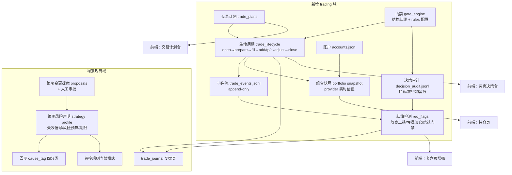

# YMOS 机制移植落地计划

> 来源：`fm/YMOS`（投资操作系统 V4）+ `fm/ymos-diagnosis`（策略结构诊断 v2.0）。
> 目标：把 YMOS 的「纪律层 + 闭环机制」移植进 tickflow-stock-panel，补齐持仓跟踪、交易计划、决策审计、复盘进化四个缺口。
> 本文档是**实施计划**，与 `FQUANT_INTEGRATION_PROGRESS.md` 同级维护；每个阶段完成后更新文末进度表。

---

## 0. 背景与差距分析

### 0.1 本项目现状（已核实）

| 已有能力 | 位置 |
|---|---|
| 选股 / NL 选股 / 策略引擎（Python 策略 + AI 生成 + overrides） | `strategy/engine.py`、`strategy/ai_generator.py`、`api/screener.py` |
| 回测（纯 Polars/NumPy，信号/因子/策略回测） | `backtest/engine.py`、`api/backtest.py` |
| 监控规则（strategy/signal/price/market 四类，实时行情驱动评估，SSE 推送） | `strategy/monitor.py`、`strategy/monitor_rules.py`、`services/alert_store.py` |
| 交易台账（上传 CSV/Excel → FIFO 配对 → 追涨诊断 + 基准超额） | `services/trade_journal/`、`api/trade_journal.py`、`data/user_data/trade_journal/ledger.json` |
| AI 能力（四维个股分析 / 大盘复盘 / 对话 Agent / 策略生成，openai_compat + codex_cli） | `services/ai_provider.py` 等 |
| 市场级复盘（情绪/连板/题材/风险线索） | `api/review.py`、`pages/Review.tsx` |

### 0.2 缺口（YMOS 已解决、本项目没有）

| 缺口 | 现状证据 |
|---|---|
| 持仓跟踪 | 无 positions/portfolio API；watchlist 只是列表，无仓位/成本 |
| 单笔交易生命周期 | 台账只能「事后上传成交单」，没有「计划→成交→平仓」正向流程 |
| 交易计划 | 无 trade-plan 相关模块 |
| 决策审计 | 监控只有告警（alert），没有「门禁拦截/放行」留痕 |
| 红旗检测 | 台账有追涨诊断，但无「放宽止损 / 亏损加仓 / 绕过门禁」机械检出 |
| 策略风险声明 | 策略 = Python 代码 + params，无失效信号 / 风险预算 / 期限声明 |
| 策略迭代治理 | 策略改了就是改了，无版本 / 提案 / 审批 / 反证条件 |

### 0.3 不移植的部分（明确排除）

- **Eyes 数据源脚本**（RSS/Tushare/Yahoo/Finnhub/问财/价格路由）：本项目本地 DuckDB 数据源全面更强，无价值。
- **Console 三页 Web 形态、自然语言暗号、Reader**：本项目已有前端与调度。
- **P1–P18 大部分提示词**：只借鉴 P5（动机审查）、P11（平仓归因）、P12（纪律裁判）三个 invariant 模块作为 AI prompt 素材；P10 期权、P17/P18 作者私有阈值不搬。
- **Agents 四角色协议**：只吸收「唯一状态写回者 + 历史只追加 + 失败语义」三条原则，不搬角色体系。

### 0.4 设计约束（与 AGENTS.md 红线对齐）

1. 行情估值一律走 `data_providers` 抽象层（`_get_data_provider()` 模式），禁止直连。
2. 用户数据写 `data/user_data/`，沿用现有 JSONL 追加写 / JSON 一实体一文件的存储习惯；不引入数据库。
3. 结构性规则硬编码在后端 service 层，**禁止只在前端校验**。
4. AI 一律走 `services/ai_provider.py` 的 `generate_ai_text / stream_ai_text`。
5. 历史记录 append-only：任何接口不得接收「整份旧内容覆盖」来改写历史事件。

---

## 1. 总体架构



**核心地基是两个 append-only 事件流**：`trade_events.jsonl`（交易事实）与 `decision_audit.jsonl`（决策事实）。红旗检测、计划偏差、周期审计全部建立在这两条流上。

---

## 2. 阶段划分

| 阶段 | 内容 | 依赖 | 预计改动量 |
|---|---|---|---|
| **P0 地基** | 交易事件流 + 生命周期状态机 + 决策审计 | 无 | 后端 ~800 行 + 前端 1 页 |
| **P1 账户与组合** | 账户模型 + 组合快照 + 持仓页 | P0 | 后端 ~300 行 + 前端 1 页 |
| **P2 门禁与计划台** | 门禁引擎 + 交易计划台 + 计划 vs 实际 | P0、P1 | 后端 ~400 行 + 前端 2 页 |
| **P3 红旗与复盘** | 三条机械红旗 + 复盘页增强 + AI 归因 | P0（事件流+审计流） | 后端 ~300 行 + 前端增强 |
| **P4 策略内核** | 策略风险声明 Schema + 回测 cause_tag + 变更提案审批 | 独立，可与 P1 并行 | 后端 ~500 行 + 前端增强 |
| **P5 收尾** | Webhook 推送补齐 + 统一失败语义 + 文档 | P2 | 后端 ~150 行 |
| **P6 诊断框架** | 12 不一致模式（红旗扩展+归因 rubric）+ 7 结构不变量（体检增强）+ 6 策略坐标卡（family 冲突检测）+ L0/L1/L2 AI 触发 | P0–P4 全部 | 后端 ~600 行 + 前端 ~200 行 |

P0 → P1 → P2 串行；P3 在 P0 之后即可启动；P4 完全独立；P6 依赖 P0–P4 的事件流/审计流/profile 地基（P6 内部顺序：6.3 schema → 6.1 → 6.2 → 6.4）。

---

## 3. P0：交易事件流 + 生命周期 + 决策审计

### 3.1 数据契约

**文件**：`data/user_data/trading/trades/{trade_id}.json`（一笔一单文件，当前事实）+ `data/user_data/trading/trade_events.jsonl`（全部事件追加流，审计基座）。

`trade_id = {symbol}_{yyyymmdd}_{seq}`。

**单笔文件**（当前事实，可被服务端更新）：

```json
{
  "schemaVersion": 1,
  "tradeId": "600519.SH_20260804_1",
  "symbol": "600519.SH",
  "name": "贵州茅台",
  "status": "计划中 | 持仓中 | 已平仓",
  "strategy": "策略名或 null",
  "thesis": { "text": "买入论点", "invalidation": "可观察的失效信号", "createdAt": "..." },
  "position": { "qty": 100, "costPrice": 1680.0, "invested": 168000.0 },
  "createdAt": "...", "closedAt": null
}
```

**事件**（只追加，写单笔文件的同时追加到事件流；事件是唯一历史源，单笔文件是缓存投影）：

```json
{ "schemaVersion": 1, "tradeId": "...", "kind": "open|prepare|revise|fill|add|tp|sl|adjust|close",
  "ts": "2026-08-04 14:30", "payload": { "...kind 相关字段..." }, "note": "自由文本" }
```

| kind | 语义 | 服务端强校验 |
|---|---|---|
| `open` | 建档：论点 + 失效信号 | thesis.invalidation 必填（可观察反证，不能是"我觉得不好"） |
| `prepare` / `revise` | 建仓准备 / 成交前修订 | 不改变 position 事实 |
| `fill` | 确认成交（**只能一次**） | 必须已有 prepare/revise；qty>0、price>0；服务端重算 invested=qty×price；状态→持仓中 |
| `add` | 加仓计划或加仓成交（`planOnly: bool`） | 仅持仓中；planOnly=false 时服务端重算 qty/成本均价 |
| `tp` / `sl` | 止盈 / 止损卖出 | 仅持仓中且已有 fill；0<sellQty≤当前 qty；服务端重算剩余 qty 与剩余成本 |
| `adjust` | 调整止损 / 逻辑退出 | 记录 oldRule→newRule（红旗检测输入） |
| `close` | 全部平仓 | 必须卖完全部剩余；状态→已平仓；之后拒绝一切写入 |

### 3.2 决策审计

**文件**：`data/user_data/trading/decision_audit.jsonl`（append-only，永不清理——区别于 alerts.jsonl 的 7 天滚动）。

```json
{ "schemaVersion": 1, "ts": "...", "mode": "buy_new|add|tp|sl|close|adjust",
  "tradeId": "...", "symbol": "...", "passed": true,
  "gates": [ { "id": "stop_loss_defined", "passed": true, "detail": "..." } ],
  "missing": [], "note": "" }
```

规则（照搬 YMOS 三条铁律）：
1. 门禁未通过而用户仍确认动作 → 记 `passed: false` 审计 + 事件流标记 `gateBypassed: true`（**不得把被拦截误记成正常事件**）。
2. 只有事件成功落盘后才写 `passed: true` 审计。
3. 审计写失败必须让 API 返回显式错误（前端明示），不得静默吞掉。

> **实现修正 (2026-08-04)**：审计读写（`append_audit` / `read_audit`）已并入 `services/trading/store.py`，**无独立 `audit.py`**（原 §3.3 文件表里的 `audit.py` 行不再成立）。审计与事件流共用同一把线程锁,保证投影/事件/审计三者落盘顺序一致。

### 3.3 API 与文件

新增 `backend/app/services/trading/` 包：

| 文件 | 职责 |
|---|---|
| `models.py` | TradeEvent / Trade / AuditEntry dataclass + kind 枚举 |
| `store.py` | 单笔文件读写 + 事件流/审计流追加（线程锁，参照 `alert_store.py`） |
| `lifecycle.py` | 状态机校验（上表全部规则），纯函数便于测试 |
| `audit.py` | 审计写入与查询 |

新增 `backend/app/api/trading.py`：

```
POST   /api/trading/trades                 建档(open)
POST   /api/trading/trades/{id}/events     追加事件(prepare/fill/add/tp/sl/adjust/close)
GET    /api/trading/trades?status=         列表
GET    /api/trading/trades/{id}            详情(当前事实+事件时间线)
GET    /api/trading/audit?tradeId=&passed= 审计查询
```

前端：新增 `pages/Trading.tsx`（占位已有，替换为真实页面）：持仓列表 + 单笔详情时间线 + 事件录入表单。

### 3.4 验收

- 状态机全路径单测：open→prepare→fill→tp→close；非法迁移（重复 fill、未 fill 就 tp、close 后再写）全部 400。
- 审计断链测试：任何成交事件必有对应审计记录。

---

## 4. P1：账户模型 + 组合快照 + 持仓页

### 4.1 账户

**文件**：`data/user_data/trading/accounts.json`（A股先单币种 CNY，结构上预留多币种）。

```json
{
  "schemaVersion": 1,
  "accounts": [ {
    "id": "default", "currency": "CNY",
    "capital": 500000,                     // 资金基数，不随行情变
    "horizonFundMonths": 12,               // 资金可用期限
    "maxSingleRatio": 0.25,                // 单一标的上限（结构红线输入）
    "changes": [ { "ts": "...", "amount": 50000, "reason": "增资" } ]
  } ]
}
```

### 4.2 组合快照（派生、可重建，不是事实源）

`GET /api/trading/portfolio` → 实时计算：

```
账户净值 NAV = capital + 已实现盈亏(已平仓事件聚合) + 浮动盈亏(持仓×provider 实时价)
剩余可开   = NAV - 持仓市值 - 待建计划金额(P2 接入)
positions  = 每笔持仓的 qty/成本/现价/敞口占比/止损距离/论点/失效信号
health     = normal | attention | critical（敞口超 maxSingleRatio、止损距离<0、数据过期 → 升级）
```

估值走 `_get_data_provider().get_realtime(symbols)`；realtime 不可用时 capabilities 门控降级为 `price: null` + `stale: true`，不把过期收盘价伪装成实时数据。真实券商持仓另通过 `services/trading/fhold_client.py` 只读调用 `fhold-cli --format json` 获取，写入快照的 `fhold` 分区；CLI 不可用或超时时 `available: false`，不阻断生命周期持仓快照。

### 4.3 前端

持仓页：账户卡片（NAV/可用/待建）+ 生命周期持仓表格（盈亏、敞口、止损距离、失效信号）+ fhold 真实券商持仓表（账户、股数、成本、现价、持仓盈亏）+ health 徽标。

### 4.4 验收

- NAV 口径与台账 FIFO 结果对账一致（用现有 `ledger.json` 样例数据交叉验证）。
- realtime 源断开时页面显示 stale 标记而非报错。

---

## 5. P2：门禁引擎 + 交易计划台

### 5.1 门禁分层（YMOS 核心划分照搬）

**结构红线**（硬编码 `services/trading/gates.py`，不可配置、不可关闭）：

| 红线 | 校验 |
|---|---|
| 单标的比例 | 新买入金额 / 账户 NAV ≤ `maxSingleRatio` |
| 最大风险可计算 | 买入必须有止损价或逻辑退出条件 |
| 价格止损有幅度 | 止损价 < 成本价（距离必须为正数） |
| 资金期限匹配 | 策略声明 horizon ≤ 账户 horizonFundMonths |
| 计划/成交对账 | fill 金额与最近一次 prepare 金额偏差 >10% 时要求填写原因 |

**用户规则**（`data/user_data/trading/gate_rules.json`，可配置）：自定义判断题清单（每个动作类型 all/any 题目 + 说明文案 + 纪律清单），前端决策台渲染为勾选列表。

### 5.2 交易计划台

**文件**：`data/user_data/trading/plans/{yyyymmdd}.json`。

盘前：为每笔持仓/候选写入当日计划（动作、触发条件、数量、理由）。盘中：记录实际动作；偏差自动关联（计划有但实际没做 / 做了但计划没有）。盘后：`GET /api/trading/plans/{date}/deviation` 输出计划 vs 实际对照表，喂给 P3 复盘。

核心原则（YMOS）：**把产生决策的任务挪到收盘后，盘中只执行**。UI 上盘中时段计划编辑入口收起为只读。

**PA_Agent 条件式扩展（2026-08-06）**：计划条目可追加 `strategyId/plannedPrice/stopLoss/exitRule/thesisHorizonMonths/invalidation`，旧 JSON 仍兼容。默认关闭的结构化计划检查只读取已保存条目，先做 canonical K 线 preflight 和本节程序门禁，再决定是否调用第二阶段 AI 审查；程序门禁有最终权威，AI 不能升级结果。检查只产生独立 append-only analysis artifact/trace，不写 `trade_events.jsonl` 或 `decision_audit.jsonl`，也不改变生命周期状态。

### 5.3 前端

- 交易计划台页：盘前计划编辑 + 盘中执行勾选 + 盘后偏差表；可显式开启只读的结构化计划检查，以中性文案展示数据充分性、审查项和可审计 trace，不展示交易方向。
- 买卖决策台页：每个动作类型一组门禁（结构红线自动校验结果 + 用户规则勾选），全绿才允许提交；提交即走 §3 事件流 + 审计流。

### 5.4 验收

- 结构红线无法通过 API 绕过（直接 POST 非法事件仍被 lifecycle 校验拒绝）。
- 计划偏差表与当日事件流一致。

---

## 6. P3：机械红旗 + 复盘增强

### 6.1 三条机械红旗（`services/trading/red_flags.py`，纯代码、无 LLM）

| 红旗 | 检出逻辑（输入：事件流 + 审计流） |
|---|---|
| **放宽止损** | `adjust` 事件：新止损相对成本的距离 > 旧止损距离（向上抬高的移动止损距离在缩小，**不算**） |
| **亏损加仓** | `add`（非 planOnly）事件：加仓价 < 当时成本价 |
| **绕过门禁** | 事件流有 fill/add/tp/sl，但对应审计 `passed: false` 或审计缺失（**审计断链一律告警**） |

**赚钱的违规也照记**——红旗与盈亏无关。

### 6.2 复盘增强

- 红旗记录写入 `data/user_data/trading/red_flags.jsonl`，在复盘页（`Review.tsx`）新增「纪律红旗」分区，与现有 trade_journal 追涨诊断并列。

> **实现修正 (2026-08-04)**：红旗改为**按读取时实时计算**，**不落 `red_flags.jsonl`**——输入始终是 `trade_events.jsonl` + `decision_audit.jsonl` 两条 append-only 流（§6.1 已定义纯函数检测器），派生数据不单独落盘，避免双写不一致。复盘页「纪律红旗」分区由 `GET /api/trading/red-flags`（或等价只读端点）即时聚合事件流+审计流计算，前端据此渲染。
- AI 归因（P11 借鉴）：`POST /api/trading/trades/{id}/autopsy` → 把单笔事件流 + 计划偏差 + 红旗喂给 `generate_ai_text`，输出 A/B/C/D 四分类归因（A 策略正常不利 / B 执行偏离 / C 规则歧义冲突 / D 数据问题）。**只有 C 才允许发起策略修改**（接 P4 提案流）。

### 6.3 验收

- 构造含三条红旗的事件流样例，检测器全部命中；构造移动止损（向上抬）不误报。

---

## 7. P4：策略内核（独立并行）

### 7.1 策略风险声明 Schema

在现有策略 META 旁新增可选声明（存 `strategy_overrides` 同目录，`{strategy_id}.profile.json`）：

```json
{ "schemaVersion": 1, "strategyId": "...",
  "invalidation": [ { "name": "...", "observable": "可观察反证", "action": "..." } ],
  "risk": { "positionLimitPct": 20, "lossBudgetPct": 5, "thesisHorizonMonths": 6 },
  "cadence": { "review": "weekly" } }
```

校验器 `services/strategy_validator.py`（照搬 ymos-diagnosis 八项体检的机械部分）：
- 字段完整性：失效信号必须 name+observable+action 三要素齐全；
- 内部一致性：thesisHorizonMonths 与回测周期、止损幅度的兼容性；
- 期限漂移检测：台账实际持仓天数中位数 vs 声明 horizon；
- 隐藏共享敞口：持仓行业/概念暴露相关性（数据已有，ext_data 概念表）。

### 7.2 回测 cause_tag 四分类

`backtest/engine.py` 的 TradeRecord 增加 `cause_tag`：`strategy_outcome / execution_deviation / kernel_conflict / driver_quality`（默认 strategy_outcome，退出原因命中止损/到期为 outcome，数据缺失导致的异常退出为 driver_quality 等）。聚合统计按 tag 分组展示，**防止"因一笔输赢改内核"**。

### 7.3 策略变更提案 + 人工审批

**文件**：`data/user_data/trading/proposals/{proposal_id}.json`。

```json
{ "id": "...", "target": "strategy 配置或 gate_rules",
  "evidence": [ "触发证据（红旗/归因/审计引用）" ],
  "before": {}, "after": {},
  "falsifier": "如果改错了，我会在什么情况下看到",   // 必填，无反证条件的提案不予受理
  "status": "draft | approved | rejected | trial | verified",
  "sampleSize": 12 }                                   // <10 笔证据只登记不提案
```

防线（照搬 YMOS）：单笔结果不改内核；提案必带反证条件；放宽类修改需额外举证。审批在设置页新增「策略提案」分区，人工点击批准/驳回。

### 7.4 统一失败语义

新增 `app/errors.py`：`data_incomplete / stale_input / blocked_by_dependency / no_change / kernel_not_ready / ai_output_invalid / ai_provider_error`，作为 API 标准错误码（HTTP 422 + `{"code": "...", "detail": ...}`）。其中 `ai_output_invalid` 仅表示模型输出语法/schema/不变量无效，`ai_provider_error` 表示认证、额度、模型或网络等 provider 故障；输入 K 线不足与过期继续分别使用 `data_incomplete`、`stale_input`。先从 trading 域和 portfolio 快照启用，逐步推广。

---

## 8. P5：收尾

1. **Webhook 推送补齐** ✅：监控规则命中路径已接入 `_push_rule_webhook`（`strategy/monitor.py`），`webhook_enabled` 且 `webhook_url` 非空时同步 `httpx.post`（超时 3s、`trust_env=False`），异常吞成 `logger.warning` 不阻塞告警落盘。统一失败语义 `app/errors.py`（`AppError` + 5 个标准码 + `app_error_handler`）已交付,由主会话在 `main.py` 统一接线。
2. **文档**：README 增加「交易与复盘」章节；AGENTS.md §3 关键文件索引补 trading 域。
3. **E2E 冒烟**：`backend/scripts/` 新增 `test_trading_lifecycle.py`（参照 `test_fquant_provider.py` 模式，真实 provider 不可达项 skip）。

---

## 9. P6：诊断框架引入（ymos-diagnosis 三件套 + L0/L1/L2 触发）

> 来源：`ymos-diagnosis/references/`（inconsistency_patterns.md 12 模式、structural_invariants.md 7 不变量 + 4 原因分类、strategy_family_map.md 6 坐标卡）。
> 前提：P0–P4 已提供这些框架需要的数据地基（事件流/审计流/计划偏差/profile/提案），本阶段把诊断方法论落到结构化数据上——可机械化的确定性检测，语义判断的进 AI prompt rubric，不照搬 Markdown 问诊流程。

### 9.1 P6.1：红旗扩展 + 归因 rubric

**12 种不一致模式分流**（机械检测 vs AI rubric）：

| # | 模式 | 处置 |
|---|---|---|
| 2 期限漂移 | ✅ 机械新红旗 `horizon_exceeded`（单笔级：持仓天数 > 关联 profile `risk.thesisHorizonMonths`；无 profile → skip 不 fail） |
| 3 仓位代替信念 | ✅ 机械新红旗 `size_over_limit`（add/fill 后 qty×当时价 > 账户 `maxSingleRatio`×NAV 或 profile `positionLimitPct`；门禁兜底检出） |
| 11 门禁膨胀 | ✅ 机械新红旗 `gate_proliferation`（全局级：用户规则清单 > 15 条 → 提示；`scan_all` 返回增加 `"global"` 分组） |
| 12 亏损后放松规则 | ✅ 提案层标记：创建提案时若属放宽（limit/budget 上调或 invalidation 减少）且近 30 天有亏损平仓 → 提案元数据 `relaxationAfterLoss: true`，审批 UI 警示（不入红旗流） |
| 1 裁判切换 / 4 价格论点混淆 / 8 事后改写 / 10 数据质量伪装 | AI rubric：压缩进 `autopsy.py` 系统提示词，要求 reasoning 引用命中模式编号 |
| 5 自称与行为不符 | → P6.2 体检项 `family_behavior_conflict`（策略级，依赖 6.3 family） |
| 6 节奏错配 | 已覆盖（`cadence_horizon_match`） |
| 7 隐藏共享敞口 | 暂不机械（依赖行业归属口径）；AI rubric 提示 |
| 9 唯结果论 | 已覆盖（红旗与盈亏无关原则本身） |

红旗契约不变：`{"type", "ts", "detail", ...}` 追加新 type；`red_flags.py` 保持纯代码无 LLM；`red_flag_webhook.py` 标签表同步。

### 9.2 P6.2：策略体检增强（7 结构不变量）

7 不变量现状对账：1 可表达性 → 部分（field_completeness）；2 内部一致 → 部分（cadence）；3 可证伪 → 部分（三要素机械校验）；4 风险承担 → 已覆盖（gates + profile 数值校验）；5 决策/执行分离 → 机制已落地（计划台）；6 真相源完整 → 机制已落地（append-only）；7 反馈治理 → 部分（提案状态机）。

增量：

1. **profile schema 增加可选 `playbook: {scope, entry, exit}`**（文本，向后兼容）→ 体检新检查 `playbook_declared`（缺失 → warn 不 fail）。
2. **体检新检查 `proposal_governance`**：该策略关联提案缺 `counterEvidence` 或复核样本 → warn。
3. **体检新检查 `family_conflict`**：family=mixed 且无 `familyMix` 四要素（入场裁判/失效权/仓位期限/冲突裁决）→ fail（依赖 6.3）。
4. **体检新检查 `family_behavior_conflict`**：family cadence 倾向 vs 台账持仓天数中位数冲突（trend/short_horizon 中位 > 20 交易日，或 value/growth 中位 < 5）→ warn（依赖 6.3）。
5. **AI 深度体检**：`GET /api/strategies/{id}/profile/validate?ai=true` 追加 AI 报告——对照 7 不变量逐项评价 + falsifiability 语义判断（不可证伪措辞识别），输出追加在机械 checks 之后，不替代机械结论。

### 9.3 P6.3：策略坐标卡（family 元数据）

- profile 新增可选 `family`: `value | growth | trend | event | short_horizon | relative_value | mixed`；`family=mixed` 时 `familyMix: {entryJudge, invalidationAuthority, sizingHorizon, conflictResolution}` 四要素必填。
- `validate_profile`：family 非枚举 → problem；mixed 缺 familyMix 要素 → problem。
- 坐标卡阈值表（family → cadence 倾向/典型失效权）硬编码在 `strategy_validator.py`，与 family_map.md 对齐，不含任何参数默认值（坐标卡是诊断坐标不是推荐）。
- 前端：profile 编辑入口加 family 下拉 + mixed 四要素表单。

### 9.4 P6.4：L0/L1/L2 状态驱动 AI 归因

新 `services/trading/review_job.py`（盘后状态驱动归因）：

- **L0** 无新红旗（最近 1 个交易日）且无新平仓 → 返回 `{"level": "L0", "autopsied": 0}`，**零 AI 调用**（`no_change` 语义）。
- **L1** 有候选 → 只对涉及 trades 跑 `run_autopsy`；去重：已有归因且事件数未变 → skip。
- **L2** 用户手动全量 → 现有单条 API 不变。
- 触发：APScheduler 独立 job（盘后，默认 16:45），settings 开关 `tradingAutoReview`（默认 false，省 token）；另提供 `POST /api/trading/review/auto-run` 手动触发。
- AI 不可用时 `blocked_by_dependency`，不中断管道。

### 9.5 验收

- 新增红旗类型在事件流注入对应场景后可复现检出；AI rubric 版归因 reasoning 含模式编号。
- 体检 checks 新增 4 项且旧 3 项结果不变；`?ai=true` 在 AI 未配置时明确降级。
- L0 路径零 AI 调用（用 mock 计数断言）；L1 只归因候选 trades 且重跑去重。
- 全部新增测试 + 既有 203 测试不退化；前端构建 0 错误。

---

## 10. 进度表

| 阶段 | 状态 | 完成日期 | 备注 |
|---|---|---|---|
| P0 交易事件流+生命周期+审计 | ✅ 完成 | 2026-08-04 | `services/trading/` + `api/trading.py`,审计读写并入 store.py 无独立 audit.py |
| P1 账户+组合快照+持仓页 | ✅ 完成 | 2026-08-04 | `accounts.py` + `portfolio.py` + `fhold_client.py`，组合快照含 fhold 真实券商持仓与 fail-soft 降级；前端持仓页已接入 |
| P2 门禁+计划台 | ✅ 完成（2026-08-06 增强） | 2026-08-04 | `gates.py` 五条后端结构红线 + `plans.py` CRUD/deviation（支持 `replace:true` 全量删除）+ 决策台/计划台前端；后续增加默认关闭的两阶段计划检查，保持门禁最终权威且不写交易事实流 |
| P3 红旗+复盘增强 | ✅ 完成 | 2026-08-04 | 三条机械红旗+审计断链、按读取实时计算、AI 四分类归因、Review 红旗分区、可选 `TRADING_RED_FLAG_WEBHOOK_URL` 去重推送 |
| P4 策略内核 | ✅ 完成 | 2026-08-04 | 策略 profile/机械体检、回测 `cause_tag`、变更提案状态机与设置页审批/体检 UI |
| P5 收尾 | ✅ 完成 | 2026-08-04 | 监控 Webhook + 红旗 Webhook、统一 AppError、README、`scripts/test_trading_lifecycle.py` E2E 冒烟 |
| P6.1 红旗扩展+归因 rubric | ✅ 完成 | 2026-08-04 | `horizon_exceeded`/`size_over_limit`/`gate_proliferation`（global 分组）+ 提案 `relaxationAfterLoss` 标记 + 12 模式归因 rubric；19 新测试 |
| P6.2 策略体检增强 | ✅ 完成 | 2026-08-04 | checks 3→7（`playbook_declared`/`family_conflict`/`family_behavior_conflict`/`proposal_governance`）+ `validate?ai=true` AI 深度体检（aiReport/aiError 降级） |
| P6.3 策略坐标卡 | ✅ 完成 | 2026-08-04 | profile `family`（7 枚举）/`familyMix` 四要素/`playbook` schema，向后兼容；前端编辑表单+下拉 |
| P6.4 L0/L1/L2 AI 触发 | ✅ 完成 | 2026-08-04 | `review_job.py`（L0 零 AI 调用/L1 去重归因）+ `POST /api/trading/review/auto-run` + 盘后 16:45 调度 + `tradingAutoReview` 开关（默认关） |

---

**创建日期**：2026-08-04（P0–P5）；P6 追加于 2026-08-04
**依据文档**：`fm/YMOS_PROJECTS_GUIDE.md`、`fm/YMOS/Console/TRADE_DATA_CONTRACT.md`、`fm/ymos-diagnosis/skills/ymos-diagnosis/references/`
