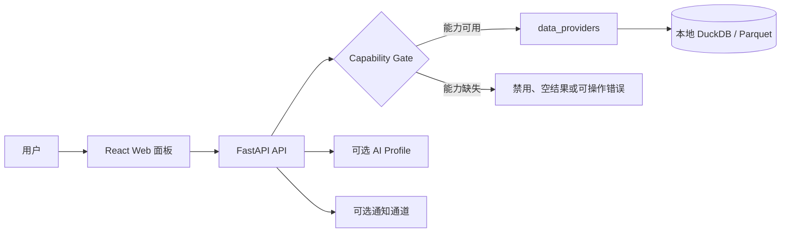

# TickFlow Stock Panel 功能使用指南

> **更新时间：2026-08-10**
> **适用版本：** 当前 `main` 工作树中的 React + FastAPI 面板  
> **读者：** 希望使用面板进行市场研究、选股、回测、监控与交易复盘的用户  
> **范围：** 本文覆盖已挂载的 Web 功能，以及可通过 REST / Agent / MCP 使用的高级功能；不把路线图、内部开发页或占位 UI 当作已交付能力。

TickFlow Stock Panel 是以本地数据为主的 A 股量化研究工作台，提供行情研究、策略选股、回测验证、实时监控、交易纪律和复盘能力。港股、ETF 与指数提供按市场能力划分的支持。AI 只用于解释、结构化分析和辅助研究；系统**不生成订单、不自动下单、不提供 AI 荐股或涨停预测**。

## 目录

1. [开始前：启动、数据与可用性](#1-开始前启动数据与可用性)
2. [完整功能地图](#2-完整功能地图)
3. [行情、看板与标的管理](#3-行情看板与标的管理)
4. [选股、策略与指标](#4-选股策略与指标)
5. [深度分析与 AI 辅助研究](#5-深度分析与-ai-辅助研究)
6. [回测、因子与组合研究](#6-回测因子与组合研究)
7. [监控、告警与消息通知](#7-监控告警与消息通知)
8. [交易计划、纪律与复盘](#8-交易计划纪律与复盘)
9. [数据管理、扩展数据与设置](#9-数据管理扩展数据与设置)
10. [高级 REST、Agent 与 MCP 能力](#10-高级-restagent-与-mcp-能力)
11. [市场覆盖与已知边界](#11-市场覆盖与已知边界)
12. [推荐使用路径](#12-推荐使用路径)

---

## 1. 开始前：启动、数据与可用性

### 1.1 启动与首次配置

开发环境可使用：

```bash
cp .env.example .env
make start-local
# 或：./dev.sh
```

默认地址：前端 `http://localhost:3011`，后端 `http://localhost:3018`。首次进入会经过四步向导：欢迎、数据源确认、能力探测和完成。启用访问密码后，访问者还需在登录页通过认证。

启动后建议先检查：

```bash
curl http://127.0.0.1:3018/health
curl http://127.0.0.1:3018/api/capabilities
```

前者用于确认应用健康，后者是功能可用性的唯一运行时依据。不要根据页面是否存在推断数据一定齐全。

### 1.2 三类可用性状态

| 状态 | 含义 | 常见例子 |
|---|---|---|
| 可直接使用 | 页面和所需本地数据均已具备 | 看板、策略列表、已有 K 线查询 |
| 需要配置或数据 | 功能入口存在，但需 AI profile、Webhook、扩展数据或可选依赖 | AI 分析、PushPlus、回测、概念行业分析 |
| 能力降级 | 当前 provider 或本地快照缺少所需能力，页面会显示空结果、禁用提示或可操作错误 | 实时行情、财务、分钟 K、五档盘口 |

所有行情与财务主链路经 `data_providers` 读取本地 DuckDB。默认 provider 为 `fquant_local`；设置中的按能力切换不等于允许任意公网行情源。数据过期、挂载缺失或能力不支持时，应先查看“设置 → 数据源”与 `GET /api/capabilities`。



**本节源码依据**

- [`README.md`](../README.md)
- [`frontend/src/pages/Onboarding.tsx`](../frontend/src/pages/Onboarding.tsx)
- [`frontend/src/pages/Auth.tsx`](../frontend/src/pages/Auth.tsx)
- [`backend/app/data_providers/registry.py`](../backend/app/data_providers/registry.py)
- [`backend/app/data_providers/capability_gate.py`](../backend/app/data_providers/capability_gate.py)

---

## 2. 完整功能地图

### 2.1 Web 页面与用途

| 入口 | 页面 | 主要用途 | 关键前置 |
|---|---|---|---|
| `/` | 看板 | 指数、涨跌分布、榜单、板块热度与市场情绪概览 | 本地行情 / enriched 数据 |
| `/watchlist` | 自选 | 自选标的、排序、行情快照与扩展字段 | 标的资料；实时数据为可选 |
| `/screener` | 策略 | 内置/自定义/AI 策略扫描、参数覆盖、公式导出 | enriched 数据 |
| `/condition-screener` | 条件选股 | 字段、运算符与阈值组合选股；可选自然语言解析 | enriched 数据；NL 解析需 AI |
| `/backtest` | 回测 | 策略/因子回测、组合策略构建与参数网格实验 | `vectorbt` 可选依赖、enriched 数据 |
| `/optimizer` | 组合优化 | 六种权重方法、风险统计与策略池导入 | 至少两只具有共同历史的数据标的 |
| `/regime` | 市场环境 | 本地 enriched 市场环境分型、历史与覆盖率 | enriched 数据 |
| `/cross-section` | 横截面研究 | 相关矩阵、相对强度、同业排名和以股找股 | enriched / 财务快照 |
| `/signal-scorecard` | 信号记分卡 | 显式跟踪信号的 T+1/3/5/10 回顾性命中统计 | 先显式启用 tracked signals |
| `/research` | 研究中心 | 研究假设、证据、Run Card 和定时研究 | 本地研究存储；定时任务需显式创建 |
| `/stock-analysis` | 个股分析 | 日 K、关键价位、形态和 AI 四维分析 | 单股 K 线；AI 分析需 profile |
| `/financials` | 财务分析 | 六类财务表、同步、AI 财务报告 | `financial` capability |
| `/concept-analysis` | 概念分析 | 概念热度、领涨股与 RPS 轮动 | 概念扩展数据 |
| `/industry-analysis` | 行业分析 | 多级行业排名、热度与龙头 | 行业扩展数据 |
| `/limit-ladder` | 连板梯队 | 涨停层级、晋级、炸板/断板与维度统计 | A 股涨跌停信号 |
| `/indices` | 指数 | 指数搜索、日 K、分钟 K 与同步 | 对应 provider capability |
| `/monitor` | 监控中心 | 规则配置、命中记录、实时提醒和推送 | `realtime` capability |
| `/review` | 大盘复盘 | A/HK 市场分区、AI 报告、定时复盘与复盘推送 | 本地数据；AI/通知可选 |
| `/agent` | AI 助手 | 多轮工具调用、会话、附件与可取消流式回答 | AI profile |
| `/journal` | 交易复盘 | 券商流水导入、FIFO 台账与行为诊断 | 可解析的成交文件；本地基准数据可选 |
| `/trading` | 交易 | 人工交易生命周期、计划、账户、纪律与 AI 归因 | 人工录入；AI/fhold 为可选 |
| `/data` | 数据 | 管道任务、状态、schema 与数据维护 | 本地数据目录 |
| `/guide` | 功能说明 | 模块用途、建议使用顺序、当前数据时效与能力边界 | 当前服务数据状态 |
| `/settings` | 设置 | 数据源、AI、监控、扩展页面、信号、菜单、系统和治理设置 | 管理权限 / 相应配置 |

`/onboarding` 和 `/login` 是首次使用与认证入口。`/analysis/:menuId` 用于用户创建的扩展分析页面。`/dev` 是隐藏开发调试页，`/branding` 仅为视觉方案预览，两者不属于常规用户功能。

### 2.2 默认关闭的能力

下表中的能力只有用户显式开启或配置后才会运行；关闭时不应有后台调用或隐式外发。

| 能力 | 默认 | 开启位置 | 说明 |
|---|---:|---|---|
| 实时行情轮询 / SSE | 关闭 | 设置 → 实时监控 | provider 无 realtime 能力时整页降级 |
| AI profile fallback | 关闭 | 设置 → AI | 仅 allowlist 中 profile 可按顺序回退 |
| 结构化计划检查 | 关闭 | 设置 → 实时监控 / 交易计划台 | 消耗 token，仅检查已保存计划 |
| 计划检查连续性分析（M25） | 关闭 | 交易 → 计划台 | 仅在结构化计划检查已开启时可选择；每次生成新 artifact |
| 受控外部行情 fallback | 关闭 | 数据 → 外部行情降级 | `realtime` / `depth` scope 独立选择；只读展示且带 provenance |
| 信号记分卡跟踪 | 空白名单 | 信号记分卡 | 未显式保存启用信号时不采集事件 |
| 交易自动归因 | 关闭 | 设置 → 实时监控 | 工作日 16:45 的 L0/L1 盘后任务 |
| 定时大盘复盘 | 关闭 | 大盘复盘页 | 生成后可选择推送渠道 |
| 系统通知与规则默认 Webhook | 关闭 | 设置 → 实时监控 | 通知和外部发送均可独立配置 |
| ETF/港股行情轮询、连板 sealed 监控 | 关闭 | 设置 → 实时监控 | 取决于数据和 provider 支持 |

**本节源码依据**

- [`frontend/src/router.tsx`](../frontend/src/router.tsx)
- [`frontend/src/components/Layout.tsx`](../frontend/src/components/Layout.tsx)
- [`frontend/src/pages/FeatureGuide.tsx`](../frontend/src/pages/FeatureGuide.tsx)
- [`backend/app/services/preferences.py`](../backend/app/services/preferences.py)

---

## 3. 行情、看板与标的管理

### 3.1 看板与指数

**看板**聚合主要指数、涨跌分布、涨跌幅榜、概念/行业维度热度和情绪信息。指数行情优先读取实时快照；不可用时会回落到本地指数日 K 的最近数据。没有 enriched 数据时，榜单或板块分区可以为空。

**指数页**提供指数列表与搜索、日 K（含 enriched 指标）、分钟 K，以及按数据能力执行的同步操作。指数侧边栏卡片与看板实时性受同一 capability 约束。

### 3.2 标的搜索与自选

标的搜索支持 A 股、港股、ETF 与指数的代码或名称匹配。自选页可以：

- 添加、删除、清空、置顶和拖拽排序自选标的；
- 展示 enriched 行情快照与迷你蜡烛图；开启实时行情后，页面会以内存中的只读快照覆盖最新价、涨跌幅、成交额和名称，不写回本地行情库；
- 读取已配置扩展数据的字段；
- 实时快照优先读取本地 provider。本地源日期落后时页面显示“本地快照截至 YYYY-MM-DD”；只有用户在“设置 → 数据源”显式开启 `realtime` 外部 fallback 且本地快照缺失或过期时，才使用公共源并显示“外部源·降级数据”。两类快照都只用于展示，不进入选股、监控或回测。

### 3.3 日 K、分钟 K 与技术形态

日 K 接口可返回 OHLCV、已计算的指标以及可选扩展字段。分钟 K 通过发布 catalog 路由到对应快照；A 股 minutes/trans 缺少 staged catalog 或 catalog 过期时会 fail-closed，返回可操作错误而非静默读取 raw 数据。

市场口径：

- A 股日 K 使用除权因子重建的前复权口径；
- 港股为未复权口径；
- ETF 与指数走独立数据分区；
- K 线形态识别支持 stock、ETF 和 index。

**本节源码依据**

- [`frontend/src/pages/Dashboard.tsx`](../frontend/src/pages/Dashboard.tsx)
- [`frontend/src/pages/Watchlist.tsx`](../frontend/src/pages/Watchlist.tsx)
- [`frontend/src/pages/Indices.tsx`](../frontend/src/pages/Indices.tsx)
- [`backend/app/api/overview.py`](../backend/app/api/overview.py)
- [`backend/app/api/intraday.py`](../backend/app/api/intraday.py)
- [`backend/app/api/kline.py`](../backend/app/api/kline.py)
- [`backend/app/api/indices.py`](../backend/app/api/indices.py)
- [`backend/app/api/watchlist.py`](../backend/app/api/watchlist.py)
- [`backend/app/api/patterns.py`](../backend/app/api/patterns.py)

---

## 4. 选股、策略与指标

### 4.1 策略选股

策略页提供内置策略、用户自定义策略与 AI 生成策略。内置策略基于 Polars 向量化表达式，在某一交易日的 enriched 截面上扫描；当前内置覆盖趋势、量价、涨跌停、反转和波动等类别。

可用操作：

1. 选择策略并设置可公开的参数、基础过滤与展示上限；
2. 对最新或指定日期运行扫描，查看命中列表；
3. 将策略结果用于回测、监控或组合优化；
4. 对有显式 DSL 的策略导出通达信/同花顺公式；
5. 保存名称、描述、过滤和参数等 override。内置策略不可删除。

没有可用 enriched 日期时，选股会明确报“无可用数据日期”；先在数据页运行盘后管道或重建 enriched。

### 4.2 条件选股、自定义信号与自然语言解析

**条件选股**是安全的字段查询界面：选择字段、运算符和阈值后执行，查询由字段注册表编译。它不接受任意 SQL 或 Polars 表达式输入。

**自定义信号库**位于“设置 → 信号库”。用户使用字段和操作符组合定义入场、出场或双向信号，信号经过白名单校验后进入 enriched 管道并可供策略/监控引用。

**自然语言条件解析**是可选 AI 功能：输入研究描述后，系统返回可审查的结构化条件与 `ai_meta`。没有可用 AI profile 时，该入口不会伪造条件，而是返回不可用错误。

### 4.3 AI 策略生成与策略治理

AI 策略生成读取项目的策略开发约束，输出策略文件并经 AST 校验后才保存到 `data/strategies/ai/`。引擎无法加载时会回滚保存，避免残缺策略进入扫描链路。完整字段约定、历史窗口策略和指标列请见 [`strategy-guide.md`](strategy-guide.md)。

每个策略可额外维护**策略风险声明（profile）**：

- 明确失效信号（名称、可观察条件、动作）；
- 声明风险预算、期限和复盘节奏；
- 可选声明策略 family 与 playbook；
- 运行七项机械体检；可选 `ai=true` 追加 AI 深度体检。

体检或 AI 归因不会自动改写策略。策略变更必须创建带反证条件的提案，经过 `draft → approved/rejected → trial → verified/rejected` 人工状态机；样本少于 10 时不能批准。

### 4.4 指标流水线与关键价位

盘后管道使用 Polars 在全市场数据上生成 enriched 分区，覆盖 MA、EMA、MACD、动量、布林、RSI、KDJ、ATR、量比、涨跌停/连板和原子信号。指标、选股与回测共用前复权口径。

个股分析还提供 11 类关键价位和带状曲线：成交密集区压力/支撑、枢轴、前高前低、布林、Keltner、ATR 止损、缺口、斐波那契与整数关口等。这些是可复算的技术观察，不是交易指令。

**本节源码依据**

- [`frontend/src/pages/Screener.tsx`](../frontend/src/pages/Screener.tsx)
- [`frontend/src/pages/ConditionScreener.tsx`](../frontend/src/pages/ConditionScreener.tsx)
- [`frontend/src/pages/settings/CustomSignals.tsx`](../frontend/src/pages/settings/CustomSignals.tsx)
- [`backend/app/api/screener.py`](../backend/app/api/screener.py)
- [`backend/app/api/strategy.py`](../backend/app/api/strategy.py)
- [`backend/app/api/signals.py`](../backend/app/api/signals.py)
- [`backend/app/api/strategy_profile.py`](../backend/app/api/strategy_profile.py)
- [`backend/app/indicators/pipeline.py`](../backend/app/indicators/pipeline.py)
- [`backend/app/indicators/levels.py`](../backend/app/indicators/levels.py)

---

## 5. 深度分析与 AI 辅助研究

### 5.1 个股与财务分析

**个股分析**提供专用日 K 图、关键价位、K 线形态与 AI 四维分析。AI 输出按技术、基本面、财务和消息面组织，采用流式展示，可取消并可归档报告。重复分析同一标的/同日时页面会要求再次确认。港股可使用该路径，但页面应把价格口径理解为未复权。

**财务分析**在 `financial` capability 可用时展示以下本地财务表：核心指标、利润表、资产负债表、现金流量表、快报和业绩预告。支持手动同步及可选 AI 财务分析和报告归档。若 provider 没有财务能力，页面与接口按 capability 灰显/拒绝，不应通过别的链路猜测数据。

### 5.2 概念、行业、RPS 与连板梯队

概念和行业分析使用扩展数据的映射字段，显示涨幅、热度、领涨标的、成交额与龙头等维度。行业支持按层级查看；概念页还提供最近 7–30 个交易日的 RPS 轮动矩阵。

概念/行业数据在首次启动时只创建预设配置，仍需用户在页面或数据管理中显式获取。没有相应扩展表时，排名会为空。

连板梯队是 A 股特有的涨停研究页，可查看板层、晋级、炸板/断板池和概念/行业分布。它不适用于港股。五档盘口当前不具备，因此涉及 sealed 真假涨停的判断会降级为空，不应将其解读为“未发生”。

### 5.3 大盘复盘

复盘页区分市场制度：

- **A 股分区：** AI 报告、情绪周期、连板天梯、题材轮动、风险线索、纪律红旗；
- **港股分区：** 市场宽度和涨跌榜。港股没有涨跌停制度，因此不会复用 A 股连板/情绪/题材逻辑。

AI 大盘复盘支持流式生成、历史归档和可选发送。定时复盘需显式开启，默认工作日 15:10（可配置但不早于 15:00）。

### 5.4 AI 助手与文件上下文

AI 助手支持会话保存、多轮工具调用、工具调用链展示、流式响应、取消和 AI profile 选择。内置工具都是只读研究工具，例如查看能力、读取 K 线、运行条件选股、策略回测、组合优化和因子分析。

附件能力包括文本、Markdown、CSV、XLSX/XLS 和 PDF 上传，以及受 SSRF 保护的公开 URL 读取。PDF 使用 pypdfium2 提取文本层；扫描件或图片页不做 OCR，逐页提取失败会返回 warning。附件会标记为“非行情事实”上下文，不能替换行情/财务主数据。

### 5.5 研究中心、横截面研究与信号记分卡

**研究中心**用于维护可审计的研究假设：状态流转、证据追加、Run Card 引用和定时研究均保留本地记录。证据采用追加语义；定时研究只执行白名单模板，不生成交易动作。

**横截面研究**在用户明确输入标的后，读取本地 enriched/财务快照，展示收益率相关矩阵、相对强度、同业排名和以股找股条件。每个结果区都显示 `boundaryNotes`；样本不足或零方差返回空值，不补造相关性。

**信号记分卡**默认没有 tracked signal。用户显式保存白名单后，盘后管道才会为对应信号生成去重事件，并按 T+1/3/5/10 追加 outcome。页面可查看 hit/miss/neutral、事件明细和受限历史回填；结果只用于回顾性研究，不进入选股、回测、监控或交易。

**本节源码依据**

- [`frontend/src/pages/StockAnalysis.tsx`](../frontend/src/pages/StockAnalysis.tsx)
- [`frontend/src/pages/Financials.tsx`](../frontend/src/pages/Financials.tsx)
- [`frontend/src/pages/ConceptAnalysis.tsx`](../frontend/src/pages/ConceptAnalysis.tsx)
- [`frontend/src/pages/IndustryAnalysis.tsx`](../frontend/src/pages/IndustryAnalysis.tsx)
- [`frontend/src/pages/LimitUpLadder.tsx`](../frontend/src/pages/LimitUpLadder.tsx)
- [`frontend/src/pages/Review.tsx`](../frontend/src/pages/Review.tsx)
- [`frontend/src/pages/Agent.tsx`](../frontend/src/pages/Agent.tsx)
- [`frontend/src/pages/Research.tsx`](../frontend/src/pages/Research.tsx)
- [`frontend/src/pages/CrossSection.tsx`](../frontend/src/pages/CrossSection.tsx)
- [`frontend/src/pages/SignalScorecard.tsx`](../frontend/src/pages/SignalScorecard.tsx)
- [`backend/app/api/research.py`](../backend/app/api/research.py)
- [`backend/app/api/cross_section.py`](../backend/app/api/cross_section.py)
- [`backend/app/api/signal_scorecard.py`](../backend/app/api/signal_scorecard.py)
- [`backend/app/api/stock_analysis.py`](../backend/app/api/stock_analysis.py)
- [`backend/app/api/financials.py`](../backend/app/api/financials.py)
- [`backend/app/api/review.py`](../backend/app/api/review.py)
- [`backend/app/api/market_recap.py`](../backend/app/api/market_recap.py)
- [`backend/app/services/document_reader.py`](../backend/app/services/document_reader.py)

---

## 6. 回测、因子与组合研究

### 6.1 信号与策略回测

回测工作台提供四类分析：

- **因子回测：** IC、IR、胜率、分层与多空组合；
- **策略回测：** 针对策略和标的池执行全周期回测，支持 T+1、手续费、滑点、止损、持仓天数、最大持仓数、敞口和仓位方式；
- **组合策略：** 声明式合并至少两个非组合策略，支持并集、交集、最少确认数与权重；
- **参数网格：** 对有限参数组合运行本地历史场景，展示进度、排名、稳健性、截断与取消状态；
- **流式策略回测：** 支持进度事件、切页重连和取消；
- **结果：** 净值、收益、夏普、最大回撤、胜率、交易明细、出场原因以及 `cause_tag`。

回测依赖 `vectorbt` optional extra；环境未安装时会明确返回不可用。服务器内存保护 `backtest_range_guard` 默认关闭；若部署方开启，则单次回测限制为 186 天以避免低内存服务器 OOM。

### 6.2 因子、Alpha Zoo 与稳健性

前端回测页支持单因子的 IC、IR、胜率、分层和多空分析。系统内置 30+ 个 enriched 数值因子，以及 Alpha Zoo 的 10 个 Alpha101 因子。

以下高级研究功能当前没有独立 Web 页；可用入口因能力而异：

| 能力 | 可用入口 | 结果 |
|---|---|---|
| 因子 manifest | REST、AI 助手、MCP | 查询 Alpha Zoo 元数据、公式、所需列和 warmup |
| 多因子对比 | REST、AI 助手、MCP | 对多个 Alpha Zoo 因子对比 IC/IR，可选随机对照 |
| 多因子合成 | AI 助手、MCP | 按 IC 权重产生标的评分排名 |
| 稳健性分析 | REST、AI 助手、MCP | walk-forward、Bootstrap Sharpe 置信区间、Monte-Carlo permutation、出场原因分解 |
| Run Card | REST | 策略回测与稳健性分析自动记录配置/策略 hash，便于审计与复现 |

### 6.3 组合优化

组合优化器支持 A 股和 ETF 的历史收益矩阵，输出权重表、环形图、年化波动和分散度统计。可从策略池导入命中标的，支持：

1. 等权；
2. 等波动；
3. 风险平价；
4. 均值方差；
5. 最大分散；
6. 动量加权。

至少需要两只具有共同历史交易日的有效标的。当前港股或无数据标的会在结果中标记为 dropped，而不是混入计算。

### 6.4 组合策略与参数网格

组合策略只允许引用非组合子策略，禁止递归嵌套和重复子策略。`union` 表示任一子策略命中即可进入合并结果；`intersect` 由 `min_confirm` 控制最少同时命中数量。保存后仍经现有策略引擎和回测入口运行，不产生订单。

参数网格只接受策略声明中的有界数值参数。前端显示请求组合数，服务端默认限制 24 个场景、硬上限 36；实验可取消，并持久化配置 hash、各场景统计、最佳场景和稳健性摘要。排序靠前不代表样本外有效，页面明确提示数据挖掘偏差和过拟合风险。


**本节源码依据**

- [`frontend/src/pages/Backtest.tsx`](../frontend/src/pages/Backtest.tsx)
- [`frontend/src/pages/Optimizer.tsx`](../frontend/src/pages/Optimizer.tsx)
- [`frontend/src/pages/backtest/CompositeStrategyBuilder.tsx`](../frontend/src/pages/backtest/CompositeStrategyBuilder.tsx)
- [`frontend/src/pages/backtest/ParameterGridPanel.tsx`](../frontend/src/pages/backtest/ParameterGridPanel.tsx)
- [`backend/app/backtest/parameter_grid.py`](../backend/app/backtest/parameter_grid.py)
- [`backend/app/api/backtest.py`](../backend/app/api/backtest.py)
- [`backend/app/backtest/strategy.py`](../backend/app/backtest/strategy.py)
- [`backend/app/backtest/factor.py`](../backend/app/backtest/factor.py)
- [`backend/app/backtest/factor_zoo.py`](../backend/app/backtest/factor_zoo.py)
- [`backend/app/backtest/robustness.py`](../backend/app/backtest/robustness.py)
- [`backend/app/backtest/optimizers.py`](../backend/app/backtest/optimizers.py)
- [`backend/app/services/research_registry.py`](../backend/app/services/research_registry.py)

---

## 7. 监控、告警与消息通知

### 7.1 监控规则与命中记录

监控中心可创建四类规则：策略、个股信号、价格涨跌和全市场异动。规则支持：

- 目标范围（标的、全市场或板块）；
- 多条件 `AND` / `OR`；
- 冷却期去重；
- `info`、`warn`、`critical` 严重级别；
- 是否允许此规则向外部 Webhook 推送。

行情更新后，规则引擎负责评估、去重、写入 `alerts.jsonl`、通过 SSE 推送，并在已开启时发出系统通知或 Webhook。页面提供未读徽标、命中原因与当前价位详情，以及单条/批量清理。

监控需要 realtime capability 且用户开启实时行情。若能力缺失，监控页面会提示切换数据源，而不会用无标记的公共接口替代数据。

### 7.2 推送和本机通知

可配置的消息通道如下：

| 通道 | 用途 | 凭据/限制 |
|---|---|---|
| 飞书 | 监控告警、复盘报告，支持文本和卡片 | URL/secret 经设置保存 |
| 钉钉、企微 | 监控告警、复盘报告 | 配置 Webhook 后可选用 |
| MeoW | 个人推送 | 按昵称配置 |
| PushPlus | 监控告警与复盘报告的微信推送 | 固定 PushPlus host；Token 仅保存在 `secrets.json`（0600），页面仅显示掩码 |
| 系统通知 | 本机弹窗 | 默认关闭；按操作系统适配 |
| 纪律红旗 Webhook | 每条新红旗的去重推送 | 仅由 `TRADING_RED_FLAG_WEBHOOK_URL` 显式配置 |

外发失败只记日志，**不会阻断**告警落盘、复盘归档、交易事件或审计写入。

**本节源码依据**

- [`frontend/src/pages/Monitor.tsx`](../frontend/src/pages/Monitor.tsx)
- [`frontend/src/pages/settings/Monitoring.tsx`](../frontend/src/pages/settings/Monitoring.tsx)
- [`backend/app/api/monitor_rules.py`](../backend/app/api/monitor_rules.py)
- [`backend/app/api/alerts.py`](../backend/app/api/alerts.py)
- [`backend/app/services/quote_service.py`](../backend/app/services/quote_service.py)
- [`backend/app/services/webhook_adapter.py`](../backend/app/services/webhook_adapter.py)
- [`backend/app/services/notify_adapter.py`](../backend/app/services/notify_adapter.py)

---

## 8. 交易计划、纪律与复盘

> 本章的功能用于记录和审查用户自己的交易计划与事实。它们不是自动化交易系统，也不能绕过用户的最终决策。

### 8.1 人工交易生命周期与账户快照

交易页只展示四个已实现页签：持仓、单笔详情、计划台和账户。系统不提供向交易软件发送信号或自动下单的入口。

单笔交易由 append-only 事件驱动，状态明确区分：

- `计划中`：已建档/准备但尚无真实成交，可修订计划或以 `void` 显式作废；
- `建仓中`：已有部分 `fill`，但计划尚未 `complete/finalizeOnly` 收口；`trim` 只能在此阶段缩减未成交计划，`add` 可调大计划，二者都不改变真实仓位；
- `持仓中`：建仓已显式完成，可止盈、止损、调整或全部平仓；如需继续分批建仓，必须先用 `add` 调大计划并回到建仓中；
- `已平仓` / `已作废`：终态，拒绝继续写事件。

系统把 `trade_events.jsonl` 作为只追加的历史事实流，把 `decision_audit.jsonl` 作为只追加、永不清理的决策审计流；成本、投入金额和已实现盈亏始终由服务端重算。`close` 成功后账户按 `tradeId` 幂等结转，客户端原请求重试不会重复事件、审计或资金变化。门禁拦截和用户确认绕行都会留下审计记录。

账户页维护资金基数、单标的比例上限、期限资金等门禁输入，资金变化只允许追加。组合快照实时派生 NAV、持仓和健康状态；其下方“组合风险透视”用 canonical 日 K 在后端计算组合年化波动、最大回撤、最大两两相关性、有效持仓数、风险贡献和相关性矩阵。前端不重算；无持仓或共同样本不足时返回明确状态和 warning，不伪造数值。

可选 fhold 接入只读调用 `fhold-cli` 获取真实券商账户/持仓；CLI 不可用、超时或输出异常时，响应中的 `fhold.available` 为 `false`，不会阻断面板自己的生命周期快照。

### 8.2 门禁、计划台与纪律红旗

事件提交前可执行门禁预检。服务端不可关闭的结构红线包括：单标的比例、止损/退出定义、止损距离、资金期限匹配，以及计划与成交价格对账。用户可以确认绕行，但系统会将其作为 `gateBypassed` 事实审计，而不是悄悄放行。

**计划台**按日保存盘前计划，支持 `buy_new`、`add`、`tp`、`sl`、`close`、`adjust` 与 `watch`。盘后可查看：

- `planned_but_not_done`：计划但未执行；
- `done_but_not_planned`：执行但未计划；
- `matched`：计划与执行匹配。

计划文件可为了编辑而整体替换；它不是 append-only 交易事实源。`watch` 是观察动作，不计作“未执行”。

**纪律红旗**由程序机械检测，不依赖 AI：放宽止损、亏损加仓、绕过门禁/审计断链、持仓超期、仓位超限与门禁膨胀都会被记录。即使交易盈利，违规仍会被保留。缺少账户或策略 profile 时，只跳过依赖该数据的单项检查。

### 8.3 策略提案、AI 归因与结构化计划检查

单笔 AI 归因将事件流和红旗按 A/B/C/D 四类结果整理，并给出 12 种不一致模式：策略正常不利、执行偏离、规则歧义/冲突、数据问题。只有“规则歧义/冲突”才允许提出策略变更；结果不会自动修改策略。

盘后状态驱动归因分三级：L0 无候选时不调用 AI；L1 只处理新红旗或新平仓；L2 才是用户手动触发的全量归因。AI 未配置时自动任务用 `blocked_by_dependency` 表示依赖阻断。

**结构化计划检查**默认关闭，仅可对已保存的单条计划运行：

1. preflight 检查数据与输入完整性；
2. Stage1 对 canonical 日 K 做趋势、波动、流动性和充分性诊断；
3. 程序门禁以最保守规则产生 `proceed`、`wait` 或 `unknown`；
4. 只有 `proceed` 才调用 Stage2 检查计划文本。

`proceed` 仅表示输入与前置条件足以进行检查，不表示建议交易。Stage2 schema 不包含订单、方向、数量、建议价格或执行动作；模型也不能把程序门禁升级。结果可查看可审计 trace 并导出 JSON/Markdown，且不写交易事件。

计划检查还提供默认关闭的 **M25 连续性分析**。开启后，程序只比较上一份同用途 artifact 的数据截止日、策略配置、市场与复权等兼容性锚点；兼容时可使用增量上下文，锚点失配、跨度过大或父记录不可用时强制回到全量分析。每次运行都生成新的 append-only artifact，通过 `parent_attempt_id` 保留链路，UI 展示 mode、原因、新增 K 线数量、截止日和 token 用量。连续性元数据不包含订单、方向、建议价格或执行动作。

### 8.4 券商流水交易复盘

“交易复盘”页独立于人工生命周期，面向导入的券商成交流水：上传文件、修正列映射、预览后进入 FIFO 配对台账。系统输出已清仓/持仓回合、处置效应、过度交易、追涨、浮亏加仓、基准超额和可选 narrative 摘要。

导入支持追加去重；本地缺少日 K、基准或港股覆盖不足时，相关指标以 warning 告知。原始 fills 与报告分开保存，不会被自动送入 AI。

**本节源码依据**

- [`frontend/src/pages/Trading.tsx`](../frontend/src/pages/Trading.tsx)
- [`frontend/src/pages/TradeJournal.tsx`](../frontend/src/pages/TradeJournal.tsx)
- [`backend/app/api/trading.py`](../backend/app/api/trading.py)
- [`backend/app/api/trading_plans.py`](../backend/app/api/trading_plans.py)
- [`backend/app/api/trading_review.py`](../backend/app/api/trading_review.py)
- [`backend/app/services/trading/lifecycle.py`](../backend/app/services/trading/lifecycle.py)
- [`backend/app/services/trading/gates.py`](../backend/app/services/trading/gates.py)
- [`backend/app/services/trading/red_flags.py`](../backend/app/services/trading/red_flags.py)
- [`backend/app/services/trading/plan_check.py`](../backend/app/services/trading/plan_check.py)
- [`backend/app/services/ai_continuity.py`](../backend/app/services/ai_continuity.py)
- [`backend/app/api/trade_journal.py`](../backend/app/api/trade_journal.py)

---

## 9. 数据管理、扩展数据与设置

### 9.1 数据页和盘后管道

数据页可查看数据状态和 Parquet schema，并管理异步任务。主要操作包括：

- 手动运行盘后管道：日 K 同步、enriched 重算和监控评估；
- 重建 enriched、修复指定范围、扩展日 K/分钟 K 历史；
- 查看任务进度、取消可取消任务；
- 按页面授权范围维护本地数据。
- A 股 canonical 全历史可在数据页手动回填。任务只读启动时 pin 住的已发布 provider snapshots，在用户 `data/` 之外生成 staging；完整成功后才原子发布 generation。图表、选股和回测读取时会把该历史与受信任的本地近期 enriched 合并，同日以本地为准。

在 `fquant_local` 模式，stock raw mirror 被显式禁止写入；选股和分析依赖的是 enriched 分区。数据页不能把外部 fallback 结果写进 canonical/enriched 或回测输入。

数据页的“外部行情降级”仍默认关闭，且 scope 需显式选择：

- `realtime`：本地快照缺失或陈旧时，只为页面展示补读实时快照；
- `depth`：本地 provider 无五档能力时，只在盘中补读腾讯公共行情五档。

两条路径都保留 `source` / `degraded` provenance，并复用 host 白名单、`trust_env=False`、限速、缓存、重试与熔断。它们不写 sealed、canonical、enriched，也不进入选股、回测或监控评估。连板 sealed 真假判断仍只认本地 sealed 分区，不因开启 depth fallback 而改变历史口径。

### 9.2 市场数据研究

研究页“市场数据”提供严格限界的只读查询：

- A 股筹码分布；
- 个股日级/分钟资金流与板块净流入排名；
- 集合竞价与 A 股逐笔成交；
- 各数据集的来源、覆盖日期、行数/标的数以及 unavailable reason。

每次查询都要求明确的标的、日期/范围、频率与条数上限；不可用与可用但本次无数据分开展示。结果不会写入 canonical/enriched，也不会成为选股、回测或监控评估输入。

### 9.3 扩展数据

扩展数据允许将自有研究数据与内置数据同台分析：

- 通过 CSV/Excel 上传或 JSON 写入；
- 自动发现 schema 与 symbol/code 候选；
- 选择 snapshot 或 timeseries 模式；
- 配置 HTTP 定时拉取、测试拉取和手动运行；
- 查看/修复符号映射，供自选、概念、行业和扩展页面使用。

内置预设包括概念、行业、龙虎榜以及东方财富的限售解禁、股东户数、融资融券、大宗交易、研报/EPS 和个股新闻等。预设创建配置不等于已拉取数据；需要用户明确获取，网络失败只产生 warning。

### 9.4 设置

设置页集中管理：

- AI profile（OpenAI 兼容、ACP、Codex CLI）、全局默认、按功能选择和受控 fallback；已保存 profile 可由用户主动执行最小“测试连接”，该探测只检查目标 profile、不使用 fallback，并显示实际模型与耗时；
- 实时行情、监控、通知、定时复盘与交易自动归因；
- 自定义信号、策略提案审批、扩展分析菜单；
- 侧边栏菜单隐藏/排序、访问密码和系统偏好。

扩展分析菜单可创建 `dimension_rank`、`ranking` 或 `table` 模板的动态页面，绑定已有扩展数据集，支持显隐和排序。它不会自动生成与内置概念/行业页重复的菜单。

**本节源码依据**

- [`frontend/src/pages/Data.tsx`](../frontend/src/pages/Data.tsx)
- [`frontend/src/pages/Settings.tsx`](../frontend/src/pages/Settings.tsx)
- [`backend/app/api/data.py`](../backend/app/api/data.py)
- [`backend/app/api/pipeline.py`](../backend/app/api/pipeline.py)
- [`backend/app/api/ext_data.py`](../backend/app/api/ext_data.py)
- [`backend/app/services/ext_data.py`](../backend/app/services/ext_data.py)
- [`backend/app/services/ext_pull.py`](../backend/app/services/ext_pull.py)
- [`backend/app/api/analysis.py`](../backend/app/api/analysis.py)
- [`backend/app/api/settings.py`](../backend/app/api/settings.py)

---

## 10. 高级 REST、Agent 与 MCP 能力

### 10.1 REST-only 研究能力

下列能力主要面向 API 客户端、Agent 或 MCP；部分结果也会被已有 Web 页面引用。

| 能力 | API 前缀 | 用途 |
|---|---|---|
| 因子对比 | `/api/backtest/factors/compare` | 对比 Alpha Zoo 因子的 IC/IR |
| 稳健性分析 | `/api/backtest/strategy/robustness` | walk-forward、Bootstrap、Monte-Carlo、出场归因 |
| 文件 / URL 读取 | `/api/documents/read`、`/api/documents/read-url` | 为 AI 提供受限的非行情事实附件上下文 |

研究假设、证据、Run Card 和定时研究已挂载到 `/research`；横截面研究和信号记分卡也已有独立页面，不再属于“仅 REST”能力。多因子评分合成仍没有 REST 端点，请通过 AI 助手或 MCP 的 `compose_factor_score` 调用。

### 10.2 AI 助手的只读工具

Agent 与 MCP 共用以下 11 个只读工具：

1. `get_capabilities`；
2. `list_strategies`；
3. `get_kline`；
4. `run_screener`；
5. `run_backtest`；
6. `get_market_overview`；
7. `list_ext_data`；
8. `optimize_portfolio`；
9. `analyze_factor`；
10. `compare_factors`；
11. `compose_factor_score`。

它们能够读数据和计算研究结果，但没有文件写入、网络抓取、账户操作或下单工具。Agent 的语言输出仍须由用户审查。

### 10.3 MCP Server

MCP 使用 stdio JSON-lines，不监听 TCP：

```bash
cd backend
uv run python -m app.mcp_server --self-test
```

`--self-test` 会列举工具并调用 `get_capabilities`。将其接入支持 MCP 的客户端后，应先调用 capability/策略/数据查询工具，再组合调用回测、因子或优化工具。MCP 与面板共享本地 provider 和同一套只读工具注册表。

**本节源码依据**

- [`backend/app/api/research.py`](../backend/app/api/research.py)
- [`backend/app/api/backtest.py`](../backend/app/api/backtest.py)
- [`backend/app/api/documents.py`](../backend/app/api/documents.py)
- [`backend/app/api/agent.py`](../backend/app/api/agent.py)
- [`backend/app/services/agent_tools.py`](../backend/app/services/agent_tools.py)
- [`backend/app/mcp_server.py`](../backend/app/mcp_server.py)

---

## 11. 市场覆盖与已知边界

### 11.1 市场覆盖矩阵

| 能力 | A 股 | 港股 | ETF | 指数 |
|---|---:|---:|---:|---:|
| 日 K / 分钟 K / 实时快照 | 支持，受 capability 约束 | 支持，未复权 | 日 K；实时按设置/能力 | 日 K / 分钟 K |
| 选股与指标 | 主路径 | 不作为全市场主路径 | 可用于部分策略/研究 | 不参与股票选股 |
| 个股分析 / 形态 | 支持 | 支持，未复权提示 | 形态支持 | 形态支持 |
| 财务 | 支持，受 `financial` capability 约束 | 当前本地发布快照无港股财务，明确 unavailable | 不适用 | 不适用 |
| 概念 / 行业 / RPS | 支持，需扩展数据 | 不适用 | 无概念标签 | 不适用 |
| 连板 / 情绪周期 | 支持 | 不适用 | 不适用 | 不适用 |
| 回测 / 组合优化 | 支持 | 优化时可能 dropped | 支持 | 仅作为基准/数据源 |
| 大盘复盘 | A 股六分区 | 宽度与涨跌榜分区 | 不适用 | 指数展示 |

### 11.2 明确不支持或不应误解的能力

| 范围 | 当前状态 | 正确理解 |
|---|---|---|
| 五档盘口 depth5 | 本地 provider 不可用；受控 fallback 可选 | `depth` scope 默认关闭，只补盘中只读展示；sealed/历史判断仍按本地能力降级 |
| 自动交易、券商下单 | 不支持 | 交易页仅记录人工事件、审计和计划；桥接页是占位 |
| AI 荐股、涨停预测 | 不支持 | AI 只提供研究、报告、归因和计划检查辅助 |
| 任意外部行情替代主数据 | 不支持 | 主链路只读本地 DuckDB；受控 fallback 也不得污染 canonical/enriched/回测 |
| PDF 附件解析 | 支持文本层，图片页降级 | 使用 pypdfium2 提取文本层；扫描件不做 OCR，逐页提取失败会返回 warning |
| 港股连板/情绪/题材轮动 | 不适用 | 港股没有 A 股涨跌停制度与对应概念标签链路 |
| 港股复权 / 财务 | 本地源缺失，明确 unavailable | 港股日 K/minutes/trans 可用，但 provider 不借用同码 A 股公司行动或财务；相关查询 fail-closed |
| 研究登记、横截面与信号记分卡 | 已挂载页面 | `/research`、`/cross-section`、`/signal-scorecard` 均为只读/回顾性研究入口 |

**本节源码依据**

- [`AGENTS.md`](../AGENTS.md)
- [`backend/app/markets.py`](../backend/app/markets.py)
- [`backend/app/data_providers/fquant_provider.py`](../backend/app/data_providers/fquant_provider.py)
- [`backend/app/services/depth_service.py`](../backend/app/services/depth_service.py)
- [`backend/app/services/document_reader.py`](../backend/app/services/document_reader.py)

---

## 12. 推荐使用路径

### 12.1 每日研究路径

1. 在“设置 → 数据源”确认 capability 与数据截止日；
2. 在“数据”运行盘后管道或确认上次任务完成；
3. 从看板、指数和自选观察市场与标的；
4. 用策略页或条件选股生成候选；
5. 在个股/财务/概念/行业页补充证据；
6. 需要时通过回测、因子分析或组合优化验证假设；
7. 将需持续观察的规则加入监控中心。

### 12.2 交易纪律路径

1. 在交易计划台先保存盘前计划和失效条件；
2. 创建单笔交易并让门禁检查结构红线；
3. 所有实际变化通过追加事件记录，而不是修改历史；
4. 在盘后查看计划偏差、纪律红旗和账户健康度；
5. 需要时运行 AI 归因；策略规则变化必须转为带反证条件的提案；
6. 如要使用结构化计划检查，先显式开启，且只把结果当作审查材料。

### 12.3 从零配置 AI 与通知

1. 在“设置 → AI”创建并保存一个 profile，先点“测试连接”确认目标后端可用；测试固定不走备用 profile，因此不会把备用源成功误报为当前配置健康；
2. 再在个股/财务/复盘/Agent 等低风险研究入口验证输出；
3. 在“设置 → 实时监控”配置通知渠道；PushPlus Token 只填写在其专用输入框；
4. 先用少量监控规则验证推送与冷却期；
5. 仅在了解 token 成本与辅助性质后开启 fallback、结构化计划检查、交易自动归因或定时复盘。

---

## 相关文档

- [快速开始与运行配置](../README.md)
- [策略开发指南](strategy-guide.md)
- [FQuant 数据源集成进度与能力边界](../backend/docs/FQUANT_INTEGRATION_PROGRESS.md)
- [受控外部 fallback 设计](../backend/docs/CONTROLLED_EXTERNAL_FALLBACK_DESIGN.md)
- [交易纪律与 YMOS 移植设计](../backend/docs/YMOS_PORTING_PLAN.md)
- [PA_Agent 移植能力与 AI 边界](../backend/docs/PA_AGENT_PORTING_PLAN.md)

> 本项目用于学习、研究和复盘。回测与 AI 分析都不构成投资建议，也不能代表未来收益。
