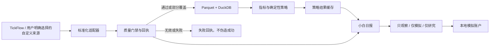

# A 股小白顾问与本地模拟盘

## 产品边界

本应用只用于个人研究和模拟练习。它不预测政策或新闻，不给目标价，不连接券商，不读取券商凭据，也不会自动下单。AI 不参与数据门禁、候选排序、交易规则或模拟账户记账。

页面中的研究判断只有以下含义：

- `可进入研究清单`：可以继续人工研究，不是买入指令；
- `等待更多确认`：条件不足，继续观察；
- `暂不纳入`：当前不进入研究清单。

任何历史结果、评分或模拟盈亏都不代表未来收益。

## 数据源与架构

当前提交内置 TickFlow，并保留现有的自定义数据源插件机制；它**没有把
Tushare 或 AKShare 插件作为本次功能的一部分提交**。以后若明确安装其他
数据源，可信门禁仍按实际选择的来源验收，不会因为来源名称不同而降低标准。

| 层级 | 数据源 | 用途 | 关键边界 |
| --- | --- | --- | --- |
| 当前内置 | TickFlow | 仅使用当前套餐明确声明支持的数据集 | 套餐能力缺失或失效时写失败回执 |
| 可扩展 | 用户明确安装并选择的自定义插件 | 由插件声明证券主表、日 K、复权因子等数据集 | 只有用户主动选择才启用，不自动回退 |
| 后续候选 | Tushare / AKShare | 仍需单独实现、验证和提交 | 本文不把未提交的本地文件当作已交付能力 |

任何已选择来源报错、返回空数据或字段校验失败都会留下本地回执。系统不会自动换源，也不会用随机数、演示数据或旧结果伪装本次成功。



后端使用 FastAPI、Polars、DuckDB、Parquet/JSON；前端使用 React、TypeScript、TanStack Query。日报只读取本地数据回执和已持久化策略结果。

## 四份硬数据门禁

每个数据集的最新回执保存在 `DATA_DIR/data_quality/`。日报必须同时找到且验证以下四份唯一回执：

1. `instruments`：证券主表；
2. `daily`：原始日 K；
3. `adj_factor`：复权因子；
4. `daily_enriched`：已落盘的派生日 K。

回执会展示来源、状态、覆盖率、实际日期范围、拦截原因和下一步。门禁采用 fail closed：

- 回执缺失、重复或字段结构无效：拦截；
- 四份回执中任一状态为 `error`、`invalid` 或 `empty`：拦截；
- 非证券主表数据标记为合成数据或发生未授权回退：拦截；
- `daily`、`adj_factor`、`daily_enriched` 覆盖率低于 95%：拦截；
- `daily` 或 `daily_enriched` 的截止日与策略日期不一致：拦截；
- 复权因子是事件流，不强制其起止日期等于策略日期，但其回执和覆盖率仍必须合格。

门禁失败时，页面固定为“只观察”，模拟成交表单由前端禁用；后端也会独立拒绝模拟成交，不能靠绕过页面按钮跳过。

## 候选风险隔离

候选顺序和分数完全由确定性规则产生，AI 不能改分。即使全局数据门禁通过，出现以下任一情况也会强制隔离：

- 策略日期发生复权因子事件；
- 有限的单日涨跌幅绝对值大于 30%；
- 收盘价缺失、非有限数或不大于 0；
- 涨停或跌停状态。

异常涨跌幅只是“需要人工复核”的隔离规则，不代表系统断言行情一定错误。风险标记会按稳定顺序返回，页面不会把被隔离标的包装成交易建议。

## 今日行动

`GET /api/advisor/daily-brief` 由后端直接给出完整决定，前端不自行拼接业务结论：

| 页面文案 | 后端状态 | 含义 |
| --- | --- | --- |
| 只观察 | `OBSERVE_ONLY` | 数据门禁未通过；不能记录模拟成交 |
| 仅模拟 | `SIMULATE_ONLY` | 数据通过，但没有研究候选通过全部硬风险门禁 |
| 仅研究 | `RESEARCH_ONLY` | 数据通过，存在可继续人工研究的候选 |

日报最多显示 3 只候选。每张卡只解释“为什么入选、继续观察条件、失效条件、风险拦截”，不显示目标价，也不输出命令式买卖文案。

## 本地模拟账户

模拟账户只记录用户手动填写的模拟成交，数据保存在：

```text
DATA_DIR/user_data/paper_account.json
```

主要规则：

- 默认初始资金 10,000 元；重置时只能选择 5,000 或 10,000 元；
- 重置会清空全部模拟持仓和日志，必须准确输入 `RESET`；
- 金额在文件中使用整数分，写入受进程锁保护并以同目录临时文件原子替换；
- 只支持规则内的 A 股股票代码，不支持 ETF、可转债、港股或美股；
- 普通股票模拟买入数量必须是 100 股整数倍；
- `688`、`689` 开头的科创板股票模拟买入至少 200 股，之后仍按 100 股步进；
- 不允许现金透支、卖空或卖出超过持仓；
- 模拟卖出执行 T+1，当日买入数量当日不可卖；
- 卖出按 FIFO 消耗持仓批次；
- 每笔日志保留成交前后现金、费用、已实现盈亏、模拟计划和失效条件；
- 读取账户时优先使用最新策略缓存收盘价估值；没有有效行情时使用成本价并明确标记。

### 费用假设

当前模拟费用固定为：

- 买卖双边佣金：成交金额的 0.03%，每笔最低 5 元；
- 卖出印花税：成交金额的 0.05%；
- 用户填写的模拟成交价视为已经包含其自行判断的滑点。

0.03% 只是模拟默认值，不代表任何券商的真实费率；实际佣金和其他费用以券商为准。上海证券交易所的投资者指引列示，券商交易佣金最高不超过成交金额的 3‰、最低 5 元起；财政部、税务总局公告自 2023 年 8 月 28 日起证券交易印花税减半征收，当前模型据此使用卖出 0.05%。

- [上海证券交易所：股票投资一件事](https://one.sse.com.cn/onething/gptz/)
- [财政部、税务总局关于减半征收证券交易印花税的公告](https://fgk.chinatax.gov.cn/zcfgk/c102416/c5211343/content.html)

## 小白使用顺序

每天只按下面顺序看，不要先看涨幅榜：

1. 看“今日行动”。只要是“只观察”，当天就不记录模拟成交；
2. 看“数据可信度”。四张回执必须正常，具体问题按页面“处理步骤”修复；
3. 看最多 3 张研究卡，重点记录失效条件，不把“可进入研究清单”理解成买入；
4. 数据通过后，才在模拟账户里手动记录练习；
5. 下一交易日检查 T+1 可卖数量、费用和计划是否仍成立；
6. 先积累完整日志，再讨论是否需要调整规则；不要因为一两次模拟盈利就放宽门禁。

## API

| 方法 | 路径 | 作用 |
| --- | --- | --- |
| `GET` | `/api/advisor/daily-brief` | 小白日报、完整门禁与最多 3 只候选 |
| `GET` | `/api/paper/account` | 读取或首次创建本地模拟账户 |
| `POST` | `/api/paper/reset` | 以 5,000/10,000 元重置，要求 `RESET` |
| `POST` | `/api/paper/trades` | 记录一笔用户手填的模拟成交 |

校验错误返回面向用户的中文说明。数据门禁拦截模拟成交时返回 HTTP 409；普通输入错误返回 HTTP 400。

## 首次运行

1. 复制 `.env.example` 为 `.env`，按当前使用的数据源填写必要配置；
2. 启动 `.\dev.ps1` 或 Docker；
3. 在“设置 → 数据源”确认来源并明确切换；
4. 同步证券主表、日 K、复权因子和派生日 K；
5. 检查四份可信度回执；
6. 运行策略后打开“量化顾问”。

如果以后单独接入 Tushare，其接口权限与积分要求可能变化，实施前应核对
[官方接口文档](https://tushare.pro/document/2)。如果以后接入 AKShare，也应把
上游结构变化、可用性和当前证券列表的生存者偏差写进该插件自己的验收测试；
这两项都不属于当前提交。

## 已知限制

- 排除政策因素不代表政策风险消失，只代表系统不尝试预测政策；
- 技术和财务因子无法覆盖停牌、重大事项、流动性枯竭等全部风险；
- 尚未提交 Tushare/AKShare 数据源实现；本地未提交的插件文件不能视为已交付；
- 数据源接口权限不足会明确失败，不会自动偷换来源；
- 模拟盘不等于实盘成交：滑点、盘口冲击、临时停牌、券商费率和实际成交概率均可能不同。
